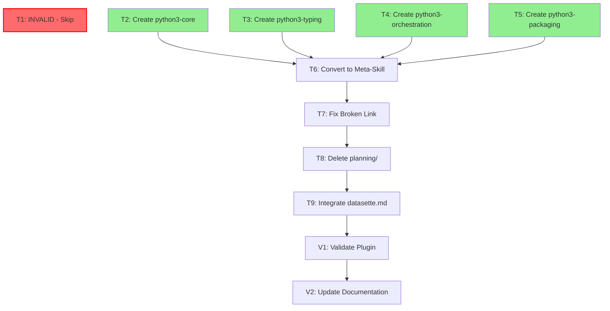

# Task Breakdown: python3-development Plugin Refactoring

## Overview

This document provides the complete task breakdown for refactoring the python3-development plugin based on the Phase 2 design specification. Tasks are organized by dependencies and include explicit parallelization opportunities.

**Design Source**: `.claude/plan/refactor-design-python3-development.md`

**Success Metrics**:

- Main SKILL.md reduced from 1318 lines to ~50 lines (meta-skill)
- Largest sub-skill: ~440 lines (67% reduction from original)
- Orphaned files: 20 → 0 (-100%)
- Broken links: 1 → 0 (-100%)
- Estimated score: 68/100 → 90+/100 (+32%)

---

## ~~Priority 1: Critical Frontmatter Fix~~ INVALIDATED

### ~~Task T1: Fix python3-development SKILL.md Frontmatter YAML~~ INVALID

**Status**: ⛔ INVALID - BASED ON HALLUCINATED ASSESSMENT
**Dependencies**: None
**Priority**: ~~1~~ N/A
**Complexity**: N/A
**Agent**: N/A

**INVALIDATION REASON**:

This task was created based on a **hallucinated claim** from the plugin-assessor agent. The agent incorrectly stated that single-quoted YAML descriptions were "broken" and recommended multiline `|` syntax.

**FACT**: Per `claude-skills-overview-2026` lines 78-94 and GitHub issue anthropics/claude-code#12313:

- Single-quoted strings are the **CORRECT** format for frontmatter descriptions
- YAML multiline indicators (`|`, `>-`, `|-`) are **BROKEN** due to Claude Code's hand-rolled YAML parser
- The current frontmatter is valid and parses correctly

**ACTION**: Skip this task entirely. The frontmatter does NOT need fixing.

**Root Cause**: The plugin-assessor agent lacked epistemic guardrails and invented a syntax rule from training data without consulting its loaded skills. Agent has been updated with Epistemic Protocol to prevent recurrence.

---

## Priority 1: Skill Splits (Parallelizable - No Blocking Dependency)

### Task T2: Create python3-core Skill

**Status**: ❌ NOT STARTED
**Dependencies**: None
**Priority**: 2
**Complexity**: High
**Agent**: skill-refactorer

**Target**: `./plugins/python3-development/skills/python3-core/SKILL.md` (new file)
**Issue Type**: SKILL_SPLIT

**Description**: Extract foundational Python development standards, exception handling, linting protocols, and quality gates into focused skill. Target size ~350-400 lines.

**Acceptance Criteria**:

1. SKILL.md created with valid YAML frontmatter including 6 trigger conditions
2. Content sections match design specification (Role ID, Script Dependencies, Rich Handling, Exception Handling, Linting Discovery, Quality Gates, Linting Exceptions)
3. Total line count between 350-400 lines
4. All relative references to `./references/` files resolve correctly
5. Frontmatter includes correct `tools` field referencing required assets

**Required Inputs**:

- Design spec section: "Split 1: python3-core" lines 49-88
- Source file sections: Lines 1-98, 98-270, 941-1088 from original SKILL.md
- Dependencies: `./references/exception-handling.md`, `./references/tool-library-registry.md`, `./assets/typer_examples/index.md`

**Expected Outputs**:

- Created: `./plugins/python3-development/skills/python3-core/SKILL.md`
- Created: `./plugins/python3-development/skills/python3-core/references/` (symlink to `../python3-development/references/`)

**Can Parallelize With**: T3, T4, T5
**Reason**: Each skill writes to separate directory with no shared file modifications

**Verification Steps**:

1. Count lines: `wc -l ./plugins/python3-development/skills/python3-core/SKILL.md` (expect 350-400)
2. Verify YAML frontmatter parses: `yq eval '.name' ./plugins/python3-development/skills/python3-core/SKILL.md`
3. Verify all reference links resolve: `grep -o '\[.*\](\.\/.*\.md)' SKILL.md | sed 's/.*(\(.*\))/\1/' | xargs -I {} test -f "$(dirname ./plugins/python3-development/skills/python3-core/SKILL.md)/{}" && echo "All links valid"`
4. Verify 6 description triggers present in frontmatter

---

### Task T3: Create python3-typing Skill

**Status**: ❌ NOT STARTED
**Dependencies**: None
**Priority**: 2
**Complexity**: High
**Agent**: skill-refactorer

**Target**: `./plugins/python3-development/skills/python3-typing/SKILL.md` (new file)
**Issue Type**: SKILL_SPLIT

**Description**: Extract type hints, mypy configuration, generics, protocols, TypedDict, type narrowing, and attrs/dataclasses/pydantic selection guidance into focused skill. Target size ~440 lines.

**Acceptance Criteria**:

1. SKILL.md created with valid YAML frontmatter including 6 trigger conditions
2. Content sections match design specification (Type Safety, Generics, Protocols, TypedDict, Type Narrowing, attrs vs dataclasses vs pydantic, Additional Mypy Features, Mypy Configuration)
3. Total line count approximately 440 lines
4. All relative references to `./references/mypy-docs/` files resolve correctly
5. Frontmatter includes correct `tools` field referencing required assets

**Required Inputs**:

- Design spec section: "Split 2: python3-typing" lines 92-133
- Source file sections: Lines 271-711 from original SKILL.md
- Dependencies: `./references/mypy-docs/*.rst` (5 files), `./references/tool-library-registry.md`

**Expected Outputs**:

- Created: `./plugins/python3-development/skills/python3-typing/SKILL.md`
- Created: `./plugins/python3-development/skills/python3-typing/references/` (symlink to `../python3-development/references/`)

**Can Parallelize With**: T2, T4, T5
**Reason**: Each skill writes to separate directory with no shared file modifications

**Verification Steps**:

1. Count lines: `wc -l ./plugins/python3-development/skills/python3-typing/SKILL.md` (expect ~440)
2. Verify YAML frontmatter parses: `yq eval '.name' ./plugins/python3-development/skills/python3-typing/SKILL.md`
3. Verify all mypy-docs references resolve: `find ./plugins/python3-development/skills/python3-typing/references/mypy-docs -name "*.rst" | wc -l` (expect 5)
4. Verify 6 description triggers present in frontmatter

---

### Task T4: Create python3-orchestration Skill

**Status**: ❌ NOT STARTED
**Dependencies**: None
**Priority**: 2
**Complexity**: Medium
**Agent**: skill-refactorer

**Target**: `./plugins/python3-development/skills/python3-orchestration/SKILL.md` (new file)
**Issue Type**: SKILL_SPLIT

**Description**: Extract orchestrator-only patterns for agent delegation and workflow coordination into focused skill. Target size ~300 lines. Add `ROLE_TYPE: orchestrator` to frontmatter to restrict loading.

**Acceptance Criteria**:

1. SKILL.md created with valid YAML frontmatter including 4 trigger conditions AND `ROLE_TYPE: orchestrator` field
2. Content sections match design specification (Agent Orchestration, Core Workflows, Common Patterns, Summary)
3. Total line count approximately 300 lines
4. Primary reference `./references/python-development-orchestration.md` is correctly linked
5. Frontmatter restricts loading to orchestrator context only

**Required Inputs**:

- Design spec section: "Split 3: python3-orchestration" lines 137-169
- Source file sections: Lines 712-846, 924-940, 1227-1318 from original SKILL.md
- Dependencies: `./references/python-development-orchestration.md` (CRITICAL primary reference)

**Expected Outputs**:

- Created: `./plugins/python3-development/skills/python3-orchestration/SKILL.md`
- Created: `./plugins/python3-development/skills/python3-orchestration/references/` (symlink to `../python3-development/references/`)

**Can Parallelize With**: T2, T3, T5
**Reason**: Each skill writes to separate directory with no shared file modifications

**Verification Steps**:

1. Count lines: `wc -l ./plugins/python3-development/skills/python3-orchestration/SKILL.md` (expect ~300)
2. Verify YAML frontmatter includes `ROLE_TYPE: orchestrator`: `yq eval '.ROLE_TYPE' ./plugins/python3-development/skills/python3-orchestration/SKILL.md`
3. Verify link to python-development-orchestration.md resolves
4. Verify 4 description triggers present in frontmatter

---

### Task T5: Create python3-packaging Skill

**Status**: ❌ NOT STARTED
**Dependencies**: None
**Priority**: 2
**Complexity**: Medium
**Agent**: skill-refactorer

**Target**: `./plugins/python3-development/skills/python3-packaging/SKILL.md` (new file)
**Issue Type**: SKILL_SPLIT

**Description**: Extract project structure, pyproject.toml configuration, PEP 723 inline script metadata, and asset template usage into focused skill. Target size ~300 lines.

**Acceptance Criteria**:

1. SKILL.md created with valid YAML frontmatter including 6 trigger conditions
2. Content sections match design specification (Command Usage, Standard Project Structure, Integration, Using Asset Templates)
3. Total line count approximately 300 lines
4. All relative references to `./references/` and `./assets/` files resolve correctly
5. Frontmatter includes correct `tools` field referencing asset templates

**Required Inputs**:

- Design spec section: "Split 4: python3-packaging" lines 174-207
- Source file sections: Lines 847-923, 1088-1226 from original SKILL.md
- Dependencies: `./references/PEP723.md`, `./references/user-project-conventions.md`, `./assets/version.py`, `./assets/hatch_build.py`, `./assets/.pre-commit-config.yaml`

**Expected Outputs**:

- Created: `./plugins/python3-development/skills/python3-packaging/SKILL.md`
- Created: `./plugins/python3-development/skills/python3-packaging/references/` (symlink to `../python3-development/references/`)

**Can Parallelize With**: T2, T3, T4
**Reason**: Each skill writes to separate directory with no shared file modifications

**Verification Steps**:

1. Count lines: `wc -l ./plugins/python3-development/skills/python3-packaging/SKILL.md` (expect ~300)
2. Verify YAML frontmatter parses: `yq eval '.name' ./plugins/python3-development/skills/python3-packaging/SKILL.md`
3. Verify all asset references resolve: `test -f ./plugins/python3-development/assets/version.py && test -f ./plugins/python3-development/assets/hatch_build.py && echo "Assets exist"`
4. Verify 6 description triggers present in frontmatter

---

## Priority 3: Meta-Skill Creation (Sequential After Priority 2)

### Task T6: Convert python3-development to Meta-Skill

**Status**: ❌ NOT STARTED
**Dependencies**: T2, T3, T4, T5
**Priority**: 3
**Complexity**: Low
**Agent**: claude-context-optimizer

**Target**: `./plugins/python3-development/skills/python3-development/SKILL.md`
**Issue Type**: STRUCTURE_FIX

**Description**: Replace the 1318-line monolithic skill with a ~50-line meta-skill that loads all four sub-skills. Maintains backward compatibility while enabling focused skill activation.

**Acceptance Criteria**:

1. SKILL.md reduced to approximately 50 lines
2. Frontmatter includes `includes:` field listing all four sub-skills
3. Meta-skill description explains sub-skill structure
4. Instructions for activating individual skills provided
5. Backward compatibility maintained (activating `@python3-development` loads all sub-skills)

**Required Inputs**:

- Design spec section: "Meta-Skill Pattern" lines 470-506
- Design spec section: "Backward Compatibility" lines 238-253
- Completed sub-skills from T2, T3, T4, T5

**Expected Outputs**:

- Modified: `./plugins/python3-development/skills/python3-development/SKILL.md` (replace content with meta-skill)

**Can Parallelize With**: None
**Reason**: Depends on all four sub-skills being complete; blocks documentation fixes

**Verification Steps**:

1. Count lines: `wc -l ./plugins/python3-development/skills/python3-development/SKILL.md` (expect ~50)
2. Verify `includes` field lists: python3-core, python3-typing, python3-orchestration, python3-packaging
3. Verify version bumped to "2.0.0"
4. Test loading meta-skill loads all sub-skills (manual verification in Claude Code)

---

## Priority 4: Documentation Fixes (Sequential After T6)

### Task T7: Fix Broken Commands README Link

**Status**: ❌ NOT STARTED
**Dependencies**: T6
**Priority**: 4
**Complexity**: Low
**Agent**: claude-context-optimizer

**Target**: `./plugins/python3-development/skills/python3-development/SKILL.md`
**Issue Type**: DOC_IMPROVE

**Description**: Remove broken link to non-existent `./commands/README.md` file. The reference describes command templates which are already documented inline.

**Acceptance Criteria**:

1. Line 57 reference to `[Commands README](./commands/README.md)` removed
2. Replacement text clarifies command templates are documented inline
3. No other references to `./commands/README.md` remain in any skill file
4. Markdown linting passes

**Required Inputs**:

- Design spec section: "Broken Link Fix" lines 259-282
- Current file: `./plugins/python3-development/skills/python3-development/SKILL.md` line 57

**Expected Outputs**:

- Modified: `./plugins/python3-development/skills/python3-development/SKILL.md` (line 57 only)

**Can Parallelize With**: None
**Reason**: Modifies same file as T6, must run after meta-skill creation

**Verification Steps**:

1. Grep for broken link: `grep -n "Commands README" ./plugins/python3-development/skills/python3-development/SKILL.md` (expect no matches)
2. Run markdown linter: `uv run pre-commit run --files ./plugins/python3-development/skills/python3-development/SKILL.md`
3. Verify replacement text exists and makes sense in context

---

### Task T8: Delete planning/ Directory

**Status**: ❌ NOT STARTED
**Dependencies**: T7
**Priority**: 4
**Complexity**: Low
**Agent**: orchestrator (direct execution)

**Target**: `./plugins/python3-development/skills/python3-development/planning/` (directory deletion)
**Issue Type**: ORPHAN_RESOLVE

**Description**: Delete historical proposal document that was never implemented. Document explicitly marked with `implementation_status: "not-implemented"`. Keeping creates confusion about actual architecture.

**Acceptance Criteria**:

1. File `./plugins/python3-development/skills/python3-development/planning/reference-document-architecture.md` deleted
2. Directory `./plugins/python3-development/skills/python3-development/planning/` deleted (if empty after file removal)
3. No references to planning/ directory remain in any skill files
4. No reverse references pointed to the deleted file

**Required Inputs**:

- Design spec section: "Orphan 1: planning/reference-document-architecture.md" lines 287-313
- Target file: `./plugins/python3-development/skills/python3-development/planning/reference-document-architecture.md`

**Expected Outputs**:

- Deleted: `./plugins/python3-development/skills/python3-development/planning/reference-document-architecture.md`
- Deleted: `./plugins/python3-development/skills/python3-development/planning/` (if empty)

**Can Parallelize With**: None
**Reason**: Sequential cleanup task, must run after link fix

**Verification Steps**:

1. Verify file deleted: `test ! -f ./plugins/python3-development/skills/python3-development/planning/reference-document-architecture.md && echo "File deleted"`
2. Verify directory deleted: `test ! -d ./plugins/python3-development/skills/python3-development/planning && echo "Directory deleted"`
3. Grep for any references: `grep -r "planning/reference-document-architecture" ./plugins/python3-development/` (expect no matches)

---

### Task T9: Integrate datasette.md into modern-modules.md

**Status**: ❌ NOT STARTED
**Dependencies**: T8
**Priority**: 4
**Complexity**: Low
**Agent**: claude-context-optimizer

**Target**: `./plugins/python3-development/skills/python3-development/references/modern-modules.md`
**Issue Type**: ORPHAN_RESOLVE

**Description**: Add datasette.md to the modern-modules.md index with "See Also" link pattern. Place in "Data Processing & Analysis" or "Database & ORM" section after DuckDB entry.

**Acceptance Criteria**:

1. New section added to modern-modules.md for Datasette
2. Section includes: PyPI package, status, Python version, key features, when to use
3. "See Also" link to `./modern-modules/datasette.md` added
4. Placement is after DuckDB section (around line 443)
5. Formatting matches existing module entries

**Required Inputs**:

- Design spec section: "Orphan 2: references/modern-modules/datasette.md" lines 316-356
- Target file: `./plugins/python3-development/skills/python3-development/references/modern-modules.md`
- Source file: `./plugins/python3-development/skills/python3-development/references/modern-modules/datasette.md`

**Expected Outputs**:

- Modified: `./plugins/python3-development/skills/python3-development/references/modern-modules.md` (new section added)

**Can Parallelize With**: None
**Reason**: Final documentation integration task, runs after cleanup

**Verification Steps**:

1. Grep for Datasette section: `grep -n "### Datasette" ./plugins/python3-development/skills/python3-development/references/modern-modules.md` (expect match)
2. Verify link to datasette.md: `grep "See Also.*datasette.md" ./plugins/python3-development/skills/python3-development/references/modern-modules.md` (expect match)
3. Verify formatting matches other entries (manual review)
4. Run markdown linter: `uv run pre-commit run --files ./plugins/python3-development/skills/python3-development/references/modern-modules.md`

---

## Priority 5: Validation and Documentation (Sequential After All Refactoring)

### Task V1: Validate Plugin Structure

**Status**: ❌ NOT STARTED
**Dependencies**: T2, T3, T4, T5, T6, T7, T8, T9
**Priority**: 5
**Complexity**: Low
**Agent**: plugin-assessor

**Description**: Run comprehensive structural validation on refactored plugin to verify all quality gates pass and score improvement achieved.

**Acceptance Criteria**:

1. Plugin passes structural validation (no critical errors)
2. All markdown links resolve correctly (no 404s)
3. No orphaned files remain in skills/ or references/ directories
4. Frontmatter validates against schema for all SKILL.md files
5. Score improved from 68/100 baseline
6. All four sub-skills under 500 lines
7. Meta-skill under 100 lines

**Required Inputs**:

- All completed refactoring tasks (T1-T9)
- Plugin directory: `./plugins/python3-development/`
- Design spec verification checklist: lines 522-535

**Expected Outputs**:

- Assessment report with score and detailed findings
- Comparison to baseline 68/100 score

**Can Parallelize With**: None
**Reason**: Final validation requires all refactoring complete

**Verification Steps**:

1. Run: `Task(agent="plugin-assessor", prompt="Assess ./plugins/python3-development for marketplace readiness")`
2. Verify score >= 90/100 (target from design spec)
3. Verify no CRITICAL or ERROR severity issues in report
4. Verify all sub-skill line counts: `for f in ./plugins/python3-development/skills/*/SKILL.md; do echo "$f: $(wc -l < "$f")"; done`

---

### Task V2: Update Plugin Documentation

**Status**: ❌ NOT STARTED
**Dependencies**: V1
**Priority**: 5
**Complexity**: Low
**Agent**: plugin-docs-writer

**Description**: Generate comprehensive user-facing documentation (README.md) reflecting the new four-skill architecture and usage patterns.

**Acceptance Criteria**:

1. README.md reflects current four-skill architecture
2. All skills documented with descriptions and trigger conditions
3. Usage examples provided for individual skill activation vs meta-skill activation
4. Installation instructions accurate
5. Migration guide for users of old monolithic skill included

**Required Inputs**:

- Completed refactoring with passing validation (V1)
- Plugin directory: `./plugins/python3-development/`
- All four sub-skill SKILL.md files for content extraction

**Expected Outputs**:

- Created/Modified: `./plugins/python3-development/README.md`
- Potentially created: `./plugins/python3-development/docs/skills.md` (if multi-file structure needed)

**Can Parallelize With**: None
**Reason**: Documentation generation requires validation complete

**Verification Steps**:

1. Run: `Task(agent="plugin-docs-writer", prompt="Generate complete documentation for ./plugins/python3-development")`
2. Verify README.md exists and is comprehensive: `test -f ./plugins/python3-development/README.md && wc -l ./plugins/python3-development/README.md`
3. Verify all four skills listed: `grep -c "python3-\(core\|typing\|orchestration\|packaging\)" ./plugins/python3-development/README.md` (expect >= 4)
4. Verify usage examples present for both meta-skill and individual skills

---

## Parallelization Summary

### Parallel Group A (Immediate - No Blocking Dependencies)

**Tasks T2, T3, T4, T5 can run simultaneously immediately**

- Each creates new skill in separate directory
- No shared file modifications
- No interdependencies
- Maximum parallelization: 4 concurrent sub-agents
- ~~T1 dependency removed~~ (T1 was invalid - based on hallucinated assessment)

### Sequential Group B (After Group A)

**Tasks must run in order: T6 → T7 → T8 → T9**

- T6 modifies main SKILL.md (depends on all sub-skills)
- T7 modifies main SKILL.md (must run after T6)
- T8 deletes directory (cleanup after T7)
- T9 integrates orphan (cleanup after T8)

### Sequential Group C (After Group B)

**Tasks must run in order: V1 → V2**

- V1 validates entire refactored plugin (depends on all changes)
- V2 generates documentation (depends on validation passing)

---

## Dependency Graph



**Legend**:

- Red node (T1): INVALID - hallucinated task, skip entirely
- Green nodes (T2-T5): Parallelizable group (can start immediately)
- White nodes: Sequential execution required

---

## Success Verification Checklist

After all tasks complete, verify:

- [ ] All new SKILL.md files under 500 lines
- [ ] Meta-skill under 100 lines
- [ ] All frontmatter YAML parses correctly
- [ ] All relative reference paths resolve (no 404s)
- [ ] Meta-skill loads all sub-skills when activated
- [ ] Individual skills load independently
- [ ] No orphaned files in references/ or skills/ directories
- [ ] No broken markdown links in any file
- [ ] Planning directory removed
- [ ] Datasette integrated into modern-modules.md
- [ ] Pre-commit linting passes on all modified files
- [ ] Plugin assessment score >= 90/100
- [ ] README.md accurately reflects new architecture

---

## Context Manifest

### Current Plugin Structure Summary

The python3-development plugin is a monolithic skill located at `./plugins/python3-development/` with the following structure:

**Plugin Root**: `./plugins/python3-development/`

- `.claude-plugin/plugin.json` - Plugin manifest (version 1.0.0)
- `README.md` - Plugin documentation
- `commands/` - Command templates directory (NOT slash commands, but reference material for creating them)
- `skills/python3-development/` - The main skill directory

**Main Skill Directory**: `./plugins/python3-development/skills/python3-development/`

- `SKILL.md` - 1318 lines (exceeds 500-line target by 164%)
- `references/` - 7 primary reference documents + mypy-docs subdirectory
- `assets/` - Template files (version.py, hatch_build.py, typer_examples/, etc.)
- `planning/` - Contains orphaned historical document (to be deleted)

### Current SKILL.md Section Structure with Line Ranges

| Section                                  | Lines     | Target Skill          |
| ---------------------------------------- | --------- | --------------------- |
| YAML Frontmatter (BROKEN - needs fix)    | 1-7       | All (fix first)       |
| Role Identification                      | 11-35     | python3-core          |
| Skill Architecture                       | 38-97     | python3-core          |
| Script Dependency Trade-offs             | 127-156   | python3-core          |
| Rich Panel/Table Width Handling          | 157-247   | python3-core          |
| Python Exception Handling                | 249-271   | python3-core          |
| Type Safety with Mypy                    | 273-278   | python3-typing        |
| When to Use Generics                     | 279-363   | python3-typing        |
| When to Use Protocols                    | 364-436   | python3-typing        |
| TypedDict for Dictionary Typing          | 437-505   | python3-typing        |
| Type Narrowing                           | 506-568   | python3-typing        |
| attrs vs dataclasses vs pydantic         | 569-639   | python3-typing        |
| Additional Mypy Features                 | 641-677   | python3-typing        |
| Mypy Configuration Best Practices        | 679-711   | python3-typing        |
| Agent Orchestration (Orchestrator Only)  | 713-846   | python3-orchestration |
| Command Usage (/modernpython, /shebang)  | 847-923   | python3-packaging     |
| Core Workflows (Orchestrator Only)       | 924-940   | python3-orchestration |
| Linting Discovery Protocol               | 941-1046  | python3-core          |
| Quality Gates                            | 1047-1087 | python3-core          |
| Linting Exception Conditions             | 1088-1128 | python3-core          |
| Standard Project Structure               | 1130-1163 | python3-packaging     |
| Integration / External Reference Example | 1164-1179 | python3-packaging     |
| Using Asset Templates                    | 1181-1226 | python3-packaging     |
| Common Patterns (Orchestrator Only)      | 1227-1246 | python3-orchestration |
| Detailed Documentation                   | 1248-1291 | python3-core          |
| Summary (All Roles + Orchestrator)       | 1293-1319 | python3-orchestration |

### Reference Files Inventory

**Primary References** (`./skills/python3-development/references/`):

| File                                | Size       | Used By Skill(s)      |
| ----------------------------------- | ---------- | --------------------- |
| modern-modules.md                   | 1477 lines | python3-core          |
| tool-library-registry.md            | -          | python3-core, typing  |
| python-development-orchestration.md | -          | python3-orchestration |
| exception-handling.md               | -          | python3-core          |
| PEP723.md                           | -          | python3-packaging     |
| user-project-conventions.md         | -          | python3-packaging     |
| api_reference.md                    | -          | python3-packaging     |

**Mypy Documentation** (`./skills/python3-development/references/mypy-docs/`):

| File                    | Used By        |
| ----------------------- | -------------- |
| generics.rst            | python3-typing |
| protocols.rst           | python3-typing |
| typed_dict.rst          | python3-typing |
| type_narrowing.rst      | python3-typing |
| additional_features.rst | python3-typing |

**Modern Modules Detail Files** (`./skills/python3-development/references/modern-modules/`):

18 detailed module documentation files including: arrow.md, attrs.md, bidict.md, blinker.md, boltons.md, box.md, copier.md, datasette.md (ORPHANED), fabric.md, GitPython.md, httpx.md, paho-mqtt.md, prefect.md, python-diskcache.md, python-dotenv.md, robotframework.md, shiv.md, uvloop.md

### External References Found (29 files reference python3-development)

**Critical Dependencies - Other Plugins Reference This Skill**:

1. **holistic-linting plugin** (17 references):

   - `SKILL.md` lines 101, 461, 466, 476, 506, 587, 592, 685, 800, 805, 918, 929, 931, 961, 1225
   - `agents/post-linting-architecture-reviewer.md` line 41
   - `agents/linting-root-cause-resolver.md` lines 3, 20, 22
   - Usage pattern: `Skill(command: "python3-development")`

2. **fastmcp-creator plugin** (4 references):

   - `SKILL.md` lines 182, 184, 196, 199
   - Usage pattern: `Skill(command: "python3-development")`

3. **toml-python plugin** (2 references):

   - `SKILL.md` line 624
   - `README.md` line 75
   - Listed as related skill dependency

4. **Repository-level references**:

   - `CLAUDE.md` lines 224, 803 (skill-refactorer example, httpx path)
   - `README.md` (root) - plugin listing
   - `.claude-plugin/marketplace.json` - marketplace registration

5. **Planning/workflow references**:
   - `.claude/plan/REFACTOR-PLAN.md`
   - `.claude/plan/tasks-refactor-python3-development.md`
   - `.claude/plan/refactor-design-python3-development.md`
   - `.claude/commands/implement-refactor.md`
   - `.claude/commands/complete-refactor.md`
   - `.claude/commands/review-plugin-for-refactor.md`
   - `.claude/commands/how-to-delegate.md`
   - `.claude/agents/skill-refactorer.md`
   - `.claude/agents/plugin-assessor.md`
   - `.claude/skills/agent-creator/references/agent-examples.md`

### Issues to Resolve

**~~CRITICAL - Frontmatter YAML Issue (T1)~~ INVALID - This was a hallucination**:

The plugin-assessor agent incorrectly claimed the frontmatter was broken. **FACT**:

- The current single-quoted description format is **CORRECT** per `claude-skills-overview-2026` lines 78-94
- YAML multiline indicators (`|`, `>-`) are **BROKEN** in Claude Code's parser (GitHub issue #12313)
- The frontmatter parses correctly and requires NO changes

**Broken Link (T7)**:

Line 57 references `[Commands README](./commands/README.md)` but this file does NOT exist at `./plugins/python3-development/skills/python3-development/commands/README.md`.

**Orphaned Files**:

1. `./skills/python3-development/planning/reference-document-architecture.md` (65,328 bytes) - Historical proposal marked as not-implemented, scheduled for deletion (T8)

2. `./skills/python3-development/references/modern-modules/datasette.md` - Exists but not linked from `modern-modules.md`, needs integration (T9)

### Cross-Reference Map for New Skills

After refactoring, relative paths must be updated. The design spec proposes symlinks from each new skill's `references/` directory to the shared `../python3-development/references/` directory:

```text
skills/
├── python3-development/     # Meta-skill + shared references
│   ├── SKILL.md            # ~50 lines (loads sub-skills)
│   └── references/         # Shared by all sub-skills
├── python3-core/
│   ├── SKILL.md            # ~350-400 lines
│   └── references -> ../python3-development/references
├── python3-typing/
│   ├── SKILL.md            # ~440 lines
│   └── references -> ../python3-development/references
├── python3-orchestration/
│   ├── SKILL.md            # ~300 lines
│   └── references -> ../python3-development/references
└── python3-packaging/
    ├── SKILL.md            # ~300 lines
    └── references -> ../python3-development/references
```

### Backward Compatibility Requirements

The skill name `python3-development` must remain valid for activation because:

1. **holistic-linting plugin** uses `Skill(command: "python3-development")` 17 times
2. **fastmcp-creator plugin** uses `Skill(command: "python3-development")` 4 times
3. **toml-python plugin** lists it as a related dependency

The meta-skill pattern (T6) maintains backward compatibility by making `@python3-development` load all four sub-skills automatically while allowing individual skill activation for focused contexts.

### plugin.json Update Required

After creating sub-skills, the plugin.json at `.claude-plugin/plugin.json` must be updated to list all skill directories:

```json
{
  "skills": [
    "./skills/python3-development",
    "./skills/python3-core",
    "./skills/python3-typing",
    "./skills/python3-orchestration",
    "./skills/python3-packaging"
  ]
}
```

### Verification Commands

```bash
# Verify current line count
wc -l ./plugins/python3-development/skills/python3-development/SKILL.md
# Expected: 1318

# Verify broken link
test -f ./plugins/python3-development/skills/python3-development/commands/README.md && echo "exists" || echo "missing"
# Expected: missing

# Verify orphaned datasette.md
grep -i datasette ./plugins/python3-development/skills/python3-development/references/modern-modules.md
# Expected: no output

# Verify planning directory exists
ls ./plugins/python3-development/skills/python3-development/planning/
# Expected: reference-document-architecture.md

# YAML frontmatter validation (after T1)
uv run python -c "import yaml; yaml.safe_load(open('./plugins/python3-development/skills/python3-development/SKILL.md').read().split('---')[1])"
```

---

## Task Execution Log

| Task | Agent | Start Time | End Time | Status      | Notes               |
| ---- | ----- | ---------- | -------- | ----------- | ------------------- |
| T1   | N/A   | N/A        | N/A      | ⛔ INVALID  | Hallucinated - skip |
| T2   |       |            |          | NOT STARTED |                     |
| T3   |       |            |          | NOT STARTED |                     |
| T4   |       |            |          | NOT STARTED |                     |
| T5   |       |            |          | NOT STARTED |                     |
| T6   |       |            |          | NOT STARTED |                     |
| T7   |       |            |          | NOT STARTED |                     |
| T8   |       |            |          | NOT STARTED |                     |
| T9   |       |            |          | NOT STARTED |                     |
| V1   |       |            |          | NOT STARTED |                     |
| V2   |       |            |          | NOT STARTED |                     |
