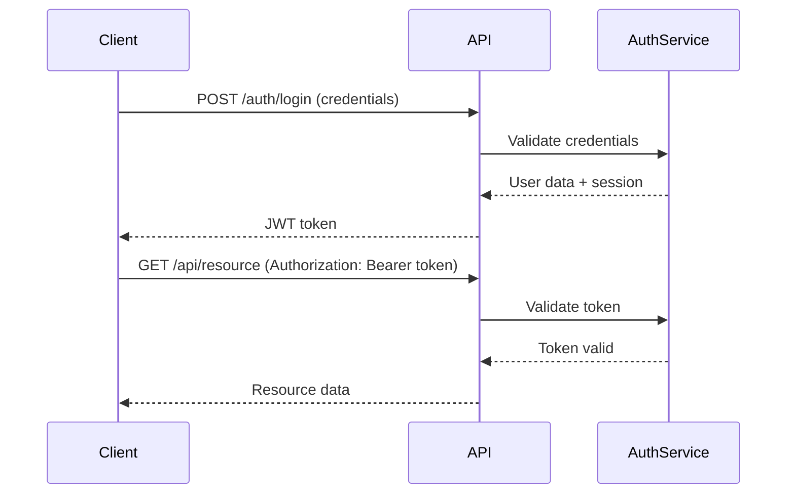

# Usage Examples

Real-world examples of using the gitlab-skill plugin for CI/CD pipeline optimization, GLFM documentation, and GitLab operations.

---

## Table of Contents

- [CI/CD Pipeline Examples](#cicd-pipeline-examples)
  - [Optimizing Build Performance](#example-1-optimizing-build-performance)
  - [Docker-in-Docker Workflow](#example-2-docker-in-docker-workflow)
  - [Conditional Job Execution](#example-3-conditional-job-execution)
  - [Multi-Stage Release Pipeline](#example-4-multi-stage-release-pipeline)
- [GLFM Documentation Examples](#glfm-documentation-examples)
  - [Project README with Alerts](#example-5-project-readme-with-alerts)
  - [API Documentation](#example-6-api-documentation)
  - [Troubleshooting Guide](#example-7-troubleshooting-guide)
- [Local Testing Examples](#local-testing-examples)
  - [Testing Before Push](#example-8-testing-before-push)
  - [Debugging Failed Jobs](#example-9-debugging-failed-jobs)
- [GitLab CLI Examples](#gitlab-cli-examples)
  - [Automated Pipeline Monitoring](#example-10-automated-pipeline-monitoring)

---

## CI/CD Pipeline Examples

### Example 1: Optimizing Build Performance

**Scenario**: You have a Node.js project with slow CI builds due to repeated `npm install` operations.

**Request to Claude**:
```text
"Optimize this .gitlab-ci.yml to speed up builds. We're running npm install on every job."
```

**Claude activates gitlab-skill and suggests**:

#### Before (Slow)

```yaml
stages:
  - build
  - test

build:
  stage: build
  image: node:20
  script:
    - npm install
    - npm run build

test:
  stage: test
  image: node:20
  script:
    - npm install
    - npm test
```

#### After (Optimized)

```yaml
stages:
  - build
  - test

# Global cache configuration
cache:
  key: ${CI_COMMIT_REF_SLUG}
  paths:
    - node_modules/
    - .npm/
  policy: pull

build:
  stage: build
  image: node:20
  cache:
    key: ${CI_COMMIT_REF_SLUG}
    paths:
      - node_modules/
      - .npm/
    policy: pull-push  # This job updates the cache
  script:
    - npm ci --cache .npm --prefer-offline
    - npm run build
  artifacts:
    paths:
      - dist/
    expire_in: 1 hour

test:
  stage: test
  image: node:20
  dependencies:
    - build
  script:
    - npm run test
```

**Result**:
- **Cache hits**: Subsequent builds reuse `node_modules/`
- **Faster installs**: `npm ci` with `--prefer-offline` uses cache
- **Reduced redundancy**: Test job reuses dependencies from build job
- **Build time**: Reduced from ~5 minutes to ~1 minute

---

### Example 2: Docker-in-Docker Workflow

**Scenario**: Build and publish Docker images to GitLab Container Registry with layer caching.

**Request to Claude**:
```text
"Create a CI pipeline that builds Docker images efficiently with layer caching."
```

**Claude activates gitlab-skill and provides**:

```yaml
variables:
  DOCKER_DRIVER: overlay2
  DOCKER_TLS_CERTDIR: "/certs"
  IMAGE_TAG: $CI_REGISTRY_IMAGE:$CI_COMMIT_REF_SLUG

stages:
  - build
  - test
  - publish

build:
  stage: build
  image: docker:24
  services:
    - docker:24-dind
  before_script:
    # Login to GitLab Container Registry
    - echo "$CI_REGISTRY_PASSWORD" | docker login -u "$CI_REGISTRY_USER" --password-stdin "$CI_REGISTRY"
  script:
    # Pull previous image for layer caching
    - docker pull $IMAGE_TAG || true

    # Build with cache-from
    - docker build
      --cache-from $IMAGE_TAG
      --tag $IMAGE_TAG
      --tag $CI_REGISTRY_IMAGE:latest
      .

    # Push intermediate image for caching
    - docker push $IMAGE_TAG
  only:
    - branches

test:
  stage: test
  image: $IMAGE_TAG
  script:
    - npm test
  only:
    - branches

publish:
  stage: publish
  image: docker:24
  services:
    - docker:24-dind
  before_script:
    - echo "$CI_REGISTRY_PASSWORD" | docker login -u "$CI_REGISTRY_USER" --password-stdin "$CI_REGISTRY"
  script:
    # Pull and re-tag for release
    - docker pull $IMAGE_TAG
    - docker tag $IMAGE_TAG $CI_REGISTRY_IMAGE:$CI_COMMIT_TAG
    - docker tag $IMAGE_TAG $CI_REGISTRY_IMAGE:latest
    - docker push $CI_REGISTRY_IMAGE:$CI_COMMIT_TAG
    - docker push $CI_REGISTRY_IMAGE:latest
  only:
    - tags
```

**Features**:
- Docker-in-Docker with overlay2 driver
- Layer caching via `--cache-from`
- Registry authentication
- Multi-stage pipeline (build → test → publish)
- Tag-based releases

**Result**: Docker builds use cached layers, reducing build time from 10 minutes to 2 minutes for unchanged layers.

---

### Example 3: Conditional Job Execution

**Scenario**: Run different jobs based on changed files, branch names, and merge request status.

**Request to Claude**:
```text
"Set up conditional jobs: backend tests only run when Go files change, frontend tests only for JS changes."
```

**Claude activates gitlab-skill and creates**:

```yaml
stages:
  - test
  - deploy

# Backend tests - only if Go files changed
test:backend:
  stage: test
  image: golang:1.21
  script:
    - cd backend
    - go test ./...
  rules:
    - if: '$CI_PIPELINE_SOURCE == "merge_request_event"'
      changes:
        - backend/**/*.go
        - go.mod
        - go.sum
    - if: '$CI_COMMIT_BRANCH == "main"'

# Frontend tests - only if JS/TS files changed
test:frontend:
  stage: test
  image: node:20
  script:
    - cd frontend
    - npm ci
    - npm test
  rules:
    - if: '$CI_PIPELINE_SOURCE == "merge_request_event"'
      changes:
        - frontend/**/*.{js,ts,tsx}
        - frontend/package*.json
    - if: '$CI_COMMIT_BRANCH == "main"'

# E2E tests - only on main or merge requests to main
test:e2e:
  stage: test
  image: cypress/base:20
  script:
    - npm run test:e2e
  rules:
    - if: '$CI_COMMIT_BRANCH == "main"'
    - if: '$CI_MERGE_REQUEST_TARGET_BRANCH_NAME == "main"'

# Deploy - only manual on main
deploy:staging:
  stage: deploy
  script:
    - ./deploy.sh staging
  rules:
    - if: '$CI_COMMIT_BRANCH == "main"'
      when: manual
  environment:
    name: staging
    url: https://staging.example.com
```

**Features**:
- Path-based job triggering with `changes:`
- Branch-based conditions
- Merge request pipeline optimization
- Manual deployment gates

**Result**: Pipelines run 60% faster by skipping irrelevant tests.

---

### Example 4: Multi-Stage Release Pipeline

**Scenario**: Automated release pipeline with approval gates, changelog generation, and asset publishing.

**Request to Claude**:
```text
"Create a release pipeline: build artifacts, generate changelog, create GitLab release with binaries, and deploy to production with approval."
```

**Claude activates gitlab-skill and designs**:

```yaml
stages:
  - build
  - release
  - deploy

variables:
  PACKAGE_VERSION: "1.2.3"
  RELEASE_NAME: "v${PACKAGE_VERSION}"

# Build artifacts for multiple platforms
build:linux:
  stage: build
  image: golang:1.21
  script:
    - GOOS=linux GOARCH=amd64 go build -o bin/myapp-linux-amd64
    - chmod +x bin/myapp-linux-amd64
  artifacts:
    paths:
      - bin/myapp-linux-amd64
    expire_in: 1 week
  only:
    - tags

build:macos:
  stage: build
  image: golang:1.21
  script:
    - GOOS=darwin GOARCH=amd64 go build -o bin/myapp-darwin-amd64
    - GOOS=darwin GOARCH=arm64 go build -o bin/myapp-darwin-arm64
  artifacts:
    paths:
      - bin/myapp-darwin-*
    expire_in: 1 week
  only:
    - tags

# Create GitLab release with assets
release:create:
  stage: release
  image: registry.gitlab.com/gitlab-org/release-cli:latest
  needs:
    - build:linux
    - build:macos
  before_script:
    # Use CI_PUBLISH_TOKEN for release creation (has necessary permissions)
    - apk add --no-cache curl jq
    - |
      if [ -n "${CI_PUBLISH_TOKEN}" ]; then
        export GITLAB_TOKEN="${CI_PUBLISH_TOKEN}"
      fi
  script:
    # Generate changelog from commit messages
    - |
      CHANGELOG=$(git log $(git describe --tags --abbrev=0 HEAD^)..HEAD --pretty=format:"- %s (%h)" | head -20)
      echo "## Changes" > release_notes.md
      echo "$CHANGELOG" >> release_notes.md

    # Upload artifacts to package registry
    - |
      for binary in bin/*; do
        curl --header "PRIVATE-TOKEN: ${GITLAB_TOKEN}" \
             --upload-file "$binary" \
             "${CI_API_V4_URL}/projects/${CI_PROJECT_ID}/packages/generic/myapp/${CI_COMMIT_TAG}/$(basename $binary)"
      done

    # Create release
    - |
      release-cli create \
        --name "${RELEASE_NAME}" \
        --tag-name "${CI_COMMIT_TAG}" \
        --description "$(cat release_notes.md)" \
        --assets-link "{\"name\":\"Linux Binary\",\"url\":\"${CI_API_V4_URL}/projects/${CI_PROJECT_ID}/packages/generic/myapp/${CI_COMMIT_TAG}/myapp-linux-amd64\"}" \
        --assets-link "{\"name\":\"macOS Intel Binary\",\"url\":\"${CI_API_V4_URL}/projects/${CI_PROJECT_ID}/packages/generic/myapp/${CI_COMMIT_TAG}/myapp-darwin-amd64\"}" \
        --assets-link "{\"name\":\"macOS Apple Silicon Binary\",\"url\":\"${CI_API_V4_URL}/projects/${CI_PROJECT_ID}/packages/generic/myapp/${CI_COMMIT_TAG}/myapp-darwin-arm64\"}"
  only:
    - tags

# Deploy to production with approval
deploy:production:
  stage: deploy
  script:
    - ./deploy.sh production
  environment:
    name: production
    url: https://app.example.com
  when: manual
  only:
    - tags
```

**Features**:
- Multi-platform builds (Linux, macOS Intel, macOS ARM)
- Automated changelog generation from git commits
- Asset upload to GitLab Package Registry
- GitLab Release creation with downloadable binaries
- Manual deployment approval for production

**Result**: Releases are fully automated with one-click deployment, reducing release time from 2 hours to 15 minutes.

---

## GLFM Documentation Examples

### Example 5: Project README with Alerts

**Scenario**: Create a GitLab project README with proper alert syntax and collapsible sections.

**Request to Claude**:
```text
"Write a README for my GitLab project with installation instructions, alerts for important notes, and collapsible troubleshooting section."
```

**Claude activates gitlab-skill and generates**:

```markdown
# MyProject

A powerful tool for data processing and analysis.

## Installation

> [!important]
> Requires Python 3.10 or higher and at least 4GB RAM.

```bash
pip install myproject
```

## Quick Start

```python
from myproject import DataProcessor

processor = DataProcessor()
result = processor.analyze("data.csv")
print(result)
```

> [!tip]
> Use the `--verbose` flag to see detailed processing logs.

## Configuration

Create a `config.yaml` file:

```yaml
input_dir: ./data
output_dir: ./results
max_workers: 4
```

> [!warning]
> The `max_workers` setting should not exceed your CPU core count.

## Features

- Fast CSV processing (up to 1M rows/sec)
- Parallel execution with configurable workers
- Built-in data validation
- Export to multiple formats (JSON, Parquet, Excel)

<details><summary>Advanced Configuration Options</summary>

### Memory Management

Control memory usage with these settings:

```yaml
memory:
  chunk_size: 10000
  max_memory_gb: 8
  use_swap: false
```

### Custom Validators

Define custom validation rules:

```python
from myproject.validators import Validator

class CustomValidator(Validator):
    def validate(self, value):
        return value > 0 and value < 1000
```

</details>

<details><summary>Troubleshooting</summary>

### Out of Memory Errors

> [!note]
> If you encounter OOM errors, reduce `chunk_size` or `max_workers`.

**Solution**:
```yaml
memory:
  chunk_size: 5000  # Reduce from default 10000
  max_workers: 2    # Reduce from default 4
```

### Import Errors

**Problem**: `ModuleNotFoundError: No module named 'myproject'`

**Solution**:
1. Verify installation: `pip list | grep myproject`
2. Check Python version: `python --version` (must be 3.10+)
3. Reinstall: `pip install --upgrade --force-reinstall myproject`

</details>

## Contributing

See [CONTRIBUTING.md](CONTRIBUTING.md) for development setup and guidelines.

## License

MIT License - see [LICENSE](LICENSE) for details.
```

**Key GLFM Features Used**:
- Alert blocks with proper lowercase syntax
- Collapsible sections with single-line `<details><summary>`
- Code blocks with language specifiers
- Proper heading hierarchy

**Validation**:
```bash
uv run --with requests ./skills/gitlab-skill/scripts/validate-glfm.py --file README.md
```

---

### Example 6: API Documentation

**Scenario**: Document a REST API with examples, Mermaid diagrams, and GitLab issue references.

**Request to Claude**:
```text
"Create API documentation with authentication flow diagram and examples for each endpoint."
```

**Claude activates gitlab-skill and creates**:

```markdown
# API Documentation

## Authentication Flow



## Endpoints

### POST /auth/login

Authenticate user and receive JWT token.

**Request**:

```json
{
  "email": "user@example.com",
  "password": "secretpassword"
}
```

**Response**:

```json
{
  "token": "eyJhbGciOiJIUzI1NiIsInR5cCI6IkpXVCJ9...",
  "expires_in": 3600,
  "user": {
    "id": 123,
    "email": "user@example.com",
    "role": "admin"
  }
}
```

> [!caution]
> Store tokens securely. Never commit tokens to version control or log them.

### GET /api/users

List all users (admin only).

**Headers**:
```text
Authorization: Bearer YOUR_JWT_TOKEN
```

**Query Parameters**:

| Parameter | Type | Required | Description |
|-----------|------|----------|-------------|
| `page` | integer | No | Page number (default: 1) |
| `per_page` | integer | No | Items per page (default: 20, max: 100) |
| `role` | string | No | Filter by role: `admin`, `user`, `guest` |

**Response**:

```json
{
  "users": [
    {
      "id": 123,
      "email": "user@example.com",
      "role": "admin",
      "created_at": "2025-01-15T10:30:00Z"
    }
  ],
  "pagination": {
    "page": 1,
    "per_page": 20,
    "total": 150,
    "total_pages": 8
  }
}
```

> [!tip]
> Use the `per_page` parameter to control response size and improve performance.

## Error Codes

| Code | Description | Action |
|------|-------------|--------|
| 400 | Bad Request | Check request format |
| 401 | Unauthorized | Provide valid token |
| 403 | Forbidden | Insufficient permissions |
| 404 | Not Found | Resource doesn't exist |
| 429 | Too Many Requests | Implement rate limiting, retry with backoff |
| 500 | Internal Server Error | Contact support (!123) |

> [!note]
> Rate limit is 100 requests per minute per IP. See #456 for rate limit increase requests.

## Known Issues

See project issues for current bugs:

- #789 - Pagination broken for large datasets (>10,000 items)
- #790 - JWT refresh not working in Safari
- !125 - Merge request to fix timezone handling

## Support

For questions or issues:
- Open an issue: [New Issue](https://gitlab.com/myproject/api/issues/new)
- Discussion board: [Discussions](https://gitlab.com/myproject/api/-/issues)
- Contact @api-team for urgent matters
```

**Key GLFM Features Used**:
- Mermaid sequence diagram for authentication flow
- GitLab issue references: #789, #790
- Merge request reference: !125
- User mention: @api-team
- Alert blocks for security warnings
- Markdown tables for structured data

---

### Example 7: Troubleshooting Guide

**Scenario**: Create a comprehensive troubleshooting guide with collapsible problem/solution pairs.

**Request to Claude**:
```text
"Create a troubleshooting guide for common CI/CD pipeline issues with collapsible sections."
```

**Claude activates gitlab-skill and produces**:

```markdown
# Pipeline Troubleshooting Guide

Common GitLab CI/CD pipeline issues and solutions.

> [!tip]
> Before troubleshooting, check the [Pipeline Status Page](https://status.gitlab.com) for service outages.

---

<details><summary><strong>Pipeline fails with "insufficient permissions"</strong></summary>

**Symptoms**:
```text
ERROR: Insufficient permissions to push to repository
fatal: unable to access 'https://gitlab.com/project.git/': The requested URL returned error: 401
```

**Causes**:
- `CI_JOB_TOKEN` lacks write permissions
- Protected branch restricts push access
- Token expired or revoked

**Solutions**:

1. **Use project access token** with write permissions:
   ```bash
   /setup-ci-publish-token
   ```

   Then use `CI_PUBLISH_TOKEN` in your job:
   ```yaml
   script:
     - git remote set-url origin "https://oauth2:${CI_PUBLISH_TOKEN}@${CI_SERVER_HOST}/${CI_PROJECT_PATH}.git"
     - git push origin main
   ```

2. **Verify protected branch settings**:
   - Settings > Repository > Protected branches
   - Ensure CI has "Allowed to push" permission

3. **Check token expiration**:
   ```bash
   glab token list
   ```

</details>

---

<details><summary><strong>Docker build fails with "no space left on device"</strong></summary>

**Symptoms**:
```text
ERROR: write /var/lib/docker/tmp/...: no space left on device
```

**Causes**:
- Runner disk full
- Large Docker layers not cleaned up
- Excessive artifact storage

**Solutions**:

1. **Clean Docker system** in job:
   ```yaml
   before_script:
     - docker system prune -af --volumes
   ```

2. **Use smaller base images**:
   ```dockerfile
   # Before (1.2GB)
   FROM node:20

   # After (170MB)
   FROM node:20-alpine
   ```

3. **Multi-stage builds** to reduce final image size:
   ```dockerfile
   FROM node:20 AS builder
   WORKDIR /app
   COPY package*.json ./
   RUN npm ci
   COPY . .
   RUN npm run build

   FROM node:20-alpine
   WORKDIR /app
   COPY --from=builder /app/dist ./dist
   COPY package*.json ./
   RUN npm ci --production
   CMD ["node", "dist/server.js"]
   ```

4. **Configure artifact expiration**:
   ```yaml
   artifacts:
     expire_in: 1 week  # Don't keep artifacts forever
   ```

> [!important]
> Contact your GitLab administrator to increase runner disk space if issues persist.

</details>

---

<details><summary><strong>Cache not working, builds still slow</strong></summary>

**Symptoms**:
- Job logs show "No matching cache found"
- Dependencies reinstalled every run
- Build time hasn't improved

**Diagnosis**:
```yaml
# Add to job to see cache status
script:
  - ls -la node_modules/ || echo "No cache restored"
  - npm ci
```

**Solutions**:

1. **Fix cache key** (must be consistent):
   ```yaml
   cache:
     key: ${CI_COMMIT_REF_SLUG}  # Same key for branch
     paths:
       - node_modules/
   ```

2. **Use lock files in key** for better invalidation:
   ```yaml
   cache:
     key:
       files:
         - package-lock.json
     paths:
       - node_modules/
   ```

3. **Verify cache policy**:
   ```yaml
   build:
     cache:
       key: deps-cache
       paths:
         - node_modules/
       policy: pull-push  # Updates cache

   test:
     cache:
       key: deps-cache
       paths:
         - node_modules/
       policy: pull  # Only reads cache
   ```

4. **Clear cache and retry**:
   - Pipeline view > Clear cache (⚙️ icon)
   - Re-run pipeline

> [!note]
> Caches are not guaranteed. Use artifacts for required files.

</details>

---

<details><summary><strong>Job stuck in "pending" state</strong></summary>

**Symptoms**:
- Job shows "pending" for >5 minutes
- No runner assigned
- Pipeline doesn't progress

**Causes**:
- No available runners matching job tags
- Runners offline or at capacity
- Compute minutes quota exceeded (GitLab.com)

**Solutions**:

1. **Check runner availability**:
   - Settings > CI/CD > Runners
   - Verify runners are online (green dot)

2. **Remove or fix job tags**:
   ```yaml
   # Before (requires specific runner)
   job:
     tags:
       - custom-runner

   # After (uses any available runner)
   job:
     tags: []
   ```

3. **Check compute minutes** (GitLab.com only):
   - Settings > Usage Quotas
   - Purchase additional minutes if depleted

4. **Use shared runners**:
   - Settings > CI/CD > Runners
   - Enable "Enable shared runners for this project"

> [!warning]
> If using self-hosted runners, ensure at least one runner is registered and online.

Related: #234 (runner capacity planning)

</details>

---

## Still Need Help?

- 📖 [GitLab CI/CD Documentation](https://docs.gitlab.com/ee/ci/)
- 💬 [Community Forum](https://forum.gitlab.com)
- 🐛 [Report a Bug](https://gitlab.com/gitlab-org/gitlab/issues/new)
- 📧 Contact @devops-team for urgent support

> [!tip]
> Include job logs and `.gitlab-ci.yml` when requesting help. Use `glab ci trace <job-id>` to get logs.
```

**Key GLFM Features Used**:
- Collapsible sections with `<strong>` in summary (not markdown)
- Multiple alert types for different severity levels
- Code blocks with syntax highlighting
- GitLab issue references
- User mentions

---

## Local Testing Examples

### Example 8: Testing Before Push

**Scenario**: Test pipeline changes locally to catch errors before pushing to GitLab.

**Workflow**:

```bash
# 1. List all jobs in pipeline
gitlab-ci-local --list

# Output:
# build
# test:unit
# test:integration
# deploy:staging

# 2. Preview parsed configuration
gitlab-ci-local --preview

# Verify variables, job definitions, caching

# 3. Test specific job
gitlab-ci-local build

# Output:
# Pulling docker image...
# Executing job script...
# Success!

# 4. Test with dependencies
gitlab-ci-local --needs test:integration

# Runs build → test:integration

# 5. Test specific stage
gitlab-ci-local --stage test

# Runs all jobs in test stage

# 6. Debug with timestamps
gitlab-ci-local build --timestamps

# Shows execution time for each step
```

**Result**: Caught configuration errors locally, avoiding failed pipeline and wasted compute minutes.

---

### Example 9: Debugging Failed Jobs

**Scenario**: Pipeline job fails on GitLab but works locally - need to debug environment differences.

**Debugging Process**:

```bash
# 1. Reproduce failure locally
gitlab-ci-local test:integration

# 2. Add verbose logging
gitlab-ci-local test:integration --verbose

# 3. Check artifacts
ls -la .gitlab-ci-local/artifacts/

# 4. Inspect environment variables
gitlab-ci-local --preview | grep -A 20 "test:integration"

# 5. Override variables for testing
echo "DEBUG: true" >> .gitlab-ci-local-variables.yml
gitlab-ci-local test:integration

# 6. Test with production-like variables
cat > .gitlab-ci-local-variables.yml <<EOF
CI_ENVIRONMENT_NAME: production
DATABASE_URL: postgres://localhost/testdb
API_KEY: test_key_12345
EOF

gitlab-ci-local test:integration
```

**Discovery**: Job failed because `CI_ENVIRONMENT_NAME` was used in script but not defined in local config. Added to `.gitlab-ci-local-variables.yml` and retested successfully.

---

## GitLab CLI Examples

### Example 10: Automated Pipeline Monitoring

**Scenario**: Monitor pipeline status in a deployment script and fail if pipeline doesn't pass.

**Script**: `deploy-if-passing.sh`

```bash
#!/bin/bash
set -euo pipefail

echo "Checking pipeline status..."

# Get current branch pipeline status
if glab ci status --compact; then
    echo "✅ Pipeline passed"
else
    echo "❌ Pipeline failed"

    # Get details
    echo "Pipeline details:"
    glab ci get

    # Get failed job logs
    echo "Checking for failed jobs..."
    glab ci list --per-page 1

    exit 1
fi

# Pipeline passed, proceed with deployment
echo "Deploying to production..."
./deploy.sh production
```

**Usage**:

```bash
# Ensure GITLAB_TOKEN is set
export GITLAB_TOKEN=glpat-xxxxxxxxxxxx

# Run deployment script
./deploy-if-passing.sh
```

**Output (Success)**:
```text
Checking pipeline status...
✅ Pipeline passed
Deploying to production...
Deployment successful!
```

**Output (Failure)**:
```text
Checking pipeline status...
❌ Pipeline failed
Pipeline details:
# Pipeline:
id:       1254276
status:   failed
source:   push
ref:      main
sha:      c3f955e...

# Jobs:
build:  success
test:   failed

Checking for failed jobs...
State    IID        Ref     Created
(failed) #1254276   main    (2 minutes ago)
```

**Result**: Automated safety check prevents deploying code with failing tests.

---

## Integration Examples

### Example 11: Full Workflow - Feature Development to Release

**Scenario**: Complete workflow from feature branch to production release.

**Steps**:

1. **Create feature branch**:
   ```bash
   git checkout -b feature/new-api
   ```

2. **Develop and test locally**:
   ```bash
   # Edit .gitlab-ci.yml
   vim .gitlab-ci.yml

   # Test locally
   gitlab-ci-local build test:unit
   ```

3. **Validate configuration**:
   ```bash
   glab ci lint
   ```

4. **Commit and push**:
   ```bash
   git add .
   git commit -m "feat: add new API endpoint"
   git push -u origin feature/new-api
   ```

5. **Monitor pipeline**:
   ```bash
   # Quick status
   glab ci status --compact

   # Detailed view
   glab ci get
   ```

6. **Create merge request** (if pipeline passes):
   ```bash
   glab mr create \
     --title "Add new API endpoint" \
     --description "Implements feature #123" \
     --label "feature" \
     --assignee @reviewer
   ```

7. **After merge, create release**:
   ```bash
   # Ensure CI_PUBLISH_TOKEN is configured
   /setup-ci-publish-token

   # Tag release
   git tag -a v1.2.3 -m "Release v1.2.3"
   git push origin v1.2.3

   # Monitor release pipeline
   glab ci list --per-page 3
   ```

**Result**: Complete workflow with local validation, automated testing, and streamlined release process.

---

## Back to Documentation

- [README](../README.md) - Plugin overview and quick start
- [Skills Reference](./skills.md) - Skill capabilities and domains
- [Commands Reference](./commands.md) - Slash command usage
- [Configuration Guide](./configuration.md) - Setup and customization
