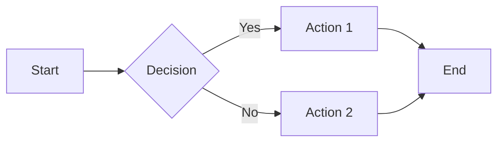
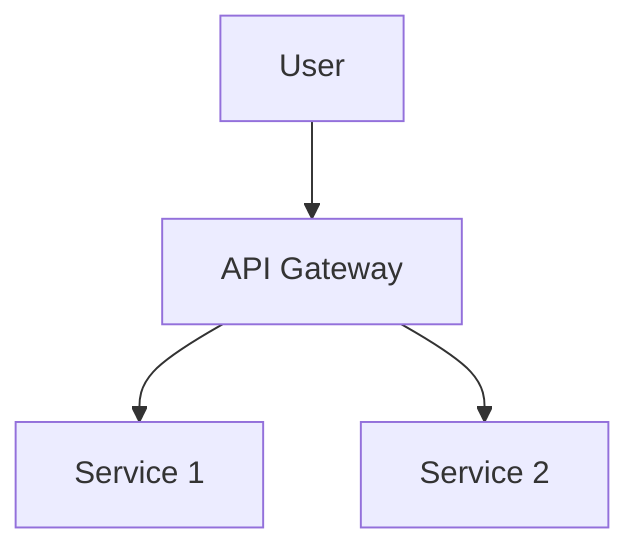

# GitLab Flavored Markdown (GLFM) Syntax Reference

Complete reference for GitLab Flavored Markdown syntax with examples, common mistakes, and best practices.

## Critical Syntax Rules

**MUST FOLLOW:**

1. **Alert types MUST be lowercase**: `[!note]`, `[!tip]`, `[!important]`, `[!caution]`, `[!warning]`
2. **Collapsibles on single line**: `<details><summary>Text</summary>` (not multi-line)
3. **No markdown in `<summary>` tags**: Use HTML equivalents (`<strong>`, `<em>`, etc.)

## Alert Blocks

GitLab supports five alert types, all using **lowercase** syntax:

```markdown
> [!note] This is a note alert. Use lowercase [!note], NOT [!NOTE]

> [!tip] This is a tip for users.

> [!important] This highlights important information.

> [!caution] This warns about potential issues.

> [!warning] This warns about dangerous operations.
```

**Common mistake:**

```markdown
❌ > [!NOTE] # Will not render ✅ > [!note] # Correct
```

## Collapsible Sections

Use for optional/advanced content, reference material, platform-specific instructions, or large code examples.

**Preferred single-line format:**

```markdown
<details><summary>Click to expand detailed instructions</summary>

Content goes here with blank line after summary tag.

</details>
```

**HTML in summary tags** (NO markdown syntax allowed):

```markdown
<details><summary><strong>Advanced Configuration</strong> - Expand for details</summary>
<details><summary><h3>Troubleshooting Guide</h3></summary>
```

**Use collapsibles for:**

- Optional/Advanced content - Features most users skip
- Reference material - API parameters, environment variables, config options
- Platform-specific instructions - Linux vs Mac vs Windows setup
- Alternative scenarios - Troubleshooting decision trees
- Large code examples - Examples that interrupt narrative flow (>15 lines)
- Supplementary details - Additional context not in main story

**DON'T use collapsibles for:**

- Essential information in primary narrative flow
- Critical warnings or security notices
- Short explanations (< 10 lines) in main content
- Fragmenting cohesive explanations
- Making documents artificially shorter

## Mermaid Diagrams

Visualize processes, architecture, and workflows:

````markdown

````

**Common diagram types:**

```mermaid
# Flowchart
graph TD
    A[Start] --> B[Process]
    B --> C{Decision}

# Sequence diagram
sequenceDiagram
    participant A
    participant B
    A->>B: Request
    B-->>A: Response

# Gantt chart
gantt
    title Project Timeline
    Task 1: 2025-01-01, 7d
    Task 2: 2025-01-08, 5d
```

## Task Lists

Track completion status:

```markdown
- [ ] Incomplete task
- [x] Completed task
- [~] Inapplicable task
```

## Table of Contents

Auto-generate navigation for long documents:

```markdown
[[_TOC_]]
```

Place at the beginning of documents with >3 main sections.

## GitLab References

Link to issues, merge requests, users, and more:

```markdown
@username # Mention a user #123 # Link to issue #123 !456 # Link to merge request !456 ~label # Link to label %milestone # Link to milestone $snippet # Link to snippet
```

## Math Expressions

Support for LaTeX math notation:

```markdown
Inline math: $E = mc^2$

Block math:

$$
\int_{a}^{b} f(x) dx = F(b) - F(a)
$$
```

## Color Chips

Display colors inline for design documentation:

```markdown
`#FF0000` displays as a red color chip `RGB(255,0,0)` also displays as red `HSL(0,100%,50%)` also displays as red
```

## Code Blocks

Syntax highlighting for code examples:

````markdown
```python
def hello_world():
    print("Hello, GitLab!")
```

```yaml
# GitLab CI configuration
stages:
  - test
  - deploy
```
````

## Tables

Create structured data with alignment:

```markdown
| Left | Center | Right |
| :--- | :----: | ----: |
| Text |  Text  |  Text |
```

## Footnotes

Add reference notes:

```markdown
Here's a sentence with a footnote[^1].

[^1]: This is the footnote content.
```

## Emoji

Use shortcodes for emoji:

```markdown
:smile: :rocket: :tada:
```

## Front Matter

Add metadata to documents:

```markdown
---
title: My Document Title
description: Brief description for SEO
author: Jane Doe
date: 2025-10-01
tags: [documentation, guide, tutorial]
---
```

## Allowed HTML Elements

GitLab sanitizes HTML through the Banzai pipeline. Commonly allowed elements:

**Text formatting:**

- `<strong>`, `<b>`, `<em>`, `<i>`, `<u>`, `<s>`, `<mark>`
- `<code>`, `<pre>`, `<kbd>`, `<samp>`, `<var>`
- `<sup>`, `<sub>`, `<small>`
- `<abbr>`, `<cite>`, `<q>`

**Structural elements:**

- `<h1>` through `<h6>` (headings)
- `<p>`, `<br>`, `<hr>`
- `<div>`, `<span>`
- `<ul>`, `<ol>`, `<li>`
- `<dl>`, `<dt>`, `<dd>`
- `<blockquote>`

**Interactive elements:**

- `<details>`, `<summary>`
- `<a href="...">` (links with href attribute)

**Media elements:**

- `` (with src and alt attributes)
- `<video>`, `<audio>` (with appropriate attributes)

**Tables:**

- `<table>`, `<thead>`, `<tbody>`, `<tfoot>`
- `<tr>`, `<th>`, `<td>`
- `<caption>`, `<col>`, `<colgroup>`

**Important HTML constraints:**

- Markdown inside HTML requires blank lines before/after
- `<summary>` tags cannot contain markdown syntax (use HTML equivalents)
- JavaScript and dangerous attributes are stripped
- Custom CSS classes/IDs may be sanitized

## Feature Selection Guide

| Feature               | Use Case                            | Example                                          |
| --------------------- | ----------------------------------- | ------------------------------------------------ |
| **Alert blocks**      | Important notices, warnings, tips   | Installation prerequisites, breaking changes     |
| **Collapsibles**      | Long explanations, optional content | Detailed troubleshooting, advanced configuration |
| **Mermaid diagrams**  | Process flows, architecture         | CI/CD pipelines, system architecture             |
| **Math expressions**  | Technical formulas, algorithms      | Performance calculations, statistical analysis   |
| **Task lists**        | Checklists, progress tracking       | Setup steps, migration checklist                 |
| **Table of contents** | Long documents (>3 sections)        | User manuals, comprehensive guides               |
| **GitLab references** | Link to issues, MRs, users          | Changelog entries, related work                  |
| **Color chips**       | Design documentation, theming       | Color palette definitions, UI specifications     |
| **Code blocks**       | Examples, configuration files       | API usage examples, config templates             |

## Common Mistakes to Avoid

### Critical Syntax Errors

1. **Using uppercase alert types** (won't render)
   - ❌ WRONG: `> [!NOTE]`, `> [!TIP]`
   - ✅ CORRECT: `> [!note]`, `> [!tip]`

2. **Markdown syntax in `<summary>` tags** (won't render)
   - ❌ WRONG: `<summary>## Configuration</summary>`
   - ✅ CORRECT: `<summary><h2>Configuration</h2></summary>`

3. **Multi-line `<details>` format** (rendering issues)
   - ❌ WRONG: `<details>\n<summary>Text</summary>` (separate lines)
   - ✅ CORRECT: `<details><summary>Text</summary>` (single line)

### Information Architecture Mistakes

4. **Collapsing essential information**
   - ❌ WRONG: Hiding installation requirements in collapsible
   - ✅ CORRECT: Essential info in main flow, advanced options collapsed

5. **Overusing collapsibles**
   - ❌ WRONG: Every 3-line section wrapped in `<details>`
   - ✅ CORRECT: Collapsibles for optional/reference content (20+ lines)

6. **Overusing alerts**
   - ❌ WRONG: Every paragraph is an alert
   - ✅ CORRECT: Reserve alerts for genuinely important information

7. **Not leveraging GitLab references**
   - ❌ WRONG: Writing "See issue 123" as plain text
   - ✅ CORRECT: `See #123` (creates automatic link)

8. **Inconsistent heading hierarchy**
   - ❌ WRONG: Jumping from `##` to `####`
   - ✅ CORRECT: Proper nesting `#` → `##` → `###`

## README Optimization Example

````markdown
---
title: Project Name
description: One-line project description
---

[[_TOC_]]

# Project Name

> [!note] This project requires GitLab Runner 15.0 or higher.

## Quick Start

<details><summary>Detailed Installation Steps</summary>

1. Clone the repository
2. Install dependencies
3. Configure environment

</details>

## Architecture



## Related Resources

- See #123 for background
- Implemented in !456
- Assigned to @developer
````

## Changelog Format Example

```markdown
## [1.2.0] - 2025-10-01

### Added

- New feature XYZ (!123) by @developer

### Fixed

- Bug in component ABC (#456)

### Changed

- Updated dependency version (!789)
```

## Validation

Use the included validation script to verify GLFM rendering:

```bash
# Validate a markdown file
uv run --with requests ./scripts/validate-glfm.py --file README.md

# Validate inline markdown
uv run --with requests ./scripts/validate-glfm.py --markdown "> [!note]\n> Test"

# Save rendered HTML
uv run --with requests ./scripts/validate-glfm.py --file test.md --output rendered.html
```

**When to verify rendering:**

- After creating or significantly updating documentation
- Testing complex document structure
- Validating overall readability and presentation
- Testing new or uncertain GLFM syntax

## Quality Checklist

- [ ] All alert blocks use lowercase syntax
- [ ] Collapsible sections use single-line format
- [ ] No markdown in `<summary>` tags
- [ ] Mermaid diagrams for process flows
- [ ] Table of contents for long documents
- [ ] GitLab references for issues/MRs/users
- [ ] Code blocks have language tags
- [ ] Heading hierarchy is consistent
- [ ] Content is accessible (alt text, semantic structure)
