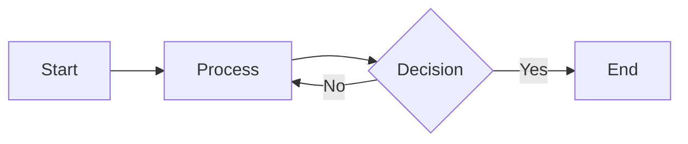
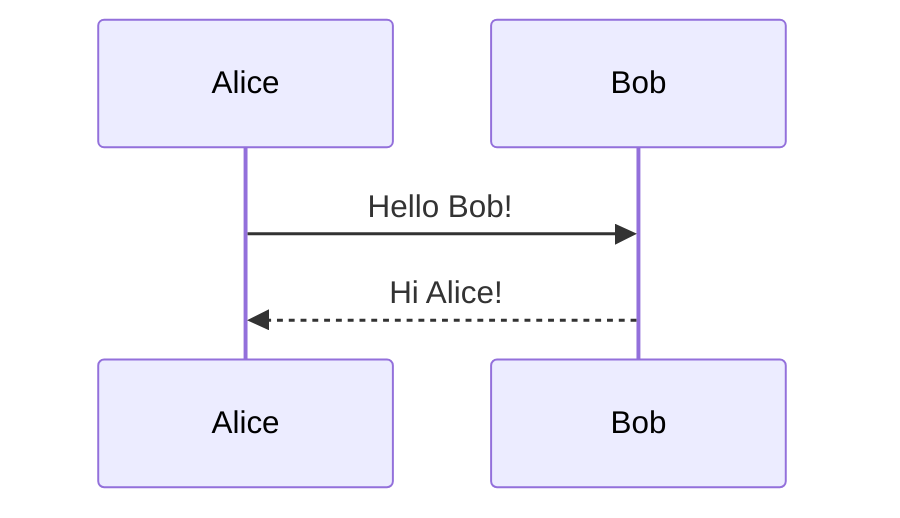
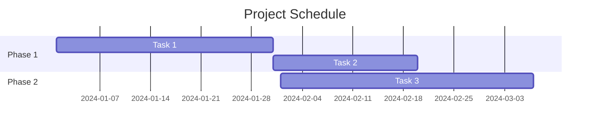

# MkDocs Plugins Reference

This reference provides comprehensive configuration options for essential MkDocs plugins used in documentation projects. Each plugin section includes all configuration options, YAML examples, and common usage patterns.

## Table of Contents

1. [mkdocstrings](#mkdocstrings) - Automatic documentation from docstrings
2. [mkdocs-gen-files](#mkdocs-gen-files) - Programmatically generate documentation pages
3. [mkdocs-literate-nav](#mkdocs-literate-nav) - Specify navigation in Markdown
4. [mkdoxy](#mkdoxy) - C/C++ Doxygen documentation integration
5. [mkdocs-typer2](#mkdocs-typer2) - Typer CLI documentation
6. [mermaid2](#mermaid2) - Mermaid diagrams support
7. [termynal](#termynal) - Terminal animations
8. [mkdocs-git-latest-changes-plugin](#mkdocs-git-latest-changes-plugin) - Recently updated pages

---

## mkdocstrings

**Purpose**: Automatically generate API documentation from source code docstrings.

**Official Documentation**: <https://mkdocstrings.github.io/>

### Installation

```bash
pip install mkdocstrings
pip install mkdocstrings[python]  # For Python handler
```

### Configuration Options

#### Global Configuration (mkdocs.yml)

```yaml
plugins:
  - mkdocstrings:
      # Enable/disable the plugin (useful for conditional builds)
      enabled: !ENV [ENABLE_MKDOCSTRINGS, true]

      # Path to custom templates directory (relative to mkdocs.yml)
      custom_templates: templates

      # Default handler when none is specified in autodoc blocks
      default_handler: python

      # Language/locale for translations
      locale: en

      # Enable/disable inventory file generation for cross-references
      enable_inventory: true

      # Handler-specific configuration
      handlers:
        python:
          # Cross-reference inventories
          inventories:
            - https://docs.python.org/3/objects.inv
            - https://installer.readthedocs.io/en/stable/objects.inv
            - https://requests.readthedocs.io/en/master/objects.inv

          # Global options for Python handler
          options:
            # Docstring style (google, numpy, sphinx)
            docstring_style: google

            # Show source code
            show_source: true

            # Show object path
            show_object_path: true

            # Show category heading
            show_category_heading: true

            # Show root heading
            show_root_heading: false

            # Show root toc entry
            show_root_toc_entry: true

            # Show symbol type in heading
            show_symbol_type_heading: true

            # Show symbol type in toc
            show_symbol_type_toc: true

            # Initial heading level
            heading_level: 2

            # Members to include
            members: true # or list of specific members

            # Members order
            members_order: source # or alphabetical

            # Inherited members
            inherited_members: true

            # Filters
            filters:
              - "!^_" # Exclude private members
              - "!^__init__$" # Exclude __init__

            # Group members by category
            group_by_category: true

            # Show if type
            show_if_no_docstring: false

            # Preload modules for better cross-references
            preload_modules:
              - mypackage

            # Show docstring attributes section
            show_docstring_attributes: true

            # Show docstring functions section
            show_docstring_functions: true

            # Show docstring classes section
            show_docstring_classes: true

            # Show docstring modules section
            show_docstring_modules: true

            # Show docstring description
            show_docstring_description: true

            # Show docstring examples
            show_docstring_examples: true

            # Show docstring parameters
            show_docstring_parameters: true

            # Show docstring other parameters
            show_docstring_other_parameters: true

            # Show docstring raises
            show_docstring_raises: true

            # Show docstring returns
            show_docstring_returns: true

            # Show docstring warns
            show_docstring_warns: true

            # Show docstring yields
            show_docstring_yields: true

            # Merge __init__ docstring into class
            merge_init_into_class: false

            # Show signature
            show_signature: true

            # Show signature annotations
            show_signature_annotations: true

            # Separate signature
            separate_signature: false

            # Line length for wrapping
            line_length: 80

            # Signature crossrefs (create links)
            signature_crossrefs: true
```

### Usage in Markdown

Basic usage:

```markdown
::: mypackage.mymodule
```

With options:

```markdown
::: mypackage.mymodule.MyClass options: show_source: false members: - method1 - method2 heading_level: 3
```

Select specific members:

```markdown
::: mypackage.mymodule options: members: - MyClass - my_function
```

With custom handler:

```markdown
::: mypackage.mymodule handler: python options: show_source: true show_root_heading: true
```

### Common Patterns

#### Document entire package

```markdown
::: mypackage options: show_submodules: true
```

#### Document class with selected methods

```markdown
::: mypackage.MyClass options: members: - **init** - important_method show_source: false
```

#### Cross-references

```markdown
See [`mypackage.MyClass`][] for more details.
```

---

## mkdocs-gen-files

**Purpose**: Programmatically generate documentation pages during the build process.

**Official Documentation**: <https://oprypin.github.io/mkdocs-gen-files/>

### Installation

```bash
pip install mkdocs-gen-files
```

### Configuration Options

```yaml
plugins:
  - gen-files:
      # List of Python scripts to execute (relative to mkdocs.yml)
      scripts:
        - gen_pages.py
        - scripts/gen_ref_nav.py
        - docs/gen_api_docs.py
```

### Usage Examples

#### Basic File Generation (gen_pages.py)

```python
import mkdocs_gen_files

# Generate a simple page
with mkdocs_gen_files.open("generated/hello.md", "w") as f:
    print("# Hello, World!", file=f)
    print("This page was generated programmatically.", file=f)

# Set edit path for the generated file
mkdocs_gen_files.set_edit_path("generated/hello.md", "gen_pages.py")
```

#### Generate API Reference Pages

```python
import mkdocs_gen_files

for path in sorted(Path("src").rglob("*.py")):
    module_path = path.relative_to("src").with_suffix("")
    doc_path = path.relative_to("src").with_suffix(".md")
    full_doc_path = Path("reference", doc_path)

    parts = list(module_path.parts)

    if parts[-1] == "__init__":
        parts = parts[:-1]
        doc_path = doc_path.with_name("index.md")
        full_doc_path = full_doc_path.with_name("index.md")
    elif parts[-1] == "__main__":
        continue

    with mkdocs_gen_files.open(full_doc_path, "w") as fd:
        identifier = ".".join(parts)
        print(f"::: {identifier}", file=fd)

    mkdocs_gen_files.set_edit_path(full_doc_path, path)
```

#### Generate Navigation

```python
import mkdocs_gen_files

# Create a nav file for literate-nav
nav = mkdocs_gen_files.Nav()

for path in sorted(Path("src").rglob("*.py")):
    module_path = path.relative_to("src").with_suffix("")
    doc_path = path.relative_to("src").with_suffix(".md")

    parts = list(module_path.parts)
    if parts[-1] == "__init__":
        parts = parts[:-1]
        doc_path = doc_path.with_name("index.md")

    nav[parts] = doc_path.as_posix()

with mkdocs_gen_files.open("reference/SUMMARY.md", "w") as nav_file:
    nav_file.writelines(nav.build_literate_nav())
```

### Common Patterns

#### Generate Changelog from Git

```python
import mkdocs_gen_files
import subprocess

result = subprocess.run(["git", "log", "--oneline"], capture_output=True, text=True)

with mkdocs_gen_files.open("CHANGELOG.md", "w") as f:
    print("# Changelog\n", file=f)
    for line in result.stdout.splitlines()[:20]:
        print(f"- {line}", file=f)
```

---

## mkdocs-literate-nav

**Purpose**: Specify navigation in Markdown files instead of YAML.

**Official Documentation**: <https://oprypin.github.io/mkdocs-literate-nav/>

### Installation

```bash
pip install mkdocs-literate-nav
```

### Configuration Options

```yaml
plugins:
  - literate-nav:
      # Name of the nav file in each directory
      nav_file: SUMMARY.md # default

      # Implicitly include index.md/README.md if not listed
      implicit_index: true # default

      # Number of spaces for list indentation
      tab_length: 4 # default (can be set to 2 for modern style)
```

### Usage Examples

#### SUMMARY.md Format

```markdown
# Navigation

- [Home](index.md)
- [Getting Started](getting-started.md)
- [User Guide](user-guide/index.md)
  - [Installation](user-guide/installation.md)
  - [Configuration](user-guide/configuration.md)
- [API Reference](reference/)
  - [Module 1](reference/module1.md)
  - [Module 2](reference/module2.md)
- [About](about.md)
```

#### Wildcards and Globs

```markdown
- [Introduction](intro.md)
- [Tutorials](tutorials/)
  - \*.md
- [Reference](reference/)
  - \*_/_.md
```

#### Section Headers

```markdown
- # Getting Started
  - [Installation](install.md)
  - [Quick Start](quickstart.md)
- # User Guide
  - [Basics](basics.md)
  - [Advanced](advanced.md)
```

### Hybrid Navigation (YAML + Literate)

```yaml
nav:
  - Home: index.md
  - Getting Started:
      - Installation: install.md
      - "*.md" # Include all other markdown files
  - API: reference/ # Delegate to SUMMARY.md in reference/
```

### Integration with gen-files

```yaml
plugins:
  - gen-files:
      scripts:
        - gen_ref_nav.py
  - literate-nav:
      nav_file: SUMMARY.md
  - mkdocstrings
```

---

## mkdoxy

**Purpose**: Integrate C/C++ Doxygen documentation into MkDocs.

**Official Documentation**: <https://mkdoxy.kubaandrysek.cz/>

### Installation

```bash
pip install mkdoxy
```

### Configuration Options

```yaml
plugins:
  - mkdoxy:
      projects:
        # Project name (alphanumeric, no spaces)
        myProjectCpp:
          # Source directories (string or list)
          src-dirs:
            - src/
            - include/

          # Generate full documentation
          full-doc: true

          # Use external Doxyfile (optional)
          doxy-cfg-file: path/to/Doxyfile

          # Doxygen configuration (overrides Doxyfile)
          doxy-cfg:
            # Input configuration
            FILE_PATTERNS: "*.cpp *.h *.hpp *.c *.cc"
            RECURSIVE: true
            EXCLUDE_PATTERNS: "*/test/* */tests/*"

            # Output configuration
            GENERATE_HTML: false
            GENERATE_XML: true
            XML_OUTPUT: xml

            # Extraction configuration
            EXTRACT_ALL: true
            EXTRACT_PRIVATE: false
            EXTRACT_STATIC: true

            # Code parsing
            ENABLE_PREPROCESSING: true
            MACRO_EXPANSION: true
            EXPAND_ONLY_PREDEF: false

            # Documentation extraction
            HIDE_UNDOC_MEMBERS: false
            HIDE_UNDOC_CLASSES: false

            # Graph generation
            HAVE_DOT: true
            CLASS_GRAPH: true
            COLLABORATION_GRAPH: true

        # Multiple projects
        embeddedProject:
          src-dirs: embedded/src/
          full-doc: false
          doxy-cfg:
            FILE_PATTERNS: "*.c *.h"
            OPTIMIZE_OUTPUT_FOR_C: true
```

### Usage in Markdown

#### Basic Usage

```markdown
::: doxy.myProjectCpp
```

#### Specific Class/Function

```markdown
::: doxy.myProjectCpp.MyClass
```

```markdown
::: doxy.myProjectCpp.MyNamespace::MyClass::myMethod
```

#### Custom Templates

```yaml
plugins:
  - mkdoxy:
      projects:
        myProject:
          src-dirs: src/
          template-dir: custom_templates/
```

### Common Patterns

#### Document Entire Namespace

```markdown
::: doxy.myProjectCpp.MyNamespace
```

#### Include Class Hierarchy

```markdown
::: doxy.myProjectCpp full-doc: true
```

---

## mkdocs-typer2

**Purpose**: Generate documentation for Typer CLI applications.

**Official Documentation**: <https://syn54x.github.io/mkdocs-typer2/>

### Installation

```bash
pip install mkdocs-typer2
```

### Configuration Options

```yaml
plugins:
  - mkdocs-typer2:
      # Enable pretty formatting (markdown tables instead of lists)
      pretty: true # default: false
```

### Usage in Markdown

#### Basic Usage

```markdown
::: mkdocs-typer2 :module: mypackage.cli :name: My CLI Application :pretty: true
```

#### Options

- **`:module:`** - Python module containing your Typer app (required)
  - Example: `mypackage.cli` for `src/mypackage/cli.py`
- **`:name:`** - Display name for the CLI (optional)
  - Default: "CLI"
- **`:pretty:`** - Enable pretty formatting with tables (optional)
  - Overrides global setting

### Example with Typer App

Given a Typer CLI app:

```python
# myapp/cli.py
import typer

app = typer.Typer()

@app.command()
def hello(name: str = "World",
          greeting: str = typer.Option("Hello", help="Greeting to use")):
    """Say hello to someone."""
    typer.echo(f"{greeting}, {name}!")

@app.command()
def goodbye(name: str = "World", formal: bool = False):
    """Say goodbye to someone."""
    if formal:
        typer.echo(f"Farewell, {name}.")
    else:
        typer.echo(f"Bye, {name}!")
```

Document it with:

```markdown
# CLI Reference

::: mkdocs-typer2 :module: myapp.cli :name: MyApp CLI :pretty: true
```

### Multiple CLIs

```markdown
## Main CLI

::: mkdocs-typer2 :module: myapp.main_cli :name: Main Application

## Admin CLI

::: mkdocs-typer2 :module: myapp.admin_cli :name: Admin Tools :pretty: true
```

---

## mermaid2

**Purpose**: Render Mermaid diagrams in MkDocs documentation.

**Official Documentation**: <https://mkdocs-mermaid2.readthedocs.io/>

### Installation

```bash
pip install mkdocs-mermaid2-plugin
```

### Configuration Options

```yaml
plugins:
  - mermaid2:
      # Mermaid library version
      version: 10.6.0 # default: latest

      # Use local JavaScript file instead of CDN
      javascript: js/mermaid.min.js # optional

      # Mermaid configuration arguments
      arguments:
        # Theme (default, dark, forest, neutral)
        theme: default

        # Theme variables
        themeVariables:
          primaryColor: "#BB2528"
          primaryTextColor: "#fff"
          primaryBorderColor: "#7C0000"
          lineColor: "#F8B229"
          secondaryColor: "#006100"
          tertiaryColor: "#fff"

        # Mermaid initialization options
        securityLevel: "loose" # strict, loose, antiscript, sandbox
        startOnLoad: true
        logLevel: 3 # 1-5, 5 being most verbose

        # Flowchart configuration
        flowchart:
          curve: basis # basis, linear, cardinal
          htmlLabels: true

        # Sequence diagram configuration
        sequence:
          showSequenceNumbers: true

        # Gantt configuration
        gantt:
          fontSize: 11
          numberSectionStyles: 4

        # Custom callback function
        mermaid:
          callback: ^myMermaidCallbackFunction

# Include Mermaid library
extra_javascript:
  - https://unpkg.com/mermaid@10/dist/mermaid.min.js
```

### Material Theme Configuration

For Material for MkDocs theme:

```yaml
markdown_extensions:
  - pymdownx.superfences:
      custom_fences:
        - name: mermaid
          class: mermaid
          format: !!python/name:mermaid2.fence_mermaid_custom

plugins:
  - mermaid2:
      arguments:
        theme: |
          ^(JSON.parse(window.localStorage.getItem('__palette')).index == 1) ? 'dark' : 'light'
```

### Usage in Markdown

#### Basic Diagram

````markdown

````

#### Sequence Diagram

````markdown

````

#### Gantt Chart

````markdown

````

### Custom Initialization

```yaml
extra_javascript:
  - js/mermaid-init.js
# mermaid-init.js content:
# window.mermaidConfig = {
#   startOnLoad: true,
#   theme: 'default',
#   flowchart: {
#     useMaxWidth: false
#   }
# }
```

---

## termynal

**Purpose**: Create animated terminal sessions in documentation.

**Official Documentation**: <https://termynal.github.io/termynal.py/>

### Installation

```bash
pip install termynal
```

### Configuration Options

```yaml
plugins:
  - termynal:
      # Custom prompt literals
      prompt_literal_start:
        - "$"
        - ">"
        - ">>>"
        - "C:\>"
```

### Usage in Markdown

#### Basic Terminal Animation

````markdown
<!-- termynal -->

```
$ pip install mypackage
---> 100%
Successfully installed mypackage
```
````

#### Custom Prompts

````markdown
<!-- termynal -->

```
$ echo "Hello"
Hello
> python
Python 3.9.0
>>> print("World")
World
>>> exit()
$ echo "Done"
Done
```
````

#### Progress Animation

````markdown
<!-- termynal -->

```
$ npm install
/ Installing dependencies...
- Installing dependencies...
\ Installing dependencies...
| Installing dependencies...
---> 100%
Dependencies installed successfully!
```
````

#### Custom Speed

````markdown
<!-- termynal data-ty-speed="50" -->

```
$ slow-command
This types slowly...
```
````

#### Custom Title

````markdown
<!-- termynal data-ty-title="Installation" -->

```
$ pip install myproject
---> 100%
```
````

### Advanced Options

#### Data Attributes

- `data-ty-speed` - Typing speed (milliseconds per character)
- `data-ty-title` - Terminal window title
- `data-ty-prompt` - Custom prompt for specific lines
- `data-ty-startDelay` - Delay before animation starts
- `data-ty-lineDelay` - Delay between lines
- `data-ty-progressLength` - Length of progress animation
- `data-ty-progressChar` - Character for progress animation
- `data-ty-cursor` - Cursor character

Example:

````markdown
<!-- termynal
     data-ty-speed="40"
     data-ty-title="Demo"
     data-ty-lineDelay="500"
-->

```
$ custom terminal
With custom settings
```
````

---

## mkdocs-git-latest-changes-plugin

**Purpose**: Display a list of recently modified pages from the Git log.

**Official Documentation**: <https://tombreit.github.io/mkdocs-git-latest-changes-plugin/>

### Installation

```bash
pip install mkdocs-git-latest-changes-plugin
```

### Configuration Options

```yaml
plugins:
  - git-latest-changes:
      # Number of recent changes to show
      limit: 10 # default: 10

      # Show pages only from specific directories
      include_dirs:
        - docs/
        - tutorials/

      # Exclude pages from specific directories
      exclude_dirs:
        - archive/
        - deprecated/

      # Date format (strftime format)
      date_format: "%Y-%m-%d" # default: "%Y-%m-%d %H:%M:%S"

      # Columns to display in the table
      columns:
        - Page
        - Last Modified
        - Author
        - Commit Message

      # Enable/disable showing commit hash
      show_commit: true # default: false

      # Enable/disable showing author
      show_author: true # default: true

      # Template for rendering (optional custom template)
      template: custom_template.html

      # CSS classes for the table
      table_class: "latest-changes-table"

      # Sort order
      sort_reverse: true # default: true (newest first)
```

### Usage in Markdown

#### Basic Usage

```markdown
# Recent Updates

{{ latest_changes }}
```

#### In a Specific Section

```markdown
## Documentation Updates

Below are the most recently modified pages:

{{ latest_changes }}

---
```

#### Multiple Instances

You can use `{{ latest_changes }}` multiple times in different pages, each will render independently based on the plugin configuration.

### Custom Styling

Add custom CSS to style the table:

```css
/* docs/stylesheets/extra.css */
.latest-changes-table {
  width: 100%;
  border-collapse: collapse;
}

.latest-changes-table th {
  background-color: var(--md-primary-fg-color);
  color: white;
  padding: 10px;
  text-align: left;
}

.latest-changes-table td {
  padding: 8px;
  border-bottom: 1px solid #ddd;
}

.latest-changes-table tr:hover {
  background-color: #f5f5f5;
}
```

Include in mkdocs.yml:

```yaml
extra_css:
  - stylesheets/extra.css
```

### Integration with CI/CD

The plugin works best with a complete Git history. In CI/CD pipelines, ensure full history is fetched:

```yaml
# GitHub Actions example
- name: Checkout
  uses: actions/checkout@v3
  with:
    fetch-depth: 0 # Fetch all history
```

---

## Common Multi-Plugin Configurations

### Documentation Site with API Reference

```yaml
plugins:
  - search
  - gen-files:
      scripts:
        - scripts/gen_ref_pages.py
  - literate-nav:
      nav_file: SUMMARY.md
  - mkdocstrings:
      handlers:
        python:
          options:
            show_source: true
  - git-latest-changes:
      limit: 5
```

### CLI Application Documentation

```yaml
plugins:
  - search
  - mkdocs-typer2:
      pretty: true
  - termynal
  - mermaid2
```

### C++ Project Documentation

```yaml
plugins:
  - search
  - mkdoxy:
      projects:
        main:
          src-dirs: [src/, include/]
          full-doc: true
          doxy-cfg:
            FILE_PATTERNS: "*.cpp *.h *.hpp"
            RECURSIVE: true
  - mermaid2 # For UML diagrams
```

### Full-Featured Documentation

```yaml
plugins:
  - search
  - gen-files:
      scripts:
        - gen_ref_nav.py
        - gen_cli_docs.py
  - literate-nav:
      nav_file: SUMMARY.md
      tab_length: 2
  - mkdocstrings:
      default_handler: python
      handlers:
        python:
          options:
            show_source: true
            show_root_heading: true
  - mkdocs-typer2:
      pretty: true
  - termynal
  - mermaid2:
      arguments:
        theme: neutral
  - git-latest-changes:
      limit: 10
      show_commit: true
```

---

## Tips and Best Practices

1. **Plugin Order Matters**: Some plugins depend on others. Generally use this order:

   - gen-files (generates files)
   - literate-nav (processes navigation)
   - mkdocstrings (processes autodoc)
   - Other plugins

2. **Performance Considerations**:

   - mkdocstrings with large codebases can slow builds
   - Use `show_source: false` if source code display isn't needed
   - Consider using `enable_inventory: false` if cross-references aren't needed

3. **Version Pinning**: Pin plugin versions in requirements.txt for reproducible builds:

   ```text
   mkdocstrings==0.24.0
   mkdocstrings-python==1.8.0
   mkdocs-gen-files==0.5.0
   ```

4. **Testing Plugins**: Test plugin configurations locally before deploying:

   ```bash
   mkdocs serve --strict
   ```

5. **Debugging**: Enable verbose output to debug plugin issues:
   ```bash
   mkdocs build --verbose
   ```

## Resources

- [MkDocs Plugin Catalog](https://github.com/mkdocs/catalog)
- [MkDocs Documentation](https://www.mkdocs.org/)
- [Material for MkDocs](https://squidfunk.github.io/mkdocs-material/)
- [PyMdown Extensions](https://facelessuser.github.io/pymdown-extensions/)
