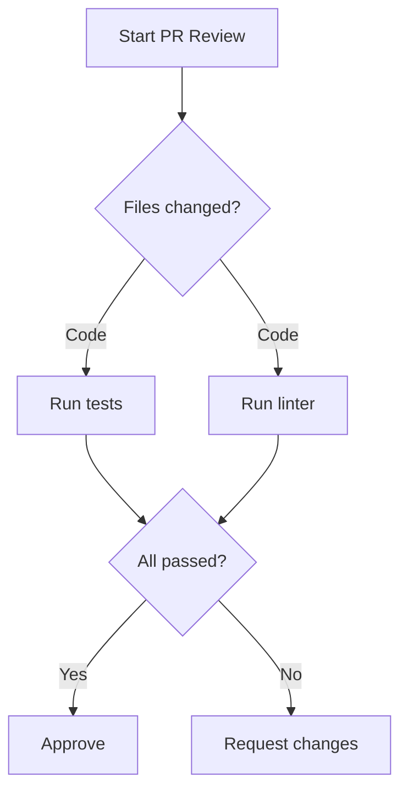

# Prompt Optimization for Claude 4.5

  

Optimize CLAUDE.md files and Skills for Claude Code CLI using Anthropic's official prompt engineering best practices. Transform negative instructions into positive patterns, increase specificity, and apply Claude 4.5-specific optimizations.

## Features

- **Positive Framing**: Convert prohibitions (NEVER, DON'T, FORBIDDEN) into actionable positive instructions
- **Specificity Enhancement**: Replace vague quality instructions with concrete, measurable standards
- **Contextual Motivation**: Add "Reason:" annotations to explain WHY instructions matter
- **Claude 4.5 Optimizations**: Apply model-specific improvements for direct action language, parallel tool usage, and concise communication
- **Skill File Optimization**: Improve skill descriptions, tool restrictions, and progressive disclosure
- **Compression Techniques**: Reduce token usage while preserving clarity and compliance
- **Verification Checklist**: Ensure technical terms are verified against official documentation

## Installation

### Prerequisites

- Claude Code CLI version 2.1 or later
- Git (for cloning plugin repositories)

### Install Plugin

#### Method 1: From GitHub (Recommended)

```bash
# Add the marketplace (if not already added)
/plugin marketplace add Jamie-BitFlight/claude_skills

# Install the plugin
/plugin install prompt-optimization-claude-45@claude_skills
```

#### Method 2: Manual Installation

```bash
# Clone the repository
git clone https://github.com/Jamie-BitFlight/claude_skills.git

# Link the plugin
cd claude_skills
./install.py

# Or manually link
ln -sf $(pwd)/plugins/prompt-optimization-claude-45 ~/.claude/plugins/prompt-optimization-claude-45
cc plugin reload
```

## Quick Start

Activate the skill when working with prompt engineering tasks:

```
@prompt-optimization-claude-45
Review my CLAUDE.md file and suggest improvements
```

Or simply ask Claude to optimize your prompts:

```
Optimize this SKILL.md file using Claude 4.5 best practices
```

Claude will automatically invoke the skill when it detects prompt engineering tasks.

## Usage

### When the Skill Activates

The skill automatically activates when you:

- Review or create CLAUDE.md files
- Optimize Skill files (SKILL.md)
- Improve system prompts for Claude Code
- Transform negative instructions into positive patterns
- Compress verbose documentation
- Verify technical terminology

### Core Optimization Principles

#### 1. Positive Framing Over Prohibitions

**Problem**: Models attend to key nouns/concepts. "NEVER use cat" still activates "use cat".

**Solution**:

| Instead of | Write |
|------------|-------|
| "Never use X" | "Use Y instead [because reason]" |
| "Don't include X" | "Include only Y" |
| "Avoid X" | "Prefer Y" |
| "X is forbidden" | "Use Y for this operation" |

#### 2. Specificity Over Vagueness

**Problem**: Vague instructions produce inconsistent results.

**Solution**:

| Vague | Specific |
|-------|----------|
| "Format code properly" | "Use 2-space indentation for all code" |
| "Write good commit messages" | "Use conventional commits: `type(scope): description`" |
| "Handle errors correctly" | "Catch exceptions only when you have a specific recovery action" |

#### 3. Provide Context and Motivation

**Problem**: Instructions without motivation lead to brittle compliance.

**Solution**: Add brief "Reason:" annotations

```markdown
## Python Environment
Use `uv run` for all Python execution.
**Reason**: Manages virtual environments and dependencies automatically.
```

#### 4. Claude 4.5-Specific Optimizations

- **Direct Action Language**: "Make these changes" not "Can you suggest changes?"
- **Parallel Tool Usage**: Structure instructions to enable simultaneous operations
- **Concise Communication**: Lead with findings, skip unnecessary summaries

### Examples

#### Example 1: Transform Prohibition List

**Before (Anti-Pattern)**:

```markdown
## FORBIDDEN ACTIONS
❌ NEVER use bare python commands
❌ NEVER use cat, head, tail, sed, awk
❌ NEVER state timelines or estimates
```

**After (Optimized)**:

```markdown
## Tool Selection
| Operation | Tool | Reason |
|-----------|------|--------|
| Run Python | `Bash(uv run ...)` | Manages venv and dependencies |
| Read files | `Read()` | Handles encoding and large files |
| Search files | `Grep()` | Structured matches with context |

## Communication Style
- Lead with observations and findings
- State facts directly
- Acknowledge dependencies when uncertain about duration
```

#### Example 2: Add Concrete Examples

**Before (Vague)**:

```markdown
Write good code and handle errors properly.
```

**After (Specific with Examples)**:

```markdown
## Error Handling
Catch exceptions only when you have a specific recovery action.
Let all other errors propagate to surface issues early.

<example>
# Good: specific recovery action
try:
    return db.query(User, id)
except ConnectionError:
    return cache.get(f"user:{id}")

# Good: let errors propagate
def process(data):
    return transform(data)  # Errors surface naturally
</example>
```

#### Example 3: Skill Description Optimization

**Before (Weak)**:

```yaml
---
name: code-helper
description: Helps with code
---
```

**After (Strong)**:

```yaml
---
name: code-reviewer
description: Review code for best practices, security issues, and potential bugs. Use when reviewing PRs, analyzing code quality, checking implementations before merge, or when user mentions code review.
---
```

## Advanced Features

### Compression Techniques

Reduce token usage while preserving clarity:

| Verbose Pattern | Compressed Form |
|-----------------|-----------------|
| "You might want to" | Direct imperative |
| "Consider doing X when Y" | "IF Y THEN X" |
| "It's important to remember" | "CONSTRAINT:" |
| "For example, when X happens" | "IF X THEN [action]" |

### Structural Templates

For simple protocols (<50 lines):

```text
## [Protocol Name]

TRIGGER: [When this applies]

PROCEDURE:
1. [Action]
2. [Action]
3. [Action]

CONSTRAINTS:
- [Required behavior]
- [Required behavior]

OUTPUT: [Expected deliverable]
```

### Mermaid Diagrams for Complex Flows

For workflows with parallel execution and conditions:



## Verification Checklist

After optimization, verify:

- [ ] Prohibition markers (NEVER, DON'T, FORBIDDEN, ❌) are used only with explicit absolute examples
- [ ] Each instruction states what TO do
- [ ] Key behaviors have motivations (Reason:)
- [ ] Complex behaviors have 2-3 examples
- [ ] Instructions grouped under descriptive headings
- [ ] Critical behaviors appear early
- [ ] Specific over vague ("2-space indent" not "format properly")
- [ ] Action language is direct ("Make changes" not "Consider making")
- [ ] Technical terms are verified against official documentation

## Reference Documentation

The skill includes comprehensive reference materials:

- **Claude 4.5 Features**: Latest improvements in Opus 4.5, Sonnet 4.5, and Haiku 4.5
- **Context Windows**: Understanding context management and token budgets

Access references by asking Claude:

```
What are the key features of Claude 4.5?
How do context windows work with extended thinking?
```

## Claude 4.5 Highlights

### Sonnet 4.5
- Best coding model with SWE-bench Verified performance
- Extended autonomous operation (works independently for hours)
- Context awareness with token usage tracking
- Enhanced parallel tool usage
- Concise, direct communication style

### Opus 4.5
- Maximum intelligence with practical performance
- Effort parameter for controlling response thoroughness
- Computer use excellence with zoom capability
- Thinking block preservation across conversations

### Haiku 4.5
- Near-frontier intelligence at blazing speed
- First Haiku model with extended thinking
- Context awareness
- 2x faster than Sonnet 4 at 1/3 the cost

## Length Targets

| Document Type | Target |
|---------------|--------|
| Single-purpose protocol | <50 lines |
| Agent task instructions | <100 lines |
| Complex workflow | <200 lines |
| Full CLAUDE.md | <500 lines |

## Troubleshooting

### Common Issues

**Issue**: Prohibition markers still present after optimization

**Solution**: Review the transformation patterns table. Convert each prohibition into a positive instruction with motivation.

**Issue**: Instructions are too vague

**Solution**: Add concrete examples and specific measurements. Replace quality terms with quantifiable standards.

**Issue**: Technical terms seem incorrect

**Solution**: Verify terminology against official documentation. Use `Grep()` or `WebSearch()` to confirm tool names and syntax.

**Issue**: Documentation is too verbose

**Solution**: Apply compression techniques. Use structural templates, remove redundant restatements, strip meta-commentary.

## Sources

This skill is based on Anthropic's official prompt engineering best practices:

- [Be clear and direct](https://platform.claude.com/docs/en/build-with-claude/prompt-engineering/be-clear-and-direct.md)
- [Use examples (multishot prompting)](https://platform.claude.com/docs/en/build-with-claude/prompt-engineering/multishot-prompting.md)
- [Use XML tags to structure prompts](https://platform.claude.com/docs/en/build-with-claude/prompt-engineering/use-xml-tags.md)
- [Chain of thought prompting](https://platform.claude.com/docs/en/build-with-claude/prompt-engineering/chain-of-thought.md)
- [Long context tips](https://platform.claude.com/docs/en/build-with-claude/prompt-engineering/long-context-tips.md)
- [Extended thinking tips](https://platform.claude.com/docs/en/build-with-claude/prompt-engineering/extended-thinking-tips.md)
- [What's new in Claude 4.5](https://platform.claude.com/docs/en/about-claude/models/whats-new-claude-4-5.md)
- [Claude Code: Agent Skills](https://code.claude.com/docs/en/skills.md)
- [Anthropic blog: Prompt engineering best practices](https://www.anthropic.com/blog/best-practices-for-prompt-engineering)

## Contributing

Contributions are welcome! To contribute:

1. Fork the repository
2. Create a feature branch
3. Make your changes following the optimization principles
4. Test your changes with Claude Code CLI
5. Submit a pull request

## License

MIT

## Credits

Created by Jamie-BitFlight

Based on Anthropic's official prompt engineering documentation and best practices for Claude 4.5 models.
