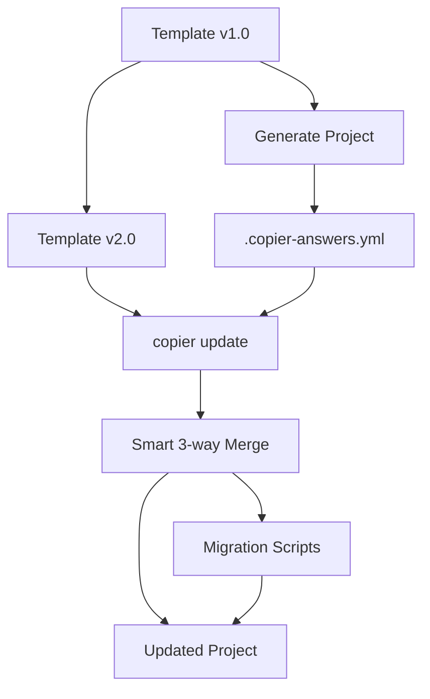

# Copier: Project Template Renderer with Update Capabilities

## Executive Summary

**What problem does it solve?** Copier solves the problem of project scaffolding AND ongoing template synchronization. Unlike most templating tools that are one-way generators, Copier enables **code lifecycle management** - you can update existing projects when the template evolves, not just generate new projects.

**Core value proposition:**

- Generate projects from templates (scaffolding)
- **Update projects when templates change** (unique feature)
- Version-aware migrations during updates
- Works with local paths and Git URLs
- Preserves customizations during updates

**When you'd be "reinventing the wheel" without it:**

- Maintaining multiple similar projects that need to stay in sync with best practices
- Rolling out security updates or dependency changes across many projects
- Applying organizational standards to existing codebases
- Managing project boilerplate that evolves over time

## Official Information

- **Repository**: @<https://github.com/copier-org/copier>
- **PyPI Package**: `copier` (current: v9.10.3)
- **Documentation**: @<https://copier.readthedocs.io/>
- **License**: MIT
- **Maintenance**: Active development, 2,880+ stars
- **Original Author**: jpsca (Juan-Pablo Scaletti)
- **Current Maintainers**: yajo, pawamoy, sisp, and community

## Installation

```bash
# As CLI tool (recommended)
pipx install copier
# or with uv
uv tool install copier

# As library
pip install copier

# With conda
conda install -c conda-forge copier

# Nix (100% reproducible)
nix profile install 'https://flakehub.com/f/copier-org/copier/*.tar.gz'

# Homebrew (macOS/Linux)
brew install copier
```

**Requirements:**

- Python 3.9 or newer
- Git 2.27 or newer (for template versioning and updates)

## Python Version Compatibility

| Python Version | Support Status       | Notes                                          |
| -------------- | -------------------- | ---------------------------------------------- |
| 3.9 - 3.12     | ✅ Full support      | Production ready                               |
| 3.13           | ✅ Supported         | v9.10.2+ built with Python 3.13.7              |
| 3.14           | ⚠️ Likely compatible | Not explicitly tested, but backward-compatible |
| < 3.9          | ❌ Not supported     | Use older Copier versions                      |

_Source: @<https://github.com/copier-org/copier/blob/master/pyproject.toml> (classifiers section)_

## Core Purpose: When to Use Copier

### Primary Use Cases

1. **Project Scaffolding with Future Updates**

   - Generate new projects from templates
   - Apply template updates to existing projects
   - Track which template version each project uses

2. **Multi-Project Standardization**

   - Maintain consistency across microservices
   - Roll out organization-wide best practices
   - Synchronize CI/CD configurations

3. **Living Templates**

   - Templates that evolve with ecosystem changes
   - Security patches propagated to all projects
   - Dependency updates across project families

4. **Template Versioning**
   - Use Git tags to version templates
   - Selective updates to specific versions
   - Smart diff between template versions

### Copier vs Cookiecutter vs Yeoman

**Use Copier when:**

- ✅ You need to update projects after generation
- ✅ You manage multiple similar projects
- ✅ Your template evolves frequently
- ✅ You want migration scripts during updates
- ✅ You prefer YAML over JSON configuration

**Use Cookiecutter when:**

- ✅ You only need one-time generation
- ✅ You want the largest template ecosystem
- ✅ You need maximum stability (mature project)
- ✅ Template updates aren't important

**Use Yeoman when:**

- ✅ You're in the Node.js ecosystem
- ✅ You want NPM package distribution
- ✅ You need JavaScript-based logic

| Feature                  | Copier                  | Cookiecutter           | Yeoman      |
| ------------------------ | ----------------------- | ---------------------- | ----------- |
| **Template Updates**     | ✅ Yes                  | ❌ No (requires Cruft) | ❌ No       |
| **Migrations**           | ✅ Yes                  | ❌ No                  | ❌ No       |
| **Config Format**        | YAML                    | JSON                   | JavaScript  |
| **Templating**           | Jinja2                  | Jinja2                 | EJS         |
| **Programming Required** | ❌ No                   | ❌ No                  | ✅ Yes (JS) |
| **Template Suffix**      | `.jinja` (configurable) | None                   | You choose  |
| **File Name Templating** | ✅ Yes                  | ✅ Yes                 | ✅ Yes      |
| **Ecosystem Size**       | Medium                  | Large                  | Large       |
| **Maturity**             | Active                  | Mature                 | Mature      |

_Source: @<https://github.com/copier-org/copier/blob/master/docs/comparisons.md>_

## Real-World Examples

### 1. FastAPI Full-Stack Template

**Repository**: @<https://github.com/fastapi/full-stack-fastapi-template> (38,000+ stars)

```bash
# Generate a new FastAPI project
pipx run copier copy https://github.com/fastapi/full-stack-fastapi-template my-project --trust
```

**Features demonstrated:**

- Multi-service Docker setup
- PostgreSQL integration
- React frontend scaffolding
- Environment variable templating
- Post-generation tasks

**Template snippet** (@<https://github.com/fastapi/full-stack-fastapi-template/blob/main/copier.yml>):

```yaml
project_name:
  type: str
  help: The name of the project
  default: FastAPI Project

secret_key:
  type: str
  help: |
    The secret key for the project, generate with:
    python -c "import secrets; print(secrets.token_urlsafe(32))"
  default: changethis

_tasks:
  - ["{{ _copier_python }}", .copier/update_dotenv.py]
```

### 2. Modern Python Package Template (copier-uv)

**Repository**: @<https://github.com/pawamoy/copier-uv> (108 stars)

```bash
# Create a uv-managed Python package
copier copy gh:pawamoy/copier-uv /path/to/project
```

**Features demonstrated:**

- uv package manager integration
- Jinja extensions (custom filters)
- Git integration (auto-detect author)
- License selection (20+ options)
- Multi-file configuration includes

**Advanced configuration** (@<https://github.com/pawamoy/copier-uv/blob/main/copier.yml>):

```yaml
_min_copier_version: "9"
_jinja_extensions:
  - copier_template_extensions.TemplateExtensionLoader
  - extensions.py:CurrentYearExtension
  - extensions.py:GitExtension
  - extensions.py:SlugifyExtension

author_fullname:
  type: str
  help: Your full name
  default: "{{ 'Default Name' | git_user_name }}"

repository_name:
  type: str
  default: "{{ project_name | slugify }}"
```

### 3. NLeSC Scientific Python Template

**Repository**: @<https://github.com/NLeSC/python-template> (223 stars)

**Features demonstrated:**

- Modular configuration (YAML includes)
- Profile-based generation
- Research software best practices
- Citation files (CITATION.cff)

**Modular structure** (@<https://github.com/NLeSC/python-template/blob/main/copier.yml>):

```yaml
# Include pattern for maintainability
!include copier/settings.yml !include copier/profiles.yml !include copier/questions/essential.yml !include copier/questions/features_code_quality.yml !include copier/questions/features_documentation.yml
```

### 4. JupyterLab Extension Template

**Repository**: @<https://github.com/jupyterlab/extension-template> (77 stars)

```bash
pip install "copier~=9.2" jinja2-time
copier copy --trust https://github.com/jupyterlab/extension-template .
```

### 5. Odoo/Doodba Template

**Repository**: @<https://github.com/Tecnativa/doodba-copier-template> (104 stars)

- Complex multi-container applications
- Multiple answer files for different template layers

## Integration Patterns

### Git Integration

**Template versioning with Git tags:**

```bash
# Copy specific version
copier copy --vcs-ref=v1.2.0 gh:org/template /path/to/project

# Copy latest release (default)
copier copy gh:org/template /path/to/project

# Copy from HEAD (including uncommitted changes)
copier copy --vcs-ref=HEAD ./template /path/to/project
```

**Update to latest template version:**

```bash
cd /path/to/project
copier update  # Reads .copier-answers.yml automatically
```

**Update to specific version:**

```bash
copier update --vcs-ref=v2.0.0
```

### Template Updates Workflow

The **killer feature** that distinguishes Copier:



**The update process:**

1. Copier clones template at old version (from `.copier-answers.yml`)
2. Regenerates project with old template
3. Compares to current project (detects your changes)
4. Clones template at new version
5. Generates with new template
6. Creates 3-way merge between: old template → your project ← new template
7. Runs migration tasks for version transitions

**Example migration** (from Copier docs):

```yaml
# copier.yml
_migrations:
  - version: v2.0.0
    command: rm ./old-folder
    when: "{{ _stage == 'before' }}"
  - invoke migrate $VERSION_FROM $VERSION_TO
```

### CI/CD Integration

**GitHub Actions example:**

```yaml
name: Update from template
on:
  schedule:
    - cron: "0 0 * * 0" # Weekly
  workflow_dispatch:

jobs:
  update:
    runs-on: ubuntu-latest
    steps:
      - uses: actions/checkout@v4
      - uses: astral-sh/setup-uv@v5
      - run: uv tool install copier
      - run: copier update --defaults --vcs-ref=HEAD
      - run: |
          git config user.name "Bot"
          git config user.email "bot@example.com"
          git checkout -b update-template
          git add -A
          git commit -m "Update from template"
          git push origin update-template
      - uses: peter-evans/create-pull-request@v5
```

### Multiple Templates per Project

Apply different templates to different aspects:

```bash
# Base framework
copier copy -a .copier-answers.main.yml \
  gh:example/framework-template .

# Pre-commit config
copier copy -a .copier-answers.pre-commit.yml \
  gh:my-org/pre-commit-template .

# Internal CI
copier copy -a .copier-answers.ci.yml \
  git@gitlab.internal.com:templates/ci .
```

Each gets its own answers file, enabling independent updates:

```bash
copier update -a .copier-answers.main.yml
copier update -a .copier-answers.pre-commit.yml
copier update -a .copier-answers.ci.yml
```

## Usage Examples

### Basic Template Creation

**Minimal template structure:**

```text
my_template/
├── copier.yml              # Template configuration
├── .git/                   # Git repo (for versioning)
├── {{project_name}}/       # Templated folder name
│   └── {{module_name}}.py.jinja  # Templated file
└── {{_copier_conf.answers_file}}.jinja  # Answers file
```

**copier.yml** (question definitions):

```yaml
project_name:
  type: str
  help: What is your project name?

module_name:
  type: str
  help: What is your Python module name?
  default: "{{ project_name | lower | replace('-', '_') }}"

python_version:
  type: str
  help: Minimum Python version
  default: "3.9"
  choices:
    - "3.9"
    - "3.10"
    - "3.11"
    - "3.12"
    - "3.13"
```

**Templated Python file** (`{{project_name}}/{{module_name}}.py.jinja`):

```python
"""{{ project_name }} - A Python package."""

__version__ = "0.1.0"

def hello() -> str:
    """Return a greeting."""
    return "Hello from {{ module_name }}!"
```

**Answers file template** (`{{_copier_conf.answers_file}}.jinja`):

```yaml
# Changes here will be overwritten by Copier
{ { _copier_answers | to_nice_yaml - } }
```

### Generating a Project

**From local template:**

```bash
copier copy /path/to/template /path/to/destination
```

**From Git URL:**

```bash
copier copy https://github.com/org/template /path/to/destination
# or shorthand
copier copy gh:org/template /path/to/destination
copier copy gl:org/template /path/to/destination  # GitLab
```

**With pre-answered questions:**

```bash
copier copy \
  --data project_name="My Project" \
  --data module_name="my_project" \
  gh:org/template /path/to/destination
```

**From data file:**

```bash
# answers.yml
project_name: My Project
module_name: my_project
python_version: "3.11"

# Use it
copier copy --data-file answers.yml gh:org/template /path/to/destination
```

### Programmatic Usage

```python
from copier import run_copy, run_update

# Generate new project
run_copy(
    "https://github.com/org/template.git",
    "/path/to/destination",
    data={"project_name": "My Project"},
    vcs_ref="v1.0.0",  # Specific version
)

# Update existing project
run_update(
    "/path/to/destination",
    vcs_ref="v2.0.0",  # Update to v2.0.0
    skip_answered=True,  # Don't re-ask answered questions
)
```

### Advanced Template Features

**Conditional file generation:**

```yaml
# copier.yml
use_docker:
  type: bool
  help: Include Docker support?
  default: true
```

**File/folder structure:**

```text
template/
  Dockerfile.jinja
  docker-compose.yml.jinja
```

**Dynamic choices:**

```yaml
language:
  type: str
  choices:
    - python
    - javascript

package_manager:
  type: str
  help: Which package manager?
  choices: |
    
    - pip
    - uv
    - poetry
    
    - npm
    - yarn
    - pnpm
    
```

**File exclusion:**

```yaml
_exclude:
  - "*.pyc"
  - __pycache__
  - .git
  - .venv
  - "docker-*"
```

**Post-generation tasks:**

```yaml
_tasks:
  - git init
  - git add -A
  - git commit -m "Initial commit from template"
  - ["{{ _copier_python }}", -m pip install -e .]
```

**Jinja2 extensions:**

```yaml
_jinja_extensions:
  - copier_templates_extensions.TemplateExtensionLoader
  - jinja2_time.TimeExtension
# Install with:
# pipx inject copier copier-templates-extensions jinja2-time
```

### Updating Projects

**Update to latest version:**

```bash
cd /path/to/project
copier update
```

**Update with conflict resolution:**

```bash
# Inline conflicts (default)
copier update --conflict=inline

# .rej files (like patch)
copier update --conflict=rej
```

**Re-answer questions:**

```bash
# Re-answer all questions
copier update --vcs-ref=:current:

# Skip previously answered
copier update --skip-answered
```

**Update without interactive prompts:**

```bash
# Use defaults/existing answers
copier update --defaults

# Override specific values
copier update --data python_version="3.12"
```

## When NOT to Use Copier

### Simple File Copying

❌ **Don't use Copier for:**

```bash
# Just copy static files
cp -r template_dir new_project
```

✅ **Use basic tools instead:**

- `cp` for simple directory copying
- `rsync` for file synchronization
- Git clone for exact repository copies

### One-Time Generation Without Updates

If you never plan to update from the template:

- Cookiecutter has larger ecosystem
- Yeoman for Node.js projects
- Manual copying might suffice

### Complex Conditional Logic

❌ **Not ideal for:**

- Heavy business logic in templates
- Complex data transformations
- Runtime configuration (use proper config libraries)

✅ **Use instead:**

- Python scripts for complex logic
- Dedicated config management (Dynaconf, python-decouple)
- Application frameworks (Django, FastAPI built-in scaffolding)

### Single Project Maintenance

If you only maintain one project:

- Template overhead isn't justified
- Direct edits are simpler
- No synchronization benefits

### Non-Text Files

Copier focuses on text file templating:

- Binary files copied as-is
- No image/binary manipulation
- No archive extraction

### Version Control Conflicts

⚠️ **Be cautious when:**

- Project has diverged significantly from template
- Many conflicting changes expected
- Team unfamiliar with 3-way merge resolution

**Mitigation:**

- Test updates in separate branch
- Use `--conflict=rej` for manual review
- Document update procedures

## Decision Matrix

### Use Copier When

| Scenario                           | Why Copier?                                                  |
| ---------------------------------- | ------------------------------------------------------------ |
| Managing 5+ similar microservices  | Templates sync security patches across all services          |
| Organizational standards evolving  | Roll out changes without manual edits to each project        |
| Onboarding new projects frequently | Consistent structure + ability to improve template over time |
| Template still experimental        | Iterate template, update existing projects with improvements |
| CI/CD pipeline standardization     | Update all projects when pipeline requirements change        |
| Multi-repo architecture            | Maintain consistency without monorepo complexity             |

### Don't Use Copier When

| Scenario                                    | Why Not?                     | Alternative                           |
| ------------------------------------------- | ---------------------------- | ------------------------------------- |
| Single project, no similar projects planned | Overhead > benefit           | Direct editing                        |
| Template is 100% stable forever             | Update feature unused        | Cookiecutter (larger ecosystem)       |
| Heavy runtime configuration needed          | Wrong tool for job           | Dynaconf, Pydantic Settings           |
| Binary file manipulation required           | Not designed for this        | Pillow, custom scripts                |
| Project has deviated >50% from template     | Merge conflicts overwhelming | Manual migration                      |
| No Git repository for template              | Can't track versions         | Use Git or accept one-shot generation |

### Copier vs Cookiecutter Decision Tree

```text
Do you need to update projects after generation?
├─ YES → Use Copier
│   └─ Need version-aware migrations?
│       ├─ YES → Definitely Copier
│       └─ NO → Still Copier (future-proofing)
│
└─ NO → Consider factors:
    ├─ Prefer YAML config? → Copier
    ├─ Want larger template ecosystem? → Cookiecutter
    ├─ Need maximum stability? → Cookiecutter
    └─ Might need updates later? → Copier (easier to start with)
```

## Best Practices

### Template Design

1. **Version your templates** - Use Git tags (v1.0.0, v2.0.0)
2. **Keep templates focused** - One concern per template
3. **Provide good defaults** - Minimize required answers
4. **Document migrations** - Explain breaking changes
5. **Test template updates** - Generate project, modify, update

### Project Maintenance

1. **Commit `.copier-answers.yml`** - Essential for updates
2. **Don't edit generated markers** - Copier overwrites them
3. **Test updates in branches** - Merge after verification
4. **Run migrations carefully** - Review before executing
5. **Document deviations** - Note why you diverge from template

### Organization Adoption

1. **Start with one template** - Prove value before expanding
2. **Automate update checks** - CI job for template freshness
3. **Train on merge conflicts** - 3-way merges need understanding
4. **Maintain template changelog** - Help consumers understand changes
5. **Version template conservatively** - Breaking changes = major version

## Common Gotchas

1. **Answers file location matters** - Must be committed and at project root
2. **Template suffix required by default** - Files need `.jinja` unless configured otherwise
3. **Git required for updates** - Template must be Git repository with tags
4. **Jinja syntax in YAML** - Must quote templated values properly
5. **Task execution order** - Tasks run sequentially, not in parallel
6. **Conflict resolution** - Learn 3-way merge basics before first update

## Performance Considerations

- **Generation speed**: Fast for typical projects (<1s for small templates)
- **Update speed**: Depends on project size and Git history
- **Memory usage**: Minimal, dominated by Git operations
- **Caching**: Template cloning cached by Git

## Related Tools

- **cruft** - Adds update capability to Cookiecutter templates
- **cookiecutter** - Popular Python templating (one-way generation)
- **yeoman** - Node.js ecosystem scaffolding
- **copier-templates-extensions** - Additional Jinja filters for Copier
- **jinja2-time** - Time-based Jinja filters

## Learning Resources

- Official docs: @<https://copier.readthedocs.io/>
- Template browser: @<https://github.com/topics/copier-template>
- Comparisons: @<https://github.com/copier-org/copier/blob/master/docs/comparisons.md>
- Example templates: See "Real-World Examples" section above

## Summary

**Copier is the best choice when:**

- You maintain multiple related projects
- Your templates evolve over time
- You need to propagate changes to existing projects
- You want version-aware template management
- You prefer declarative YAML configuration

**Copier's unique selling point:** The ability to update existing projects when templates change, with intelligent 3-way merging and version-aware migrations.

**Quick start for evaluation:**

```bash
# Install
pipx install copier

# Try popular template
copier copy gh:pawamoy/copier-uv test-project

# Make changes to project, then simulate update
cd test-project
# Edit some files...
copier update --defaults --vcs-ref=HEAD
```

---

**Research completed**: 2025-10-21 **Sources verified**: Official repository, PyPI, documentation, real-world templates **Template examples analyzed**: 5 major templates (FastAPI, copier-uv, NLeSC, JupyterLab, Doodba)
