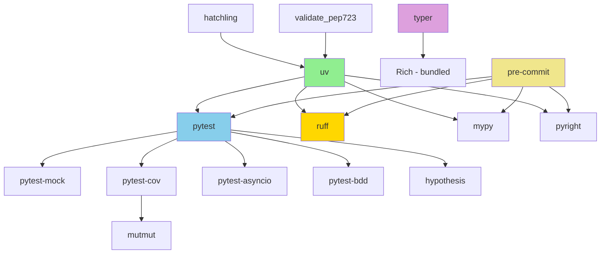

# Tool and Library Registry

Comprehensive catalog of development tools, testing frameworks, CLI libraries, data processing utilities, and MCP tools for modern Python 3.11+ development.

**Coverage**: 50+ tools across 10 categories **Sources**: Pattern extraction analysis, taxonomy organization, 13 agent discovery reports **User Requirements**: datasette, arrow, fabric, shiv, httpx, prefect, boltons, blinker, paho-mqtt, robotframework, copier, pytest, prospector, pre-commit, mypy, bandit, ruff, uv, hatchling

---

## 1. Tool Categories Overview

### Category Matrix

| Category | Tool Count | Mandatory Tools | Optional Tools | Use Cases |
| --- | --- | --- | --- | --- |
| Development Tools | 8 | uv, ruff, mypy, pyright | prospector, bandit | Package management, linting, type checking |
| Testing Tools | 9 | pytest, pytest-mock, pytest-cov | hypothesis, mutmut, robotframework | Unit tests, BDD, mutation testing |
| CLI Frameworks | 4 | typer, argparse | textual, click | Human-facing CLIs, portable scripts, TUIs |
| Data Libraries | 5 | - | datasette, arrow, httpx, requests | Data exploration, time handling, HTTP clients |
| Workflow Tools | 4 | - | prefect, fabric, copier, invoke | Orchestration, automation, templating |
| IoT/Messaging | 2 | - | paho-mqtt, blinker | MQTT messaging, signals/events |
| Build Tools | 4 | uv | hatchling, shiv, pip-tools | Package building, executable creation |
| Quality Tools | 4 | pre-commit, ruff | prospector, bandit | Code quality gates, security scanning |
| Utility Libraries | 3 | - | boltons, pydantic, structlog | General utilities, validation, logging |
| MCP Tools | 8 | - | context7, ref, exa, github | Documentation lookup, code search, reasoning |

---

## 2. Development Tools

### 2.1 uv (Package Manager & Script Executor)

```yaml
tool_name: uv
category: development
python_versions: [3.11, 3.12, 3.13, 3.14]
installation: "curl -LsSf https://astral.sh/uv/install.sh | sh"
purpose: "Modern Python package manager and PEP 723 script executor"
mandatory: true
scenarios:
  - All Python development
  - PEP 723 script execution
  - Package installation
  - Virtual environment management
alternatives:
  - pip + pip-tools + virtualenv (legacy, NOT recommended)
  - poetry (different approach, heavier)
  - pdm (alternative modern tool)
```

**When to Use**:

- MANDATORY for PEP 723 scripts (shebang requirement)
- Primary package manager for all projects
- Replaces pip, pip-tools, virtualenv, pipx

**Basic Usage**:

```bash
# Install packages
uv add requests pydantic

# Add development dependencies
uv add --dev pytest mypy ruff

# Run PEP 723 script
uv run --script script.py

# Create virtual environment
uv venv

# Sync dependencies from pyproject.toml
uv sync
```

**Integration with Other Tools**:

- Works with pyproject.toml for dependency management
- Executes PEP 723 scripts via shebang
- Compatible with pre-commit hooks
- Faster than pip for all operations

**Configuration**:

```toml
# pyproject.toml - Minimal dependency declaration example
# NOTE: Replace ALL {{template_variables}} with actual values before creating file
[project]
name = "{{project_name_from_directory_or_git_remote}}"
version = "{{version_from_git_tag_or_default_0_1_0}}"
dependencies = [
    "typer>=0.19.2",
    "pydantic>=2.0.0",
]

[project.optional-dependencies]
dev = [
    "pytest>=8.0.0",
    "mypy>=1.11.0",
    "ruff>=0.6.0",
]

[tool.hatchling.build.targets.wheel]
packages = ["packages/{{package_name_from_project_name}}"]
```

**Related Standards**:

- PEP 723 (inline script metadata)
- PEP 621 (project metadata)
- Pattern: All Python agents require uv

**Source**: pattern-extraction.md Section 3.1, all discovery reports

---

### 2.2 ruff (Linting & Formatting)

```yaml
tool_name: ruff
category: development
python_versions: [3.11, 3.12, 3.13, 3.14]
installation: "uv add --dev ruff"
purpose: "Extremely fast Python linter and formatter replacing flake8, black, isort"
mandatory: true
scenarios:
  - All Python code validation
  - Pre-commit hooks
  - CI/CD pipelines
  - Linting error investigation
alternatives:
  - flake8 + black + isort (legacy, slower)
  - pylint (comprehensive but slower)
  - prospector (multi-tool wrapper)
```

**When to Use**:

- MANDATORY for all Python code before delivery
- Layer 2 of validation pipeline
- Pre-commit hook integration
- CI/CD quality gates

**Basic Usage**:

```bash
# Check code
uv run ruff check .

# Fix auto-fixable issues
uv run ruff check --fix .

# Format code
uv run ruff format .

# Get rule documentation
ruff rule ANN201

# Check specific files (rare - usually run on .)
uv run ruff check path/to/file.py
```

**Integration with Other Tools**:

- Pre-commit: Automatic linting on git commits
- Linting-root-cause-resolver: Uses `ruff rule {CODE}` for investigation
- Mypy/Pyright: Complementary type checking
- pytest: Can check test code

**Configuration**:

```toml
# pyproject.toml
[tool.ruff]
target-version = "py311"
fix = true
unsafe-fixes = true
src = ["packages", "scripts", "tests", "typings", ".gitlab", ".github"]

[tool.ruff.format]
docstring-code-format = true
quote-style = "double"
line-ending = "lf"
skip-magic-trailing-comma = true
preview = true

[tool.ruff.lint]
preview = true
extend-select = [
    "A",     # see: https://docs.astral.sh/ruff/rules/#flake8-builtins-a
    "ANN",   # see: https://docs.astral.sh/ruff/rules/#flake8-annotations-ann
    "ASYNC", # see: https://docs.astral.sh/ruff/rules/#flake8-async-async
    "B",     # see: https://docs.astral.sh/ruff/rules/#flake8-bugbear-b
    "BLE",   # see: https://docs.astral.sh/ruff/rules/#flake8-blind-except-ble
    "C4",    # see: https://docs.astral.sh/ruff/rules/#flake8-comprehensions-c4
    "C90",   # see: https://docs.astral.sh/ruff/rules/#mccabe-c90
    "D",     # see: https://docs.astral.sh/ruff/rules/#pydocstyle-d
    "DOC",   # see: https://docs.astral.sh/ruff/rules/#pydoclint-doc
    "E",     # see: https://docs.astral.sh/ruff/rules/#error-e
    "EXE",   # see: https://docs.astral.sh/ruff/rules/#flake8-executable-exe
    "F",     # see: https://docs.astral.sh/ruff/rules/#pyflakes-f
    "FA",    # see: https://docs.astral.sh/ruff/rules/#flake8-annotations-fa
    "FAST",  # see: https://docs.astral.sh/ruff/rules/#fastapi-fast
    "FLY",   # see: https://docs.astral.sh/ruff/rules/#flynt-fly
    "FURB",  # see: https://docs.astral.sh/ruff/rules/#refurb-furb
    "G201",  # see: https://docs.astral.sh/ruff/rules/logging-exc-info/
    "G202",  # see: https://docs.astral.sh/ruff/rules/logging-redundant-exc-info/
    "I",     # see: https://docs.astral.sh/ruff/rules/#isort-i
    "N",     # see: https://docs.astral.sh/ruff/rules/#flake8-quotes-n
    "PERF",  # see: https://docs.astral.sh/ruff/rules/#perflint-perf
    "PGH",   # see: https://docs.astral.sh/ruff/rules/#pygrep-hooks-pgh
    "PIE",   # see: https://docs.astral.sh/ruff/rules/#flake8-pie-pie
    "PL",    # see: https://docs.astral.sh/ruff/rules/#pyflakes-f
    "PT",    # see: https://docs.astral.sh/ruff/rules/#flake8-pytest-style-pt
    "PTH",   # see: https://docs.astral.sh/ruff/rules/#flake8-use-pathlib-pth
    "PYI",   # see: https://docs.astral.sh/ruff/rules/#flake8-pyi-pyi
    "Q",     # see: https://docs.astral.sh/ruff/rules/#flake8-quotes-q
    "RET",   # see: https://docs.astral.sh/ruff/rules/#flake8-return-ret
    "RSE",   # see: https://docs.astral.sh/ruff/rules/#flake8-raise-rse
    "RUF",   # see: https://docs.astral.sh/ruff/rules/#ruff-ruf
    "S",     # see: https://docs.astral.sh/ruff/rules/#flake8-bandit-s
    "SIM",   # see: https://docs.astral.sh/ruff/rules/#flake8-simplify-sim
    "SLF",   # see: https://docs.astral.sh/ruff/rules/#flake8-self-slf
    "SLOT",  # see: https://docs.astral.sh/ruff/rules/#flake8-slots-slot
    "T10",   # see: https://docs.astral.sh/ruff/rules/#flake8-debugger-t10
    "T20",   # see: https://docs.astral.sh/ruff/rules/#flake8-typing-t20
    "TC",    # see: https://docs.astral.sh/ruff/rules/#flake8-type-checking-tc
    "TRY",   # see: https://docs.astral.sh/ruff/rules/#tryceratops-try
    "UP",    # see: https://docs.astral.sh/ruff/rules/#pyupgrade-up
    "W",     # see: https://docs.astral.sh/ruff/rules/#warning-w
    "YTT",   # see: https://docs.astral.sh/ruff/rules/#flake8-2020-ytt
]
ignore = [
    "DOC501", # Raised exception {id} missing from docstring
    "DOC502", # Raised exception is not explicitly raised
    "E501",   # Line too long ({width} > {limit})
    "EXE003", # Shebang should contain python, pytest, or uv run (doesn't handle global arguments)
    "S404",   # subprocess possibly insecure - still need to use subprocess though
    "S603",   # subprocess without shell=True
    "TRY003", # Long error messages are fine
]
unfixable = ["F401"]

[tool.ruff.lint.per-file-ignores]
"tests/**" = ["S", "D", "E501"]
"typings/**" = ["N", "ANN", "A"]
".gitlab/scripts/**" = [
    "T201", # print() statements are intentional for CI output visibility
]

[tool.ruff.lint.pycodestyle]
max-line-length = 120

[tool.ruff.lint.isort]
combine-as-imports = true
split-on-trailing-comma = false
force-single-line = false
force-wrap-aliases = false

[tool.ruff.lint.flake8-quotes]
docstring-quotes = "double"

[tool.ruff.lint.pydocstyle]
convention = "google"

[tool.ruff.lint.mccabe]
max-complexity = 12
```

**Common Patterns**:

```python
# REQUIRED: No legacy typing imports
# ruff will flag: from typing import List, Dict, Optional

# REQUIRED: Use native generics
def process(items: list[str]) -> dict[str, int]:  # ✓
    pass

# FORBIDDEN: Legacy typing
from typing import List, Dict
def process(items: List[str]) -> Dict[str, int]:  # ✗
    pass
```

**Related Standards**:

- NEVER suppress with # noqa comments
- Use linting-root-cause-resolver for root cause fixes
- ANN\* rules enforce type annotations
- PYI\* rules for stub files

**Source**: pattern-extraction.md Section 3.1, linting-root-cause-resolver-analysis.md

---

### 2.3 mypy (Static Type Checker)

```yaml
tool_name: mypy
category: development
python_versions: [3.11, 3.12, 3.13, 3.14]
installation: "uv add --dev mypy"
purpose: "Static type checker for Python with strict mode enforcement"
mandatory: true
scenarios:
  - All Python code type validation
  - Layer 3 of validation pipeline
  - CI/CD type safety gates
  - Pre-commit hooks
alternatives:
  - pyright (Microsoft, also recommended)
  - pyre (Facebook, less common)
```

**When to Use**:

- MANDATORY for all Python code
- Layer 3 of validation pipeline (after ruff)
- Use `--strict` mode exclusively
- Run before pyright for additional checks

**Basic Usage**:

```bash
# Check with strict mode
uv run mypy --strict .

# Generate HTML report
uv run mypy --html-report mypy-report .
```

**Integration with Other Tools**:

- Ruff: Complementary linting
- Pyright: Run both for comprehensive checking
- pytest: Type-check test code
- Pre-commit: Automatic type checking

**Configuration**:

```toml
# pyproject.toml
[tool.mypy]
python_version = "3.11"
strict = true
extra_checks = true
warn_unused_configs = true
warn_redundant_casts = true
warn_unused_ignores = true
ignore_missing_imports = true
show_error_codes = true
pretty = true
disable_error_code = ["call-arg", "misc"]
mypy_path = ["packages", "scripts", "."]

[[tool.mypy.overrides]]
module = ["test.*", "tests.*"]
disable_error_code = ["attr-defined", "call-arg", "var-annotated"]
```

**Common Patterns**:

```python
# REQUIRED: Complete type annotations
def authenticate_user(username: str, password: str) -> AuthResult:
    """Authenticate user credentials."""
    pass

# REQUIRED: Generator fixtures with full typing
from typing import Generator
from pytest import fixture

@fixture
def database_connection() -> Generator[Connection, None, None]:
    """Provide database connection."""
    conn = connect_to_db()
    yield conn
    conn.close()

# REQUIRED: Modern union syntax
def get_user(user_id: int) -> User | None:  # ✓
    pass

# FORBIDDEN: Legacy Optional
from typing import Optional
def get_user(user_id: int) -> Optional[User]:  # ✗
    pass
```

**Related Standards**:

- Python 3.11+ native generics required
- Strict mode is MANDATORY
- All functions must have return type annotations
- Pattern: Run mypy before pyright

**Source**: pattern-extraction.md Section 1.2, taxonomy.md Section 6.1

---

### 2.4 pyright (Static Type Checker)

```yaml
tool_name: pyright
category: development
python_versions: [3.11, 3.12, 3.13, 3.14]
installation: "uv add --dev pyright"
purpose: "Microsoft's static type checker with strict mode"
mandatory: true
scenarios:
  - All Python code type validation
  - Layer 3 of validation pipeline (with mypy)
  - VS Code integration
  - CI/CD type safety gates
alternatives:
  - mypy (also recommended, run both)
```

**When to Use**:

- MANDATORY for all Python code
- Run after mypy for comprehensive coverage
- Use strict mode exclusively
- Complements mypy with different checks

**Basic Usage**:

```bash
# Check with strict mode (prefer basedpyright for CI native reports)
uv run basedpyright .

# Or standard pyright
uv run pyright .
```

**Integration with Other Tools**:

- VS Code: Built-in Pylance extension uses pyright
- basedpyright: Fork with native CI output formats (GitLab, GitHub)
- Mypy: Run both for best coverage
- Ruff: Complementary linting
- Pre-commit: Automatic type checking

**Configuration** (pyproject.toml - basedpyright):

```toml
# pyproject.toml
[tool.basedpyright]
pythonVersion = "3.11"
typeCheckingMode = "basic"
reportMissingImports = false
reportMissingTypeStubs = false
reportUnnecessaryTypeIgnoreComment = "error"
reportPrivateImportUsage = false
include = ["packages", "scripts"]
extraPaths = ["packages", "scripts", "tests"]
ignore = ["**/typings", "**/tests"]
venvPath = "."
venv = ".venv"
```

**Related Standards**:

- Use strict mode only
- Complements mypy checks
- Pattern: mypy then pyright in validation pipeline

**Source**: pattern-extraction.md Section 1.2, taxonomy.md Section 6.4

---

### 2.5 pre-commit (Git Hooks)

```yaml
tool_name: pre-commit
category: development
python_versions: [3.11, 3.12, 3.13, 3.14]
installation: "uv add --dev pre-commit"
purpose: "Git hook framework for running quality checks before commits"
mandatory: true
scenarios:
  - All Python projects
  - Layer 6 integration validation
  - CI/CD pre-flight checks
  - Team quality enforcement
alternatives:
  - Manual script execution (NOT recommended)
  - Custom git hooks (harder to maintain)
```

**When to Use**:

- MANDATORY for all Python projects
- Layer 6 of validation pipeline
- Install hooks: `pre-commit install`
- Run before commits: `pre-commit run --files <files>`

**Basic Usage**:

```bash
# Install hooks
uv run pre-commit install

# Run on staged files (preferred - scoped operation)
uv run pre-commit run

# Run on specific files (scoped operation)
uv run pre-commit run --files path/to/file.py

# Update hook versions
uv run pre-commit autoupdate
```

**Important**: Always scope operations to changed files using `pre-commit run` (staged files) or `--files <paths>`. Avoid `--all-files` unless explicitly requested by user, as it formats unrelated code causing diff pollution and merge conflicts.

**Integration with Other Tools**:

- Ruff: Automatic linting and formatting
- Mypy: Type checking before commit
- Pyright: Additional type checks
- pytest: Run tests before commit

**Configuration**:

```yaml
# .pre-commit-config.yaml
repos:
  - repo: https://github.com/astral-sh/ruff-pre-commit
    rev: v0.6.0
    hooks:
      - id: ruff
        args: [--fix]
      - id: ruff-format

  - repo: https://github.com/pre-commit/mirrors-mypy
    rev: v1.11.0
    hooks:
      - id: mypy
        args: [--strict]
        additional_dependencies:
          - types-requests
          - pydantic

  - repo: local
    hooks:
      - id: basedpyright
        name: basedpyright
        entry: uv run basedpyright
        language: system
        types: [python]
        pass_filenames: false

      - id: pytest-check
        name: pytest
        entry: uv run pytest
        language: system
        pass_filenames: false
        always_run: true
```

**Common Patterns**:

```bash
# Standard workflow
git add file.py
uv run pre-commit run --files file.py  # Run checks
git commit -m "Add feature"  # Auto-runs hooks

# Fix issues on specific files
uv run pre-commit run --files file.py other.py
```

**Note**: Hooks run automatically on staged files during commit. Manual invocation is typically only needed for verification before staging. Avoid `--all-files` to prevent formatting code outside your current branch.

**Related Standards**:

- MUST pass all hooks before commit
- NEVER skip hooks without justification
- Pattern: Automated quality enforcement

**Source**: pattern-extraction.md Section 3.5, taxonomy.md Section 6.4

---

### 2.6 prospector (Multi-Tool Linter)

```yaml
tool_name: prospector
category: development
python_versions: [3.11, 3.12, 3.13, 3.14]
installation: "uv add --dev prospector[with_everything]"
purpose: "Multi-tool wrapper combining pylint, pep8, pyflakes, mccabe, and more"
mandatory: false
scenarios:
  - Comprehensive code analysis
  - Legacy codebase auditing
  - Security scanning
  - Complexity analysis
alternatives:
  - ruff + mypy + bandit (recommended modern stack)
  - Individual tools separately
```

**When to Use**:

- Optional for comprehensive analysis
- Legacy code evaluation
- NOT recommended as primary linter (use ruff)
- Useful for one-off deep analysis

**Basic Usage**:

```bash
# Run all checks
prospector

# With specific tools
prospector --with-tool bandit --with-tool mccabe

# Output to file
prospector --output-format json > report.json

# Strictness levels
prospector --strictness high
```

**Integration with Other Tools**:

- Combines: pylint, pep8, pyflakes, mccabe, dodgy, pep257, vulture
- Can run bandit for security
- Ruff replaces most prospector functionality

**Configuration**:

```yaml
# .prospector.yaml
strictness: high
test-warnings: true
doc-warnings: true

pylint:
  run: true
  disable:
    - too-few-public-methods

pep8:
  run: true
  max-line-length: 100

mccabe:
  run: true
  max-complexity: 10

bandit:
  run: true
```

**Comparison with ruff**:

- Ruff: Faster, modern, single tool
- Prospector: Comprehensive, slower, multiple tools
- Recommendation: Use ruff + mypy + bandit instead

**Source**: User requirements list

---

### 2.7 bandit (Security Scanner)

```yaml
tool_name: bandit
category: development
python_versions: [3.11, 3.12, 3.13, 3.14]
installation: "uv add --dev bandit"
purpose: "Security-focused static analysis tool for Python"
mandatory: false
scenarios:
  - Security-critical code
  - Compliance requirements (HIPAA, PCI-DSS, GDPR)
  - Pre-production security audits
  - CI/CD security gates
alternatives:
  - ruff (has some security rules via flake8-bandit)
  - semgrep (broader security scanning)
```

**When to Use**:

- MANDATORY for security-critical code
- Recommended for all production code
- CI/CD security scanning
- Compliance requirement validation

**Basic Usage**:

```bash
# Scan directory
bandit -r packages/

# Skip specific tests
bandit -r packages/ -s B101,B601

# Output formats
bandit -r packages/ -f json -o report.json
bandit -r packages/ -f html -o report.html

# Severity levels
bandit -r packages/ -ll  # Low confidence + Low severity
```

**Integration with Other Tools**:

- Ruff: Some overlap with flake8-bandit rules
- Pre-commit: Security scanning before commit
- CI/CD: Fail pipeline on high-severity issues

**Configuration**:

```yaml
# .bandit
tests:
  - B201 # flask_debug_true
  - B301 # pickle
  - B302 # marshal
  - B303 # md5
  - B304 # ciphers
  - B305 # cipher_modes
  - B306 # mktemp_q
  - B307 # eval
  - B308 # mark_safe
  - B309 # httpsconnection
  - B310 # urllib_urlopen
  - B311 # random
  - B312 # telnetlib
  - B313 # xml_bad_cElementTree
  - B314 # xml_bad_ElementTree
  - B315 # xml_bad_expatreader
  - B316 # xml_bad_expatbuilder
  - B317 # xml_bad_sax
  - B318 # xml_bad_minidom
  - B319 # xml_bad_pulldom
  - B320 # xml_bad_etree
  - B321 # ftplib
  - B323 # unverified_context
  - B324 # hashlib_new_insecure_functions
  - B325 # tempnam
  - B401 # import_telnetlib
  - B402 # import_ftplib
  - B403 # import_pickle
  - B404 # import_subprocess
  - B405 # import_xml_etree
  - B406 # import_xml_sax
  - B407 # import_xml_expat
  - B408 # import_xml_minidom
  - B409 # import_xml_pulldom
  - B410 # import_lxml
  - B411 # import_xmlrpclib
  - B412 # import_httpoxy
  - B501 # request_with_no_cert_validation
  - B502 # ssl_with_bad_version
  - B503 # ssl_with_bad_defaults
  - B504 # ssl_with_no_version
  - B505 # weak_cryptographic_key
  - B506 # yaml_load
  - B507 # ssh_no_host_key_verification
  - B601 # paramiko_calls
  - B602 # shell_true
  - B603 # subprocess_without_shell_equals_true
  - B604 # any_other_function_with_shell_equals_true
  - B605 # start_process_with_a_shell
  - B606 # start_process_with_no_shell
  - B607 # start_process_with_partial_path
  - B608 # hardcoded_sql_expressions
  - B609 # wildcard_injection

exclude_dirs:
  - /tests/
  - /venv/
```

**Common Patterns**:

```python
# AVOID: Hardcoded passwords
password = "secret123"  # B105

# PREFER: Environment variables
import os
password = os.getenv("DB_PASSWORD")

# AVOID: Shell injection
subprocess.run(f"ls {user_input}", shell=True)  # B602

# PREFER: Parameterized commands
subprocess.run(["ls", user_input], shell=False)

# AVOID: Insecure random
import random
token = random.randint(0, 1000000)  # B311

# PREFER: Cryptographically secure random
import secrets
token = secrets.token_hex(16)
```

**Related Standards**:

- MANDATORY for payment processing
- MANDATORY for authentication code
- MANDATORY for data validation
- Pattern: Security-first development

**Source**: User requirements list, pattern-extraction.md Section 4

---

## 3. Testing Tools

### 3.1 pytest (Test Framework)

```yaml
tool_name: pytest
category: testing
python_versions: [3.11, 3.12, 3.13, 3.14]
installation: "uv add --dev pytest"
purpose: "Modern Python testing framework with fixtures and plugins"
mandatory: true
scenarios:
  - All Python testing
  - Unit tests
  - Integration tests
  - E2E tests
  - API testing
alternatives:
  - unittest (stdlib, NOT recommended)
  - nose2 (deprecated)
```

**When to Use**:

- MANDATORY for all Python testing
- NEVER use unittest
- Layer 4 of validation pipeline
- Minimum 80% code coverage required

**Basic Usage**:

```bash
# Run all tests (coverage via pyproject.toml config)
uv run pytest

# Verbose output
uv run pytest -v

# Run specific test file
uv run pytest tests/test_auth.py

# Run specific test function
uv run pytest tests/test_auth.py::test_login

# Run tests matching pattern
uv run pytest -k "auth"

# Show print statements
uv run pytest -s

# Stop on first failure
uv run pytest -x

# Show local variables on failure
uv run pytest -l

# Run last failed tests
uv run pytest --lf

# Run failed tests first
uv run pytest --ff
```

**Integration with Other Tools**:

- pytest-cov: Coverage reporting
- pytest-mock: Mocking (MANDATORY)
- pytest-asyncio: Async test support
- pytest-bdd: BDD/Gherkin tests
- hypothesis: Property-based testing
- mutmut: Mutation testing

**Configuration**:

```toml
# pyproject.toml
[tool.pytest.ini_options]
testpaths = ["tests"]
python_files = ["test_*.py"]
python_classes = ["Test*"]
python_functions = ["test_*"]
addopts = [
    "-v",
    "--strict-markers",
    "--strict-config",
    "--cov=packages",
    "--cov-report=term-missing",
    "--cov-report=html",
    "--cov-fail-under=80",
]
markers = [
    "slow: marks tests as slow (deselect with '-m \"not slow\"')",
    "integration: marks tests as integration tests",
    "unit: marks tests as unit tests",
]
```

**Common Patterns**:

```python
# REQUIRED: AAA pattern (Arrange-Act-Assert)
def test_user_authentication() -> None:
    """Test user authentication with valid credentials.

    Tests: Authentication system
    How: Create user, attempt login, verify token
    Why: Core security validation
    """
    # Arrange
    user = create_test_user("test@example.com", "Pass123!")

    # Act
    response = authenticate(user.email, "Pass123!")

    # Assert
    assert response.success
    assert response.token is not None
    assert response.expires_at > datetime.now()

# REQUIRED: Type annotations
def test_data_processing(tmp_path: Path) -> None:
    """Test data processing with temporary files."""
    pass

# REQUIRED: Comprehensive docstrings
def test_edge_case_handling() -> None:
    """Test handling of empty input data.

    Tests: Data validation module
    How: Pass empty list, verify graceful handling
    Why: Prevent runtime errors on edge cases
    """
    result = process_data([])
    assert result.success is False
    assert "empty" in result.error.lower()
```

**Related Standards**:

- MANDATORY 80% coverage minimum
- AAA pattern required
- Type hints on all test functions
- Comprehensive docstrings
- Pattern: pytest-architect creates tests

**Source**: pattern-extraction.md Section 1.3, pytest-architect-analysis.md

---

### 3.2 pytest-mock (Mocking Framework)

```yaml
tool_name: pytest-mock
category: testing
python_versions: [3.11, 3.12, 3.13, 3.14]
installation: "uv add --dev pytest-mock"
purpose: "Thin wrapper around unittest.mock providing pytest fixtures"
mandatory: true
scenarios:
  - All mocking in tests
  - External service mocking
  - Database mocking
  - API client mocking
alternatives:
  - unittest.mock (FORBIDDEN - never use directly)
```

**When to Use**:

- MANDATORY for all mocking
- NEVER use unittest.mock directly
- Use `mocker: MockerFixture` parameter
- Replaces @patch decorators

**Basic Usage**:

```python
from pytest_mock import MockerFixture

def test_external_api(mocker: MockerFixture) -> None:
    """Test external API integration with mock."""
    # Mock external service
    mock_response = mocker.Mock()
    mock_response.status_code = 200
    mock_response.json.return_value = {"status": "ok"}

    mock_get = mocker.patch("requests.get", return_value=mock_response)

    # Test code that uses requests.get
    result = fetch_data("https://api.example.com")

    # Verify
    assert result["status"] == "ok"
    mock_get.assert_called_once_with("https://api.example.com")

def test_database_operations(mocker: MockerFixture) -> None:
    """Test database operations with mocked connection."""
    # Mock database connection
    mock_conn = mocker.Mock()
    mock_cursor = mocker.Mock()
    mock_conn.cursor.return_value = mock_cursor
    mock_cursor.fetchall.return_value = [("user1",), ("user2",)]

    mocker.patch("psycopg2.connect", return_value=mock_conn)

    # Test
    users = get_all_users()

    # Verify
    assert users == ["user1", "user2"]
    mock_conn.cursor.assert_called_once()
```

**Integration with Other Tools**:

- pytest: Provides MockerFixture
- Type checkers: Full type hint support
- Fixtures: Can be used in fixture composition

**Common Patterns**:

```python
# REQUIRED: Use mocker parameter
def test_with_mock(mocker: MockerFixture) -> None:  # ✓
    mock = mocker.patch("module.function")

# FORBIDDEN: Direct unittest.mock import
from unittest.mock import patch  # ✗
@patch("module.function")
def test_with_patch(mock):
    pass

# REQUIRED: mocker.Mock() not Mock()
def test_mock_object(mocker: MockerFixture) -> None:
    mock_obj = mocker.Mock()  # ✓
    mock_obj.method.return_value = 42

# REQUIRED: mocker.spy() for partial mocking
def test_spy_on_method(mocker: MockerFixture) -> None:
    obj = MyClass()
    spy = mocker.spy(obj, "method")
    obj.method("arg")
    spy.assert_called_once_with("arg")
```

**Related Standards**:

- NEVER import from unittest.mock
- ALWAYS use mocker parameter
- Type hint as MockerFixture
- Pattern: pytest-architect enforces this

**Source**: pattern-extraction.md Section 2.2, pytest-architect-analysis.md

---

### 3.3 pytest-cov (Coverage Reporting)

```yaml
tool_name: pytest-cov
category: testing
python_versions: [3.11, 3.12, 3.13, 3.14]
installation: "uv add --dev pytest-cov"
purpose: "Coverage.py plugin for pytest with comprehensive reporting"
mandatory: true
scenarios:
  - All Python testing
  - Coverage measurement
  - CI/CD quality gates
  - Coverage-driven development
alternatives:
  - coverage.py (pytest-cov wraps this)
```

**When to Use**:

- MANDATORY for all Python projects
- Minimum 80% coverage required
- Critical code: 95%+ coverage required
- Layer 4 validation with pytest

**Basic Usage**:

Coverage is configured in `pyproject.toml` - no CLI flags needed:

```bash
# Run tests with coverage (config-driven)
uv run pytest
```

**Integration with Other Tools**:

- pytest: Native plugin integration
- CI/CD: Generate reports for pipeline
- Coverage.py: Underlying engine
- Mutation testing: Complements mutmut

**Configuration** (MANDATORY - coverage in config, not CLI):

```toml
# pyproject.toml
[tool.pytest.ini_options]
addopts = [
    "--cov=packages",
    "--cov-report=term-missing",
    "--cov-report=html:htmlcov",
    "--cov-fail-under=80",
]

[tool.coverage.run]
source = ["packages"]
omit = [
    "*/tests/*",
    "*/test_*.py",
    "*/__init__.py",
]
branch = true

[tool.coverage.report]
fail_under = 80
show_missing = true
skip_covered = false
exclude_lines = [
    "pragma: no cover",
    "def __repr__",
    "raise AssertionError",
    "raise NotImplementedError",
    "if __name__ == .__main__.:",
    "if TYPE_CHECKING:",
    "@abstractmethod",
    "@overload",
]

[tool.coverage.html]
directory = "htmlcov"
```

**Coverage Standards**:

```python
# General code: 80% minimum
# Critical code: 95%+ required

# Coverage excludes
def __repr__(self) -> str:  # pragma: no cover
    """String representation."""
    return f"User({self.name})"

# Type checking blocks
if TYPE_CHECKING:  # pragma: no cover
    from .models import User

# Abstract methods
@abstractmethod
def process(self) -> None:  # pragma: no cover
    """Process data."""
```

**Related Standards**:

- MANDATORY 80% general code
- MANDATORY 95%+ critical code
- Pattern: Testing pyramid distribution
- Source: Coverage gates in validation pipeline

**Source**: pattern-extraction.md Section 1.3, taxonomy.md Section 6.2

---

### 3.4 hypothesis (Property-Based Testing)

```yaml
tool_name: hypothesis
category: testing
python_versions: [3.11, 3.12, 3.13, 3.14]
installation: "uv add --dev hypothesis"
purpose: "Property-based testing framework for generating test cases"
mandatory: false
scenarios:
  - Data validation testing
  - Algorithm correctness
  - Edge case discovery
  - Fuzzing inputs
alternatives:
  - Manual parametrization (less comprehensive)
```

**When to Use**:

- RECOMMENDED for all projects
- ESPECIALLY emphasized in pytest-architect
- Data validation and sanitization
- Complex algorithm testing
- Discovering edge cases

**Basic Usage**:

```python
from hypothesis import given, strategies as st

@given(st.integers())
def test_absolute_value_always_positive(n: int) -> None:
    """Test that absolute value is always positive."""
    assert abs(n) >= 0

@given(st.lists(st.integers()))
def test_reverse_twice_is_identity(lst: list[int]) -> None:
    """Test that reversing twice returns original list."""
    assert list(reversed(list(reversed(lst)))) == lst

@given(st.text(min_size=1, max_size=100))
def test_email_validation(email_input: str) -> None:
    """Test email validation with various inputs."""
    result = validate_email(email_input)
    # Property: valid emails have @ symbol
    if result.is_valid:
        assert "@" in email_input
```

**Integration with Other Tools**:

- pytest: Native integration
- pytest-cov: Coverage of generated cases
- Type hints: Strategy inference

**Advanced Patterns**:

```python
from hypothesis import given, strategies as st, assume
from datetime import date, timedelta

# Custom strategies
email_strategy = st.builds(
    lambda name, domain: f"{name}@{domain}",
    name=st.text(min_size=1, max_size=20, alphabet=st.characters(whitelist_categories=("Ll", "Nd"))),
    domain=st.sampled_from(["example.com", "test.org", "demo.net"])
)

@given(email_strategy)
def test_email_domain_validation(email: str) -> None:
    """Test email domain validation."""
    result = validate_email_domain(email)
    assert result.domain in ["example.com", "test.org", "demo.net"]

# Composite strategies
@st.composite
def date_range(draw):
    """Generate valid date range."""
    start = draw(st.dates())
    days = draw(st.integers(min_value=1, max_value=365))
    end = start + timedelta(days=days)
    return (start, end)

@given(date_range())
def test_date_range_processing(dates: tuple[date, date]) -> None:
    """Test date range processing."""
    start, end = dates
    assert start <= end
```

**Configuration**:

```toml
# pyproject.toml
[tool.pytest.ini_options]
markers = [
    "hypothesis: property-based tests using hypothesis",
]

# Add hypothesis profile
[tool.hypothesis]
max_examples = 100
derandomize = true
```

**Related Standards**:

- Emphasized in pytest-architect
- Recommended for data validation
- Pattern: Property-based testing

**Source**: pytest-architect-analysis.md Section 4.1

---

### 3.5 mutmut (Mutation Testing)

```yaml
tool_name: mutmut
category: testing
python_versions: [3.11, 3.12, 3.13, 3.14]
installation: "uv add --dev mutmut"
purpose: "Mutation testing tool to verify test suite quality"
mandatory: false
scenarios:
  - Critical business logic
  - Payment processing
  - Authentication/authorization
  - Security-critical code
  - Compliance code (HIPAA, PCI-DSS, GDPR)
alternatives:
  - cosmic-ray (alternative mutation tester)
```

**When to Use**:

- MANDATORY for critical code:
  - Payment processing
  - Authentication/authorization
  - Security-critical code
  - Data validation and sanitization
  - Regulatory compliance code
  - Complex algorithms
  - Core libraries
- Target: 100% mutation score (kill all mutants)

**Basic Usage**:

```bash
# Run mutation testing
mutmut run

# Show results
mutmut results

# Show specific mutant
mutmut show 1

# Apply specific mutant (for debugging)
mutmut apply 1

# Run tests after applying mutant
pytest

# Revert mutant
mutmut apply --revert

# Run on specific paths
mutmut run --paths-to-mutate=packages/auth/
```

**Integration with Other Tools**:

- pytest: Uses pytest to run tests
- Coverage: Complements code coverage
- CI/CD: Critical code quality gate

**Configuration**:

```toml
# setup.cfg or pyproject.toml
[mutmut]
paths_to_mutate = packages/
backup = false
runner = pytest
tests_dir = tests/
```

**Common Patterns**:

```python
# Example: Payment processing (MANDATORY mutation testing)
def calculate_total(items: list[Item], tax_rate: float) -> Decimal:
    """Calculate order total with tax.

    CRITICAL: Payment processing - mutation tested.
    """
    subtotal = sum(item.price * item.quantity for item in items)
    tax = subtotal * Decimal(str(tax_rate))
    total = subtotal + tax
    return total.quantize(Decimal("0.01"))

# Tests MUST kill all mutants:
# - Operator changes (+ to -, * to /)
# - Number changes (tax_rate to 0, to 1)
# - Decimal precision changes
# - Boundary conditions

def test_calculate_total_normal() -> None:
    """Test normal calculation."""
    items = [Item(price=Decimal("10.00"), quantity=2)]
    total = calculate_total(items, 0.08)
    assert total == Decimal("21.60")  # 20.00 + 1.60 tax

def test_calculate_total_zero_tax() -> None:
    """Test with zero tax rate."""
    items = [Item(price=Decimal("10.00"), quantity=1)]
    total = calculate_total(items, 0.0)
    assert total == Decimal("10.00")

def test_calculate_total_precision() -> None:
    """Test decimal precision handling."""
    items = [Item(price=Decimal("10.99"), quantity=1)]
    total = calculate_total(items, 0.08)
    assert total == Decimal("11.87")  # Rounds correctly
```

**Mutation Score Interpretation**:

- 100%: All mutants killed (perfect)
- 90-99%: Excellent test coverage
- 80-89%: Good, some gaps
- <80%: Insufficient testing for critical code

**Related Standards**:

- MANDATORY for critical code
- Target: 100% mutation score
- Pattern: Complements code coverage

**Source**: pattern-extraction.md Section 2.7, pytest-architect-analysis.md

---

### 3.6 robotframework (Acceptance Testing)

```yaml
tool_name: robotframework
category: testing
python_versions: [3.11, 3.12, 3.13, 3.14]
installation: "uv add --dev robotframework"
purpose: "Keyword-driven acceptance testing framework"
mandatory: false
scenarios:
  - BDD acceptance tests
  - E2E testing
  - Non-technical stakeholder tests
  - Keyword-driven testing
alternatives:
  - pytest-bdd (Python-native BDD)
  - behave (Gherkin-based BDD)
```

**When to Use**:

- Optional for acceptance testing
- E2E test scenarios
- Non-technical stakeholder involvement
- Keyword-driven test approach

**Basic Usage**:

```bash
# Run tests
robot tests/

# Run specific test file
robot tests/login.robot

# Run with tags
robot --include smoke tests/

# Generate reports
robot --outputdir reports tests/
```

**Example Test**:

```robotframework
*** Settings ***
Library           SeleniumLibrary

*** Variables ***
${URL}            https://example.com
${BROWSER}        Chrome

*** Test Cases ***
User Can Login With Valid Credentials
    [Documentation]    Test successful login flow
    [Tags]    smoke    login
    Open Browser    ${URL}    ${BROWSER}
    Input Text      id:username    testuser
    Input Text      id:password    TestPass123!
    Click Button    id:login
    Page Should Contain    Welcome, testuser
    [Teardown]    Close Browser
```

**Integration with Other Tools**:

- pytest: Can run alongside pytest
- Selenium: Web automation
- CI/CD: Generate XML reports

**Related Standards**:

- Alternative to pytest-bdd
- Pattern: Acceptance testing layer

**Source**: User requirements list

---

### 3.7 pytest-asyncio (Async Testing)

```yaml
tool_name: pytest-asyncio
category: testing
python_versions: [3.11, 3.12, 3.13, 3.14]
installation: "uv add --dev pytest-asyncio"
purpose: "Pytest support for testing async code"
mandatory: false
scenarios:
  - FastAPI testing
  - Async function testing
  - Concurrent operation testing
  - AsyncIO-based applications
alternatives:
  - pytest-trio (Trio async framework)
```

**When to Use**:

- Required for async/await code testing
- FastAPI endpoint testing
- Async database operations
- Concurrent task testing

**Basic Usage**:

```python
import pytest
from httpx import AsyncClient
from app import app

@pytest.mark.asyncio
async def test_async_endpoint() -> None:
    """Test async API endpoint."""
    async with AsyncClient(app=app, base_url="http://test") as client:
        response = await client.get("/users/1")
        assert response.status_code == 200
        assert response.json()["id"] == 1

@pytest.mark.asyncio
async def test_concurrent_operations() -> None:
    """Test concurrent async operations."""
    import asyncio

    async def fetch_user(user_id: int) -> dict:
        # Simulate async operation
        await asyncio.sleep(0.1)
        return {"id": user_id}

    # Test concurrent execution
    results = await asyncio.gather(
        fetch_user(1),
        fetch_user(2),
        fetch_user(3),
    )

    assert len(results) == 3
    assert results[0]["id"] == 1
```

**Configuration**:

```toml
# pyproject.toml
[tool.pytest.ini_options]
asyncio_mode = "auto"
markers = [
    "asyncio: mark test as async",
]
```

**Related Standards**:

- Use @pytest.mark.asyncio decorator
- Type hint async functions
- Pattern: FastAPI testing

**Source**: pytest-architect-analysis.md Section 4.3

---

### 3.8 pytest-bdd (BDD Testing)

```yaml
tool_name: pytest-bdd
category: testing
python_versions: [3.11, 3.12, 3.13, 3.14]
installation: "uv add --dev pytest-bdd"
purpose: "BDD plugin for pytest using Gherkin syntax"
mandatory: false
scenarios:
  - Requirements traceability
  - Stakeholder-readable tests
  - Acceptance criteria validation
  - BDD development
alternatives:
  - robotframework (keyword-driven)
  - behave (standalone BDD)
```

**When to Use**:

- Optional for BDD approach
- Requirements traceability needed
- Non-technical stakeholder involvement
- Gherkin feature files

**Basic Usage**:

```gherkin
# features/auth.feature
Feature: User Authentication
  As a user
  I want to log in with my credentials
  So that I can access my account

  Scenario: Successful login
    Given I am on the login page
    When I enter username "testuser"
    And I enter password "TestPass123!"
    And I click the login button
    Then I should see "Welcome, testuser"
    And I should be on the dashboard page
```

```python
# tests/test_auth.py
from pytest_bdd import scenarios, given, when, then, parsers

scenarios("features/auth.feature")

@given("I am on the login page")
def login_page(browser):
    """Navigate to login page."""
    browser.get("https://example.com/login")

@when(parsers.parse('I enter username "{username}"'))
def enter_username(browser, username: str) -> None:
    """Enter username."""
    browser.find_element_by_id("username").send_keys(username)

@when(parsers.parse('I enter password "{password}"'))
def enter_password(browser, password: str) -> None:
    """Enter password."""
    browser.find_element_by_id("password").send_keys(password)

@when("I click the login button")
def click_login(browser) -> None:
    """Click login button."""
    browser.find_element_by_id("login").click()

@then(parsers.parse('I should see "{text}"'))
def should_see_text(browser, text: str) -> None:
    """Verify text is visible."""
    assert text in browser.page_source
```

**Related Standards**:

- Alternative to robotframework
- Pattern: BDD acceptance testing

**Source**: pytest-architect-analysis.md Section 4.1

---

### 3.9 pytest-benchmark (Performance Testing)

```yaml
tool_name: pytest-benchmark
category: testing
python_versions: [3.11, 3.12, 3.13, 3.14]
installation: "uv add --dev pytest-benchmark"
purpose: "Performance regression testing for pytest"
mandatory: false
scenarios:
  - Performance regression detection
  - Algorithm optimization
  - Benchmarking code changes
  - CI/CD performance gates
alternatives:
  - timeit (manual benchmarking)
  - cProfile (profiling, not benchmarking)
```

**When to Use**:

- Optional for performance-critical code
- Regression testing after optimization
- CI/CD performance monitoring
- Algorithm comparison

**Basic Usage**:

```python
def test_list_comprehension_performance(benchmark):
    """Benchmark list comprehension vs map."""
    data = range(1000)

    result = benchmark(lambda: [x * 2 for x in data])

    assert len(result) == 1000

def test_algorithm_comparison(benchmark):
    """Compare sorting algorithms."""
    import random
    data = [random.randint(0, 1000) for _ in range(1000)]

    result = benchmark(sorted, data)

    assert result == sorted(data)

# Run benchmarks
# pytest --benchmark-only
# pytest --benchmark-compare
```

**Configuration**:

```toml
# pyproject.toml
[tool.pytest.ini_options]
markers = [
    "benchmark: performance benchmarks",
]
```

**Related Standards**:

- ALWAYS profile before optimizing
- Pattern: Performance regression testing

**Source**: pytest-architect-analysis.md Section 3.5

---

## 4. CLI Frameworks

### 4.1 Typer (Human-Facing CLI)

```yaml
tool_name: typer
category: cli
python_versions: [3.11, 3.12, 3.13, 3.14]
installation: "typer>=0.19.2" # In PEP 723 dependencies
purpose: "Type-based CLI framework with Rich integration"
mandatory: true
scenarios:
  - Human-facing command-line tools
  - Interactive CLI applications
  - CLI with formatted output
  - Developer tools
alternatives:
  - argparse (stdlib, less features)
  - click (typer builds on click)
```

**When to Use**:

- MANDATORY for human-facing CLIs
- Scripts with external dependencies
- Rich terminal output needed
- Type-driven CLI design

**Basic Usage**:

```python
#!/usr/bin/env -S uv --quiet run --active --script
# /// script
# requires-python = ">=3.11"
# dependencies = [
#     "typer>=0.19.2",  # Includes Rich - do NOT add Rich separately
# ]
# ///

"""Modern CLI tool with type hints."""

from pathlib import Path
from typing import Annotated

import typer
from rich.console import Console

app = typer.Typer(rich_markup_mode="rich")
console = Console()

@app.command()
def process(
    input_file: Annotated[Path, typer.Argument(help="Input file to process")],
    output: Annotated[Path, typer.Option("--output", "-o", help="Output directory")] = Path("."),
    verbose: Annotated[bool, typer.Option("--verbose", "-v", help="Verbose output")] = False,
) -> None:
    """Process files with [bold green]style[/bold green]."""
    if verbose:
        console.print(f"[cyan]Processing[/cyan] {input_file}")

    # Processing logic
    console.print("[green]:white_check_mark:[/green] Done!")

if __name__ == "__main__":
    app()
```

**Integration with Other Tools**:

- Rich: Bundled automatically (NEVER add separately)
- PEP 723: Standard shebang pattern
- Testing: Use CliRunner from typer.testing

**Advanced Patterns**:

```python
from typing import Annotated
from enum import Enum

import typer
from rich.progress import Progress, SpinnerColumn, TextColumn

# Enum for choices
class OutputFormat(str, Enum):
    JSON = "json"
    YAML = "yaml"
    CSV = "csv"

@app.command()
def export(
    format: Annotated[OutputFormat, typer.Option(help="Output format")] = OutputFormat.JSON,
) -> None:
    """Export data in specified format."""
    console.print(f"Exporting as {format.value}")

# Progress bars
@app.command()
def download() -> None:
    """Download files with progress."""
    with Progress(
        SpinnerColumn(),
        TextColumn("[progress.description]{task.description}"),
        console=console,
    ) as progress:
        task = progress.add_task("Downloading...", total=None)
        # Download logic
        progress.update(task, completed=True)
```

**Common Mistakes**:

```python
# WRONG: Adding Rich separately
# /// script
# dependencies = [
#     "typer>=0.19.2",
#     "rich>=13.0.0",  # ✗ WRONG - Rich is included with Typer
# ]
# ///

# CORRECT: Typer only
# /// script
# dependencies = [
#     "typer>=0.19.2",  # ✓ Rich is bundled
# ]
# ///
```

**Related Standards**:

- NEVER add Rich separately
- MUST use Annotated for parameters
- MUST include rich help text
- Pattern: PEP 723 CLI template

**Source**: pattern-extraction.md Section 3.3, python-cli-architect-analysis.md

---

### 4.2 Rich (Terminal Formatting)

```yaml
tool_name: rich
category: cli
python_versions: [3.11, 3.12, 3.13, 3.14]
installation: "Bundled with Typer >=0.19.2"
purpose: "Beautiful terminal formatting and output"
mandatory: false # Bundled with Typer
scenarios:
  - Formatted CLI output
  - Progress bars
  - Tables
  - Syntax highlighting
alternatives:
  - colorama (basic colors only)
  - termcolor (basic colors only)
```

**When to Use**:

- Automatically available with Typer
- NEVER add as separate dependency when using Typer
- Direct use when NOT using Typer

**Basic Usage**:

```python
from rich import box
from rich.console import Console
from rich.table import Table
from rich.measure import Measurement

console = Console()

# Print with markup
console.print("[bold green]Success![/bold green]")
console.print(":white_check_mark: Task completed")

# Tables
table = Table(
    title=":sparkles: Results",
    box=box.MINIMAL_DOUBLE_HEAD,
    title_style="bold blue"
)
table.add_column("Name", style="cyan", no_wrap=True)
table.add_column("Status", style="magenta")
table.add_row("Task 1", "✓ Complete")

# CRITICAL: Measure and set table width
def _get_table_width(table: Table) -> int:
    """Get natural width of table using temporary wide console."""
    temp_console = Console(width=99999)
    measurement = Measurement.get(temp_console, temp_console.options, table)
    return int(measurement.maximum)

table.width = _get_table_width(table)

# Print with specific parameters to prevent wrapping
console.print(
    table,
    crop=False,
    overflow="ignore",
    no_wrap=True,
    soft_wrap=True
)
```

**Rich Components**:

```python
from rich.console import Console
from rich.table import Table
from rich.progress import Progress, SpinnerColumn, TextColumn
from rich.panel import Panel
from rich.syntax import Syntax
from rich.tree import Tree
from rich.measure import Measurement
from rich import box

# Progress bars
with Progress(
    SpinnerColumn(),
    TextColumn("[progress.description]{task.description}"),
) as progress:
    task = progress.add_task("Processing...", total=100)
    for i in range(100):
        progress.update(task, advance=1)

# Panels
console.print(Panel("Important message", title="Warning", border_style="yellow"))

# Syntax highlighting
code = '''
def hello():
    print("Hello, world!")
'''
syntax = Syntax(code, "python", theme="monokai")
console.print(syntax)

# Trees
tree = Tree("Root")
tree.add("Branch 1")
tree.add("Branch 2").add("Leaf")
console.print(tree)
```

**Integration with Other Tools**:

- Typer: Automatic integration
- Testing: Capture with StringIO
- NO_COLOR: Respect environment variable

**Table Best Practices**:

- MUST use box.MINIMAL_DOUBLE_HEAD
- MUST measure table width
- MUST set table.width to prevent wrapping
- MUST use specific print parameters

**Related Standards**:

- NEVER add separately when using Typer
- MANDATORY table width measurement
- Pattern: Rich table display

**Source**: pattern-extraction.md Section 5.1, python-cli-architect-analysis.md

---

### 4.3 argparse (Portable CLI)

```yaml
tool_name: argparse
category: cli
python_versions: [3.11, 3.12, 3.13, 3.14]
installation: "Stdlib - no installation needed"
purpose: "Standard library argument parsing for portable scripts"
mandatory: false
scenarios:
  - Stdlib-only scripts
  - Maximum portability
  - No external dependencies
  - Automation/CI scripts
alternatives:
  - typer (more features, external dependency)
  - click (more features, external dependency)
```

**When to Use**:

- Scripts with NO external dependencies
- Maximum portability required
- Automation/CI environments
- Shebang: `#!/usr/bin/env python3`

**Basic Usage**:

```python
#!/usr/bin/env python3
"""Portable script with argparse."""

import argparse
from pathlib import Path

def main() -> None:
    """Main entry point."""
    parser = argparse.ArgumentParser(
        description="Process files",
        formatter_class=argparse.RawDescriptionHelpFormatter,
    )

    parser.add_argument(
        "input",
        type=Path,
        help="Input file to process"
    )

    parser.add_argument(
        "-o", "--output",
        type=Path,
        default=Path("."),
        help="Output directory (default: current directory)"
    )

    parser.add_argument(
        "-v", "--verbose",
        action="store_true",
        help="Verbose output"
    )

    args = parser.parse_args()

    if args.verbose:
        print(f"Processing {args.input}")

    # Processing logic
    print("Done!")

if __name__ == "__main__":
    main()
```

**Advanced Patterns**:

```python
# Subcommands
import argparse

parser = argparse.ArgumentParser()
subparsers = parser.add_subparsers(dest="command", required=True)

# Add subcommand
process_parser = subparsers.add_parser("process", help="Process files")
process_parser.add_argument("input", type=Path)

list_parser = subparsers.add_parser("list", help="List files")
list_parser.add_argument("--pattern", help="File pattern")

args = parser.parse_args()

if args.command == "process":
    process_files(args.input)
elif args.command == "list":
    list_files(args.pattern)

# Mutual exclusivity
group = parser.add_mutually_exclusive_group()
group.add_argument("--json", action="store_true")
group.add_argument("--yaml", action="store_true")

# Argument groups
input_group = parser.add_argument_group("Input Options")
input_group.add_argument("--file", type=Path)
input_group.add_argument("--stdin", action="store_true")

output_group = parser.add_argument_group("Output Options")
output_group.add_argument("--output", type=Path)
output_group.add_argument("--format", choices=["json", "yaml", "csv"])
```

**Related Standards**:

- Stdlib only - no dependencies
- Shebang: `#!/usr/bin/env python3`
- Pattern: Portable script template

**Source**: pattern-extraction.md Section 2.1, taxonomy.md Section 4

---

### 4.4 Textual (Terminal UI)

```yaml
tool_name: textual
category: cli
python_versions: [3.11, 3.12, 3.13, 3.14]
installation: "uv add textual"
purpose: "Rich interactive terminal user interfaces"
mandatory: false
scenarios:
  - Full terminal UI applications
  - Interactive dashboards
  - Complex navigation
  - Real-time monitoring
alternatives:
  - curses (stdlib, lower level)
  - urwid (older TUI library)
```

**When to Use**:

- Full interactive TUI needed
- Complex layouts and navigation
- Real-time updates
- Dashboard applications

**Status**: Framework support needed (see taxonomy.md Section 5.2)

**Example** (conceptual):

```python
from textual.app import App
from textual.widgets import Header, Footer, Button

class MyApp(App):
    """Textual application."""

    def compose(self):
        """Compose UI."""
        yield Header()
        yield Button("Click me")
        yield Footer()

    def on_button_pressed(self) -> None:
        """Handle button press."""
        self.exit()

if __name__ == "__main__":
    app = MyApp()
    app.run()
```

**Related Standards**:

- Framework extension needed
- Pattern: TUI development

**Source**: taxonomy.md Section 5, user requirements list

---

## 5. Data Libraries

### 5.1 datasette (Data Exploration)

```yaml
tool_name: datasette
category: data
python_versions: [3.11, 3.12, 3.13, 3.14]
installation: "uv add datasette"
purpose: "Instant JSON API and web UI for SQLite databases"
mandatory: false
scenarios:
  - Database exploration
  - Quick data APIs
  - Data visualization
  - SQLite database serving
alternatives:
  - direct SQLite access
  - custom Flask/FastAPI apps
```

**When to Use**:

- Rapid database exploration
- Prototyping data APIs
- Sharing SQLite databases
- Data journalism

**Basic Usage**:

```bash
# Serve database
datasette mydb.db

# Serve with metadata
datasette mydb.db --metadata metadata.json

# Publish to cloud
datasette publish cloudrun mydb.db --service=my-data
```

**Related Standards**:

- User requirement
- Pattern: Data exploration tools

**Source**: User requirements list

---

### 5.2 arrow (Date/Time Handling)

```yaml
tool_name: arrow
category: data
python_versions: [3.11, 3.12, 3.13, 3.14]
installation: "uv add arrow"
purpose: "Better dates and times for Python"
mandatory: false
scenarios:
  - Human-friendly date parsing
  - Timezone handling
  - Date arithmetic
  - Date formatting
alternatives:
  - datetime (stdlib, more verbose)
  - pendulum (similar features)
  - dateutil (lower level)
```

**When to Use**:

- User-friendly date handling
- Timezone conversions
- Date range generation
- Human-readable formatting

**Basic Usage**:

```python
import arrow

# Current time
now = arrow.now()
utc = arrow.utcnow()

# Parse dates
date = arrow.get("2023-05-11")
parsed = arrow.get("2023-05-11 12:30:00", "YYYY-MM-DD HH:mm:ss")

# Timezone handling
local = arrow.now("US/Pacific")
converted = utc.to("Europe/London")

# Humanization
now = arrow.now()
hour_ago = now.shift(hours=-1)
print(hour_ago.humanize())  # "an hour ago"

# Date arithmetic
future = now.shift(days=7, hours=2)
past = now.shift(months=-1)

# Formatting
formatted = now.format("YYYY-MM-DD HH:mm:ss")
iso = now.isoformat()
```

**Related Standards**:

- User requirement
- Pattern: Time-aware scripts

**Source**: User requirements list, python-portable-script-analysis.md

---

### 5.3 httpx (Async HTTP Client)

```yaml
tool_name: httpx
category: data
python_versions: [3.11, 3.12, 3.13, 3.14]
installation: "uv add httpx"
purpose: "Modern async HTTP client with HTTP/2 support"
mandatory: false
scenarios:
  - Async API clients
  - HTTP/2 support
  - Modern async applications
  - FastAPI testing
alternatives:
  - requests (sync only, more common)
  - aiohttp (async, lower level)
```

**When to Use**:

- Async HTTP requests needed
- HTTP/2 support required
- FastAPI async testing
- Modern async applications

**Basic Usage**:

```python
import httpx

# Sync usage (like requests)
response = httpx.get("https://api.example.com/users")
data = response.json()

# Async usage
import asyncio

async def fetch_users():
    async with httpx.AsyncClient() as client:
        response = await client.get("https://api.example.com/users")
        return response.json()

users = asyncio.run(fetch_users())

# Testing FastAPI
from httpx import AsyncClient
from app import app

async def test_endpoint():
    async with AsyncClient(app=app, base_url="http://test") as client:
        response = await client.get("/users")
        assert response.status_code == 200
```

**Related Standards**:

- User requirement
- Pattern: Async HTTP client

**Source**: User requirements list

---

### 5.4 requests (HTTP Client)

```yaml
tool_name: requests
category: data
python_versions: [3.11, 3.12, 3.13, 3.14]
installation: "uv add requests"
purpose: "HTTP library for humans"
mandatory: false
scenarios:
  - Synchronous HTTP requests
  - API clients
  - Web scraping
  - Simple HTTP operations
alternatives:
  - httpx (async support, modern)
  - urllib (stdlib, lower level)
```

**When to Use**:

- Synchronous HTTP requests
- Simple API clients
- Most common HTTP library
- Well-documented patterns

**Basic Usage**:

```python
import requests

# GET request
response = requests.get("https://api.example.com/users")
users = response.json()

# POST request
data = {"name": "Alice", "email": "alice@example.com"}
response = requests.post("https://api.example.com/users", json=data)

# Headers and authentication
headers = {"Authorization": "Bearer token123"}
response = requests.get("https://api.example.com/protected", headers=headers)

# Error handling
try:
    response = requests.get("https://api.example.com/users")
    response.raise_for_status()  # Raise for 4xx/5xx
    data = response.json()
except requests.HTTPError as e:
    print(f"HTTP error: {e}")
except requests.RequestException as e:
    print(f"Request failed: {e}")
```

**Related Standards**:

- Pattern: Common in examples
- Alternative: httpx for async

**Source**: Common Python library

---

### 5.5 pydantic (Data Validation)

```yaml
tool_name: pydantic
category: data
python_versions: [3.11, 3.12, 3.13, 3.14]
installation: "uv add pydantic"
purpose: "Data validation using Python type annotations"
mandatory: false
scenarios:
  - API request/response validation
  - Configuration management
  - Data serialization
  - Type-safe data models
alternatives:
  - dataclasses (stdlib, no validation)
  - marshmallow (schema-based validation)
```

**When to Use**:

- API data validation
- Configuration management
- Type-safe data models
- JSON schema generation

**Basic Usage**:

```python
from pydantic import BaseModel, Field, validator
from datetime import datetime

class User(BaseModel):
    """User model with validation."""
    id: int
    name: str = Field(..., min_length=1, max_length=100)
    email: str
    created_at: datetime = Field(default_factory=datetime.now)
    is_active: bool = True

    @validator("email")
    def validate_email(cls, v: str) -> str:
        """Validate email format."""
        if "@" not in v:
            raise ValueError("Invalid email address")
        return v.lower()

# Usage
user = User(id=1, name="Alice", email="alice@example.com")
print(user.json())
print(user.dict())

# Validation errors
try:
    invalid_user = User(id=1, name="", email="invalid")
except ValueError as e:
    print(f"Validation error: {e}")
```

**Related Standards**:

- Pattern: FastAPI integration
- Pattern: DTO models

**Source**: Common in modern Python

---

## 6. Workflow Tools

### 6.1 prefect (Workflow Orchestration)

```yaml
tool_name: prefect
category: workflow
python_versions: [3.11, 3.12, 3.13, 3.14]
installation: "uv add prefect"
purpose: "Modern workflow orchestration platform"
mandatory: false
scenarios:
  - Data pipeline orchestration
  - Task scheduling
  - Distributed workflows
  - Workflow monitoring
alternatives:
  - airflow (older, more complex)
  - dagster (data pipeline focused)
  - celery (task queue, lower level)
```

**When to Use**:

- Complex workflow orchestration
- Data pipeline management
- Scheduled task execution
- Distributed computing

**Basic Usage**:

```python
from prefect import flow, task

@task
def extract_data(source: str) -> list:
    """Extract data from source."""
    # Extraction logic
    return data

@task
def transform_data(data: list) -> list:
    """Transform extracted data."""
    # Transformation logic
    return transformed

@task
def load_data(data: list, destination: str) -> None:
    """Load data to destination."""
    # Loading logic
    pass

@flow
def etl_pipeline(source: str, destination: str) -> None:
    """ETL pipeline flow."""
    raw_data = extract_data(source)
    clean_data = transform_data(raw_data)
    load_data(clean_data, destination)

# Run flow
if __name__ == "__main__":
    etl_pipeline("source.csv", "database")
```

**Related Standards**:

- User requirement
- Pattern: Workflow orchestration

**Source**: User requirements list

---

### 6.2 fabric (Remote Execution)

```yaml
tool_name: fabric
category: workflow
python_versions: [3.11, 3.12, 3.13, 3.14]
installation: "uv add fabric"
purpose: "High-level SSH command execution and deployment"
mandatory: false
scenarios:
  - Remote server management
  - Deployment automation
  - DevOps scripting
  - SSH task execution
alternatives:
  - paramiko (lower level SSH)
  - ansible (YAML-based automation)
  - invoke (local task execution)
```

**When to Use**:

- Remote server automation
- Deployment scripts
- DevOps workflows
- SSH-based operations

**Basic Usage**:

```python
from fabric import Connection, task

@task
def deploy(c):
    """Deploy application to server."""
    # Connect to remote server
    with Connection("user@server.com") as conn:
        # Update code
        conn.run("cd /app && git pull")

        # Install dependencies
        conn.run("cd /app && uv sync")

        # Restart service
        conn.sudo("systemctl restart myapp")

# Multiple servers
from fabric import SerialGroup

def deploy_cluster():
    """Deploy to cluster."""
    servers = SerialGroup("server1.com", "server2.com", "server3.com")
    servers.run("cd /app && git pull")
    servers.sudo("systemctl restart myapp")
```

**Related Standards**:

- User requirement
- Pattern: DevOps automation

**Source**: User requirements list, python-portable-script-analysis.md

---

### 6.3 copier (Project Templating)

```yaml
tool_name: copier
category: workflow
python_versions: [3.11, 3.12, 3.13, 3.14]
installation: "uv add copier"
purpose: "Project and file template rendering with updates"
mandatory: false
scenarios:
  - Project scaffolding
  - Template-based code generation
  - Consistent project structure
  - Template updates
alternatives:
  - cookiecutter (similar, no updates)
  - jinja2-cli (basic templating)
```

**When to Use**:

- Project scaffolding
- Consistent project structure
- Template maintenance
- Multi-project standardization

**Basic Usage**:

```bash
# Create project from template
copier copy https://github.com/org/template myproject

# Update existing project
cd myproject
copier update

# Copy with answers
copier copy --data project_name=MyApp template/ myapp/
```

**Template Example**:

```yaml
# copier.yml
_subdirectory: template

_questions:
  - name: project_name
    type: str
    help: Project name

  - name: author
    type: str
    help: Author name

  - name: python_version
    type: str
    default: "3.11"
    help: Python version

_templates_suffix: .jinja
```

**Related Standards**:

- User requirement
- Pattern: Project templates

**Source**: User requirements list

---

### 6.4 invoke (Task Execution)

```yaml
tool_name: invoke
category: workflow
python_versions: [3.11, 3.12, 3.13, 3.14]
installation: "uv add invoke"
purpose: "Python task execution tool and library"
mandatory: false
scenarios:
  - Build automation
  - Development tasks
  - Task orchestration
  - Local workflows
alternatives:
  - make (Makefile-based)
  - nox (test automation)
  - tox (test environments)
```

**When to Use**:

- Local task automation
- Development workflows
- Build scripts
- Task organization

**Basic Usage**:

```python
# tasks.py
from invoke import task

@task
def clean(c):
    """Clean build artifacts."""
    c.run("rm -rf build dist *.egg-info")

@task
def test(c):
    """Run tests."""
    c.run("pytest")

@task
def lint(c):
    """Run linters."""
    c.run("ruff check .")
    c.run("mypy .")

@task(pre=[clean, test, lint])
def build(c):
    """Build package."""
    c.run("uv build")

# Run: invoke build
```

**Related Standards**:

- Alternative to make
- Pattern: Task automation

**Source**: Common Python tool

---

## 7. IoT/Messaging

### 7.1 paho-mqtt (MQTT Client)

```yaml
tool_name: paho-mqtt
category: iot
python_versions: [3.11, 3.12, 3.13, 3.14]
installation: "uv add paho-mqtt"
purpose: "MQTT protocol client library"
mandatory: false
scenarios:
  - IoT device communication
  - Message broker integration
  - Publish-subscribe messaging
  - Real-time data streams
alternatives:
  - gmqtt (async MQTT)
  - aiomqtt (async wrapper)
```

**When to Use**:

- IoT device integration
- MQTT messaging
- Pub/sub patterns
- Real-time communication

**Basic Usage**:

```python
import paho.mqtt.client as mqtt

def on_connect(client, userdata, flags, rc):
    """Callback for connection."""
    print(f"Connected with result code {rc}")
    client.subscribe("sensors/temperature")

def on_message(client, userdata, msg):
    """Callback for messages."""
    print(f"{msg.topic}: {msg.payload.decode()}")

# Create client
client = mqtt.Client()
client.on_connect = on_connect
client.on_message = on_message

# Connect and loop
client.connect("mqtt.example.com", 1883, 60)
client.loop_forever()

# Publishing
def publish_temperature(temp: float) -> None:
    """Publish temperature reading."""
    client = mqtt.Client()
    client.connect("mqtt.example.com", 1883, 60)
    client.publish("sensors/temperature", str(temp))
    client.disconnect()
```

**Related Standards**:

- User requirement
- Pattern: IoT integration

**Source**: User requirements list

---

### 7.2 blinker (Signals/Events)

```yaml
tool_name: blinker
category: messaging
python_versions: [3.11, 3.12, 3.13, 3.14]
installation: "uv add blinker"
purpose: "Fast Python in-process signal/event system"
mandatory: false
scenarios:
  - Event-driven architecture
  - Decoupled components
  - Plugin systems
  - Observer pattern
alternatives:
  - PyPubSub (publish-subscribe)
  - custom event handlers
```

**When to Use**:

- Event-driven design
- Decoupling components
- Plugin architecture
- Observer pattern implementation

**Basic Usage**:

```python
from blinker import signal

# Define signals
user_logged_in = signal("user-logged-in")
data_processed = signal("data-processed")

# Connect handlers
@user_logged_in.connect
def on_user_login(sender, user_id):
    """Handle user login event."""
    print(f"User {user_id} logged in")

@data_processed.connect
def on_data_processed(sender, record_count):
    """Handle data processing completion."""
    print(f"Processed {record_count} records")

# Emit signals
user_logged_in.send("auth-system", user_id=123)
data_processed.send("processor", record_count=1000)

# Named receivers
def log_user_activity(sender, user_id):
    """Log user activity."""
    pass

user_logged_in.connect(log_user_activity, sender="auth-system")
```

**Related Standards**:

- User requirement
- Pattern: Event-driven systems

**Source**: User requirements list

---

## 8. Build Tools

### 8.1 hatchling (Build Backend)

```yaml
tool_name: hatchling
category: build
python_versions: [3.11, 3.12, 3.13, 3.14]
installation: "uv add hatchling"
purpose: "Modern Python build backend for packages"
mandatory: false
scenarios:
  - Package building
  - PEP 517/PEP 660 compliance
  - Modern packaging
  - PyPI publishing
alternatives:
  - setuptools (legacy)
  - poetry (different approach)
  - flit (simpler, limited)
```

**When to Use**:

- Building Python packages
- Modern build backend
- PEP 517 compliance
- PyPI publishing

**Basic Usage**:

```toml
# pyproject.toml - Complete project metadata example
# NOTE: Replace ALL {{template_variables}} with actual values before creating file
# See "Pyproject.toml Template Variable Reference" section for sourcing methods
[build-system]
requires = ["hatchling"]
build-backend = "hatchling.build"

[project]
name = "{{project_name_from_directory_or_git_remote}}"
version = "{{version_from_git_tag_or_default_0_1_0}}"
description = "{{project_description_from_user_or_readme}}"
readme = "README.md"
requires-python = ">=3.11"
license = {text = "{{license_type_from_user_or_default_MIT}}"}
authors = [
    {name = "{{author_name_from_git_config_user_name}}", email = "{{author_email_from_git_config_user_email}}"},
]
keywords = [{{project_keywords_from_user}}]
classifiers = [
    "Development Status :: {{dev_status_from_user}}",
    "Intended Audience :: {{audience_from_user}}",
    "Programming Language :: Python :: 3.11",
    "Programming Language :: Python :: 3.12",
    "Programming Language :: Python :: 3.13",
]
dependencies = [
    "typer>=0.19.2",
    "pydantic>=2.0.0",
]

[project.optional-dependencies]
dev = [
    "pytest>=8.0.0",
    "mypy>=1.11.0",
    "ruff>=0.6.0",
]

[project.scripts]
{{cli_command_name_from_user}} = "{{package_name_from_project_name}}.cli:main"

[project.urls]
Homepage = "{{repository_homepage_url_from_git_remote}}"
Repository = "{{repository_url_from_git_remote_get_url}}"
Issues = "{{repository_issues_url_from_git_remote}}"
Documentation = "{{documentation_url_from_user_or_readme}}"

[tool.hatchling.build.targets.wheel]
packages = ["packages/{{package_name_from_project_name}}"]
```

```bash
# Build package
uv build

# Outputs:
# dist/mypackage-1.0.0-py3-none-any.whl
# dist/mypackage-1.0.0.tar.gz
```

**Related Standards**:

- User requirement
- Pattern: Modern packaging

**Source**: User requirements list

---

### 8.2 shiv (Executable Builder)

```yaml
tool_name: shiv
category: build
python_versions: [3.11, 3.12, 3.13, 3.14]
installation: "uv add shiv"
purpose: "Command-line utility for building Python zip apps"
mandatory: false
scenarios:
  - Single-file executables
  - Portable Python apps
  - Easy distribution
  - Self-contained scripts
alternatives:
  - pex (similar concept)
  - pyinstaller (binary executables)
  - nuitka (Python to C compiler)
```

**When to Use**:

- Create portable executables
- Single-file distribution
- No installation deployment
- Python zip applications

**Basic Usage**:

```bash
# Create executable
shiv -c mycli -o mycli.pyz mypackage

# Create with dependencies
shiv -c mycli -o mycli.pyz --python '/usr/bin/env python3' mypackage requests pydantic

# Run executable
./mycli.pyz --help

# With specific Python
python3.11 mycli.pyz --help
```

**Related Standards**:

- User requirement
- Pattern: Portable executables

**Source**: User requirements list

---

### 8.3 pip-tools (Dependency Management)

```yaml
tool_name: pip-tools
category: build
python_versions: [3.11, 3.12, 3.13, 3.14]
installation: "uv add pip-tools"
purpose: "Pin and manage Python dependencies"
mandatory: false
scenarios:
  - Dependency pinning
  - Reproducible builds
  - Dependency resolution
  - Requirements management
alternatives:
  - uv (modern, faster, recommended)
  - poetry (different approach)
```

**When to Use**:

- Legacy projects
- Dependency locking
- NOT recommended (use uv instead)

**Basic Usage**:

```bash
# Compile requirements
pip-compile requirements.in -o requirements.txt

# Sync environment
pip-sync requirements.txt

# Upgrade dependencies
pip-compile --upgrade requirements.in
```

**Related Standards**:

- Legacy tool
- Replaced by uv
- Pattern: Use uv instead

**Source**: Mentioned as legacy alternative

---

## 9. Quality Tools

### 9.1 validate_pep723.py (PEP 723 Validator)

```yaml
tool_name: validate_pep723.py
category: quality
python_versions: [3.11, 3.12, 3.13, 3.14]
installation: "~/.claude/tools/validate_pep723.py"
purpose: "Validate PEP 723 script metadata compliance"
mandatory: true
scenarios:
  - PEP 723 script validation
  - Layer 5 validation pipeline
  - Pre-delivery checks
  - Dependency verification
alternatives:
  - Manual verification (error-prone)
```

**When to Use**:

- MANDATORY for all PEP 723 scripts
- Layer 5 of validation pipeline
- Before script delivery
- Dependency auditing

**Basic Usage**:

```bash
# Validate script
~/.claude/tools/validate_pep723.py check script.py

# Expected output
✅ Shebang correct: #!/usr/bin/env -S uv --quiet run --active --script
✅ Metadata block found
✅ requires-python present: >=3.11
✅ All imports have dependencies
✅ Rich not listed separately (bundled with Typer)
```

**Checks Performed**:

1. Shebang correctness
2. Metadata block presence
3. requires-python declaration
4. All imports in dependencies
5. Rich not separately listed with Typer
6. Dependency version format

**Related Standards**:

- MANDATORY validation step
- Layer 5 of validation pipeline
- Pattern: PEP 723 compliance

**Source**: pattern-extraction.md Section 3.5, all CLI agents

---

## 10. MCP Tools

### 10.1 Context7 (Library Documentation)

```yaml
tool_name: mcp__context7__get-library-docs
category: mcp
python_versions: [3.11, 3.12, 3.13, 3.14]
installation: "MCP server integration"
purpose: "Fetch up-to-date library documentation"
mandatory: false
scenarios:
  - Library documentation lookup
  - API reference research
  - Best practices discovery
  - Framework usage patterns
alternatives:
  - WebSearch (less specific)
  - Manual documentation reading
```

**When to Use**:

- Researching library APIs
- Finding best practices
- Understanding frameworks
- Linting rule investigation

**Basic Usage**:

```python
# Tool call
context7_docs = mcp__context7__get-library-docs(
    context7CompatibleLibraryID="/astral-sh/ruff",
    topic="ANN201 rule",
    tokens=5000
)

# Use case: Linting investigation
# Step 1: Resolve library ID
library_id = mcp__context7__resolve-library-id(libraryName="ruff")

# Step 2: Get specific documentation
docs = mcp__context7__get-library-docs(
    context7CompatibleLibraryID=library_id,
    topic="type annotation rules"
)
```

**Related Standards**:

- Used by linting-root-cause-resolver
- Used by subagent-refactorer
- Pattern: Authoritative research

**Source**: pattern-extraction.md Section 3.4, linting-resolver-analysis.md

---

### 10.2 Ref (Documentation Search)

```yaml
tool_name: mcp__Ref__ref_search_documentation
category: mcp
python_versions: [3.11, 3.12, 3.13, 3.14]
installation: "MCP server integration"
purpose: "Search official documentation"
mandatory: false
scenarios:
  - Official docs lookup
  - API reference search
  - Framework documentation
  - Standard library docs
alternatives:
  - WebSearch (broader)
  - Context7 (library-specific)
```

**When to Use**:

- Official documentation search
- Python stdlib references
- Framework official docs
- API specifications

**Basic Usage**:

```python
# Search Python docs
python_docs = mcp__Ref__ref_search_documentation(
    query="asyncio gather Python 3.11"
)

# Search framework docs
fastapi_docs = mcp__Ref__ref_search_documentation(
    query="FastAPI dependency injection"
)
```

**Related Standards**:

- Used by linting-root-cause-resolver
- Used by subagent-refactorer
- Pattern: Official documentation

**Source**: pattern-extraction.md Section 3.4

---

### 10.3 Exa (Code Context)

```yaml
tool_name: mcp__exa__get_code_context_exa
category: mcp
python_versions: [3.11, 3.12, 3.13, 3.14]
installation: "MCP server integration"
purpose: "Get code context for libraries, SDKs, and APIs"
mandatory: false
scenarios:
  - Library usage examples
  - SDK integration patterns
  - API client code
  - Real-world usage
alternatives:
  - GitHub search (less curated)
  - Stack Overflow (less reliable)
```

**When to Use**:

- Finding library usage examples
- Understanding SDK integration
- Discovering code patterns
- Real-world implementations

**Basic Usage**:

```python
# Get code context
code_examples = mcp__exa__get_code_context_exa(
    query="pytest-mock fixture usage examples"
)

# Library integration
integration = mcp__exa__get_code_context_exa(
    query="FastAPI with SQLAlchemy async"
)
```

**Related Standards**:

- Used by linting-root-cause-resolver
- Used by subagent-refactorer
- Pattern: Code example research

**Source**: pattern-extraction.md Section 3.4

---

### 10.4 GitHub (Code Search)

```yaml
tool_name: mcp__github__search_code
category: mcp
python_versions: [3.11, 3.12, 3.13, 3.14]
installation: "MCP server integration"
purpose: "Search GitHub code repositories"
mandatory: false
scenarios:
  - Finding real-world examples
  - Pattern discovery
  - Library usage in wild
  - Error resolution
alternatives:
  - Direct GitHub web search
  - Exa code context
```

**When to Use**:

- Real-world code examples
- Common error solutions
- Library usage patterns
- Best practices discovery

**Basic Usage**:

```python
# Search for pattern
examples = mcp__github__search_code(
    query="pytest-mock mocker.patch language:python"
)

# Find error solutions
solutions = mcp__github__search_code(
    query="ruff ANN201 fix examples"
)
```

**Related Standards**:

- Used by linting-root-cause-resolver
- Used by subagent-refactorer
- Pattern: GitHub examples

**Source**: pattern-extraction.md Section 3.4

---

### 10.5 Sequential Thinking

```yaml
tool_name: mcp__sequential_thinking__sequentialthinking
category: mcp
python_versions: [3.11, 3.12, 3.13, 3.14]
installation: "MCP server integration"
purpose: "Chain-of-thought reasoning for complex problems"
mandatory: false
scenarios:
  - Complex problem decomposition
  - Multi-step reasoning
  - Dependency analysis
  - Architecture decisions
alternatives:
  - Direct analysis (less structured)
```

**When to Use**:

- Complex problem solving
- Architecture decisions
- Dependency analysis
- Multi-step workflows

**Related Standards**:

- Used for complex analysis
- Pattern: Structured reasoning

**Source**: pattern-extraction.md Section 3.4

---

### 10.6 WebSearch

```yaml
tool_name: WebSearch
category: mcp
python_versions: [3.11, 3.12, 3.13, 3.14]
installation: "Built-in tool"
purpose: "General web search"
mandatory: false
scenarios:
  - Broad research
  - Technology comparison
  - Current trends
  - General information
alternatives:
  - Specific MCP tools (more targeted)
```

**When to Use**:

- Broad research needs
- Technology comparisons
- Current trends
- General information

**Related Standards**:

- Used by spec-analyst
- Pattern: General research

**Source**: pattern-extraction.md Section 3.4

---

### 10.7 WebFetch

```yaml
tool_name: WebFetch
category: mcp
python_versions: [3.11, 3.12, 3.13, 3.14]
installation: "Built-in tool"
purpose: "Fetch specific web content"
mandatory: false
scenarios:
  - Retrieve specific pages
  - Documentation fetching
  - Blog post reading
  - Article analysis
alternatives:
  - Direct URL access
  - Ref search (for docs)
```

**When to Use**:

- Specific URL content needed
- Documentation retrieval
- Blog/article analysis
- Targeted content fetch

**Related Standards**:

- Used by spec-analyst
- Pattern: Content retrieval

**Source**: pattern-extraction.md Section 3.4

---

## 11. Tool Comparison Tables

### 11.1 Linter Comparison

| Feature            | ruff           | prospector             | bandit            | pylint    |
| ------------------ | -------------- | ---------------------- | ----------------- | --------- |
| **Speed**          | Extremely fast | Slow                   | Medium            | Slow      |
| **Rules**          | 800+           | Combined               | Security-focused  | 200+      |
| **Auto-fix**       | Yes            | Some                   | No                | Some      |
| **Type checking**  | No             | Via mypy               | No                | Basic     |
| **Security**       | Via plugins    | Via bandit             | Primary           | Basic     |
| **Configuration**  | pyproject.toml | .prospector.yaml       | .bandit           | .pylintrc |
| **Python 3.11+**   | Yes            | Yes                    | Yes               | Yes       |
| **Recommendation** | **PRIMARY**    | Optional deep analysis | Security scanning | Legacy    |

**Verdict**: Use **ruff** as primary linter, add **bandit** for security, skip prospector and pylint.

---

### 11.2 Type Checker Comparison

| Feature             | mypy           | pyright             |
| ------------------- | -------------- | ------------------- |
| **Speed**           | Medium         | Fast                |
| **Strict mode**     | Yes            | Yes                 |
| **IDE integration** | Good           | Excellent (VS Code) |
| **Error messages**  | Good           | Excellent           |
| **Python 3.11+**    | Yes            | Yes                 |
| **Plugin system**   | Yes            | Limited             |
| **Configuration**   | pyproject.toml | pyrightconfig.json  |
| **Recommendation**  | **PRIMARY**    | **COMPLEMENTARY**   |

**Verdict**: Run **both** mypy and pyright for comprehensive type checking.

---

### 11.3 Testing Framework Comparison

| Feature             | pytest          | unittest       | robotframework     |
| ------------------- | --------------- | -------------- | ------------------ |
| **Style**           | Modern fixtures | Class-based    | Keyword-driven     |
| **Mocking**         | pytest-mock     | unittest.mock  | Built-in           |
| **Fixtures**        | Yes (powerful)  | setUp/tearDown | Suite setup        |
| **Parametrization** | Yes (native)    | Manual         | Via templates      |
| **Plugins**         | 800+            | Few            | 100+               |
| **BDD support**     | pytest-bdd      | No             | Native             |
| **Coverage**        | pytest-cov      | coverage.py    | Built-in           |
| **Python 3.11+**    | Yes             | Yes            | Yes                |
| **Recommendation**  | **MANDATORY**   | FORBIDDEN      | Optional (BDD/E2E) |

**Verdict**: Use **pytest** exclusively. NEVER use unittest. Consider robotframework for BDD/E2E.

---

### 11.4 CLI Framework Comparison

| Feature            | Typer            | argparse     | Click           | Textual      |
| ------------------ | ---------------- | ------------ | --------------- | ------------ |
| **Stdlib**         | No               | Yes          | No              | No           |
| **Type hints**     | Native           | Manual       | Decorators      | N/A          |
| **Rich output**    | Bundled          | Manual       | No              | Native       |
| **Subcommands**    | Yes              | Manual       | Yes             | N/A          |
| **Auto help**      | Yes              | Yes          | Yes             | N/A          |
| **Validation**     | Type-based       | Manual       | Limited         | N/A          |
| **Use case**       | Human CLI        | Portable     | Alternative     | Full TUI     |
| **Python 3.11+**   | Yes              | Yes          | Yes             | Yes          |
| **Recommendation** | **Human-facing** | **Portable** | Not recommended | **TUI apps** |

**Verdict**: Use **Typer** for human-facing CLIs, **argparse** for portable scripts, **Textual** for TUIs.

---

### 11.5 Package Builder Comparison

| Feature            | hatchling       | setuptools   | poetry         | flit            |
| ------------------ | --------------- | ------------ | -------------- | --------------- |
| **PEP 517**        | Yes             | Yes          | Yes            | Yes             |
| **Speed**          | Fast            | Medium       | Slow           | Fast            |
| **Complexity**     | Low             | Medium       | High           | Low             |
| **Lock files**     | No              | No           | Yes            | No              |
| **Plugins**        | Yes             | Many         | Yes            | Limited         |
| **Configuration**  | pyproject.toml  | setup.py/cfg | pyproject.toml | pyproject.toml  |
| **Python 3.11+**   | Yes             | Yes          | Yes            | Yes             |
| **Recommendation** | **RECOMMENDED** | Legacy       | Alternative    | Simple packages |

**Verdict**: Use **hatchling** for modern packages, avoid setuptools for new projects.

---

## 12. Tool Dependency Graph



---

## 13. Installation Profiles

### 13.1 CLI Human-Facing Profile

```bash
#!/usr/bin/env -S uv --quiet run --active --script
# /// script
# requires-python = ">=3.11"
# dependencies = [
#     "typer>=0.19.2",     # Rich bundled - do NOT add separately
# ]
# ///

# Development dependencies
uv add --dev pytest pytest-mock pytest-cov mypy ruff pyright pre-commit
```

**Use Case**: Interactive CLI tools for humans with Rich output

---

### 13.2 CLI Portable Profile

```python
#!/usr/bin/env python3
# No dependencies - stdlib only

# Development dependencies
uv add --dev pytest mypy ruff pyright
```

**Use Case**: Maximum portability, no external dependencies

---

### 13.3 Testing Profile

```bash
# Core testing
uv add --dev pytest pytest-mock pytest-cov

# Extended testing
uv add --dev pytest-asyncio pytest-bdd pytest-benchmark hypothesis mutmut

# Quality tools
uv add --dev mypy ruff pyright pre-commit
```

**Use Case**: Comprehensive testing setup

---

### 13.4 Data Science Profile

```bash
# Data libraries
uv add datasette arrow httpx pydantic

# Development
uv add --dev pytest mypy ruff
```

**Use Case**: Data exploration and processing

---

### 13.5 Full Development Profile

```bash
# Core development
uv add typer pydantic requests

# Testing
uv add --dev pytest pytest-mock pytest-cov hypothesis mutmut

# Quality
uv add --dev ruff mypy pyright pre-commit bandit

# Optional
uv add --dev pytest-asyncio pytest-bdd robotframework
```

**Use Case**: Complete development environment

---

## 14. Tool Integration Patterns

### 14.1 Validation Pipeline Integration

```bash
# Preferred: Use pre-commit on staged files (runs all layers in correct order)
uv run pre-commit run

# Or on specific files
uv run pre-commit run --files src/module.py tests/test_module.py

# Individual layers for targeted validation:

# Layer 1: Format first
uv run ruff format .

# Layer 2: Linting
uv run ruff check .

# Layer 3: Type Checking (use project-detected checker)
uv run basedpyright .  # or mypy based on project config

# Layer 4: Testing (coverage via pyproject.toml config)
uv run pytest

# Layer 5: PEP 723 (scripts only)
/shebangpython script.py
```

**Important - Scoped Operations**: Pre-commit runs on staged files by default, preventing formatting changes to unrelated code. Avoid `--all-files` unless explicitly requested by user for repository-wide cleanup, as it causes diff pollution and merge conflicts.

**Pattern**: Sequential validation gates

**Source**: pattern-extraction.md Section 8.1, taxonomy.md Section 6.4

---

### 14.2 Testing Stack Integration

```bash
# Standard test run (coverage via config)
uv run pytest

# Specific test directory
uv run pytest tests/unit/
uv run pytest tests/integration/ -v

# Async tests
uv run pytest tests/test_async.py --asyncio-mode=auto

# BDD tests
uv run pytest --gherkin-terminal-reporter features/

# Mutation testing (critical code)
uv run mutmut run

# Performance benchmarks
uv run pytest --benchmark-only tests/benchmarks/
```

**Pattern**: pytest + plugins ecosystem

**Source**: pattern-extraction.md Section 3.2

---

### 14.3 Pre-commit Hook Integration

```yaml
# .pre-commit-config.yaml
repos:
  # Formatting and linting
  - repo: https://github.com/astral-sh/ruff-pre-commit
    rev: v0.6.0
    hooks:
      - id: ruff
        args: [--fix]
      - id: ruff-format

  # Type checking
  - repo: https://github.com/pre-commit/mirrors-mypy
    rev: v1.11.0
    hooks:
      - id: mypy
        args: [--strict]

  # Security scanning
  - repo: https://github.com/PyCQA/bandit
    rev: 1.7.9
    hooks:
      - id: bandit
        args: [-c, pyproject.toml]

  # Local hooks
  - repo: local
    hooks:
      - id: basedpyright
        name: basedpyright
        entry: uv run basedpyright
        language: system
        types: [python]
        pass_filenames: false

      - id: pytest
        name: pytest
        entry: uv run pytest
        language: system
        pass_filenames: false
        always_run: true

      - id: validate-pep723
        name: validate PEP 723
        entry: ~/.claude/tools/validate_pep723.py check
        language: system
        files: '^.*\.py$'
```

**Pattern**: ruff + mypy + bandit + pyright + pytest + validate_pep723

**Source**: pattern-extraction.md Section 3.5

---

### 14.4 uv + hatchling Packaging

```toml
# pyproject.toml - Minimal packaging configuration example
# NOTE: Replace ALL {{template_variables}} with actual values before creating file
[build-system]
requires = ["hatchling"]
build-backend = "hatchling.build"

[project]
name = "{{project_name_from_directory_or_git_remote}}"
version = "{{version_from_git_tag_or_default_0_1_0}}"
description = "{{project_description_from_user_or_readme}}"
authors = [
    {name = "{{author_name_from_git_config_user_name}}", email = "{{author_email_from_git_config_user_email}}"},
]
dependencies = [
    "typer>=0.19.2",
    "pydantic>=2.0.0",
]

[project.optional-dependencies]
dev = [
    "pytest>=8.0.0",
    "pytest-mock>=3.14.0",
    "pytest-cov>=5.0.0",
    "mypy>=1.11.0",
    "ruff>=0.6.0",
    "pre-commit>=3.8.0",
]

[project.scripts]
{{cli_command_name_from_user}} = "{{package_name_from_project_name}}.cli:main"

[tool.hatchling.build.targets.wheel]
packages = ["packages/{{package_name_from_project_name}}"]
```

```bash
# Workflow
uv sync                    # Install dependencies
uv run pytest              # Run tests
uv run ruff check .        # Lint
uv run mypy .              # Type check
uv build                   # Build package
uv publish                 # Publish to PyPI
```

**Pattern**: uv + hatchling modern packaging

---

## 15. Version Requirements Matrix

### 15.1 Python Version Support

| Tool     | 3.11 | 3.12 | 3.13 | 3.14 | Notes              |
| -------- | ---- | ---- | ---- | ---- | ------------------ |
| uv       | ✓    | ✓    | ✓    | ✓    | Universal          |
| ruff     | ✓    | ✓    | ✓    | ✓    | Universal          |
| mypy     | ✓    | ✓    | ✓    | ✓    | Universal          |
| pyright  | ✓    | ✓    | ✓    | ✓    | Universal          |
| pytest   | ✓    | ✓    | ✓    | ✓    | Universal          |
| typer    | ✓    | ✓    | ✓    | ✓    | Requires 0.19.2+   |
| rich     | ✓    | ✓    | ✓    | ✓    | Bundled with Typer |
| pydantic | ✓    | ✓    | ✓    | ✓    | v2 recommended     |
| httpx    | ✓    | ✓    | ✓    | ✓    | Async support      |
| prefect  | ✓    | ✓    | ✓    | ✓    | Modern workflow    |

**Baseline**: Python 3.11+ required for all tools

---

### 15.2 Minimum Tool Versions

| Tool     | Minimum Version | Reason                         |
| -------- | --------------- | ------------------------------ |
| typer    | 0.19.2          | Rich bundling, modern features |
| pydantic | 2.0.0           | V2 rewrite, performance        |
| pytest   | 8.0.0           | Modern fixtures                |
| mypy     | 1.11.0          | Python 3.11+ support           |
| ruff     | 0.6.0           | Comprehensive rules            |
| requests | 2.31.0          | Security fixes                 |
| arrow    | 1.3.0           | Modern API                     |

---

### 15.3 Known Compatibility Issues

**None identified** for Python 3.11+ environment with listed minimum versions.

**Legacy Python** (3.8-3.10):

- Cannot use native generics syntax
- Cannot use union operator (`|`)
- Requires typing module imports
- NOT supported by this skill

---

## 16. Common Patterns and Usage

### 16.1 PEP 723 Script Template

```python
#!/usr/bin/env -S uv --quiet run --active --script
# /// script
# requires-python = ">=3.11"
# dependencies = [
#     "typer>=0.19.2",     # Rich bundled
#     "pydantic>=2.0.0",
#     "httpx>=0.27.0",
# ]
# ///

"""Modern CLI tool with type hints and validation.

This script demonstrates:
- PEP 723 inline metadata
- Typer CLI framework
- Pydantic data validation
- httpx async HTTP client
"""

from pathlib import Path
from typing import Annotated

import httpx
import typer
from pydantic import BaseModel, Field
from rich.console import Console

app = typer.Typer(rich_markup_mode="rich")
console = Console()

class Config(BaseModel):
    """Configuration model."""
    api_url: str = Field(..., description="API base URL")
    timeout: int = Field(default=30, ge=1, le=300)

@app.command()
def fetch(
    url: Annotated[str, typer.Argument(help="URL to fetch")],
    config_file: Annotated[Path, typer.Option("--config", "-c")] = Path("config.json"),
) -> None:
    """Fetch data from API with [bold green]validation[/bold green]."""
    # Load and validate config
    config = Config.model_validate_json(config_file.read_text())

    # Fetch data
    response = httpx.get(url, timeout=config.timeout)
    response.raise_for_status()

    console.print("[green]:white_check_mark:[/green] Success!")

if __name__ == "__main__":
    app()
```

**Validation**:

```bash
~/.claude/tools/validate_pep723.py check script.py
```

---

### 16.2 pytest Test Suite Template

```python
"""Test suite for authentication module.

Tests: User authentication system
Coverage: 95%+ (critical business logic)
"""

from typing import Generator

import pytest
from pytest_mock import MockerFixture

from app.auth import authenticate_user, AuthResult
from app.models import User

@pytest.fixture
def mock_database(mocker: MockerFixture) -> MockerFixture:
    """Mock database connection.

    Returns:
        Configured mocker for database operations.
    """
    mock_db = mocker.Mock()
    mock_db.get_user.return_value = User(
        id=1,
        username="testuser",
        email="test@example.com",
        password_hash="$2b$12$...",  # bcrypt hash
    )
    return mocker.patch("app.auth.db", mock_db)

@pytest.fixture
def sample_user() -> User:
    """Provide sample user for testing.

    Returns:
        User instance with test data.
    """
    return User(
        id=1,
        username="testuser",
        email="test@example.com",
    )

def test_authenticate_valid_credentials(
    mock_database: MockerFixture,
    sample_user: User,
) -> None:
    """Test authentication with valid credentials.

    Tests: User authentication flow
    How: Mock database, provide valid password, verify token generation
    Why: Ensure core security functionality works correctly
    """
    # Arrange
    username = "testuser"
    password = "ValidPass123!"

    # Act
    result = authenticate_user(username, password)

    # Assert
    assert result.success is True
    assert result.token is not None
    assert result.user_id == sample_user.id
    mock_database.get_user.assert_called_once_with(username)

def test_authenticate_invalid_password(mock_database: MockerFixture) -> None:
    """Test authentication with invalid password.

    Tests: Authentication failure handling
    How: Provide incorrect password, verify failure
    Why: Ensure security - wrong password must fail
    """
    # Arrange
    username = "testuser"
    password = "WrongPassword"

    # Act
    result = authenticate_user(username, password)

    # Assert
    assert result.success is False
    assert result.token is None
    assert "invalid credentials" in result.error.lower()

@pytest.mark.parametrize("invalid_input", [
    "",
    None,
    " " * 10,
    "a",  # Too short
])
def test_authenticate_invalid_input(
    invalid_input: str | None,
    mock_database: MockerFixture,
) -> None:
    """Test authentication with invalid inputs.

    Tests: Input validation
    How: Parametrized test with various invalid inputs
    Why: Prevent errors from malformed data
    """
    # Act & Assert
    with pytest.raises(ValueError, match="Invalid username"):
        authenticate_user(invalid_input, "password")  # type: ignore
```

**Coverage**:

Coverage thresholds configured in `pyproject.toml` (95%+ for critical code like auth).

---

## 17. Documentation

### 17.1 When to Use Each Tool

**Development Phase**:

1. **Project Setup**: uv, hatchling
2. **Code Writing**: typer/argparse, pydantic, httpx/requests
3. **Testing**: pytest, pytest-mock, pytest-cov, hypothesis
4. **Quality**: ruff, mypy, pyright, bandit
5. **Pre-commit**: pre-commit, validate_pep723.py
6. **Building**: uv build (hatchling backend)
7. **Publishing**: uv publish

**Tool Selection Decision Tree**:

```text
Need to...
├─ Manage packages? → uv
├─ Lint code? → ruff
├─ Type check? → mypy + pyright
├─ Test code? → pytest + pytest-mock + pytest-cov
├─ Build CLI?
│  ├─ Human-facing? → typer (Rich bundled)
│  └─ Portable? → argparse
├─ Validate data? → pydantic
├─ Make HTTP requests?
│  ├─ Async? → httpx
│  └─ Sync? → requests
├─ Orchestrate workflows? → prefect
├─ Automate deployments? → fabric
├─ Template projects? → copier
├─ Explore data? → datasette
└─ Handle dates? → arrow
```

---

### 17.2 Tool Documentation References

**Official Documentation**:

- uv: <https://github.com/astral-sh/uv>
- ruff: <https://docs.astral.sh/ruff/>
- mypy: <https://mypy.readthedocs.io/>
- pyright: <https://microsoft.github.io/pyright/>
- pytest: <https://docs.pytest.org/>
- typer: <https://typer.tiangolo.com/>
- rich: <https://rich.readthedocs.io/>
- pydantic: <https://docs.pydantic.dev/>
- httpx: <https://www.python-httpx.org/>
- prefect: <https://docs.prefect.io/>

**MCP Tool Access**:

```python
# Get latest documentation
docs = mcp__context7__get-library-docs(
    context7CompatibleLibraryID="/astral-sh/ruff",
    topic="configuration"
)

# Search official docs
ref = mcp__Ref__ref_search_documentation(
    query="pytest fixtures best practices"
)

# Get code examples
examples = mcp__exa__get_code_context_exa(
    query="typer CLI with Rich tables"
)
```

---

## 18. Pyproject.toml Template Variable Reference

CRITICAL: This section defines template variables used in pyproject.toml examples throughout this document. The model MUST replace ALL template variables with actual values before creating any pyproject.toml file.

### 18.1 Template Variable Format

Template variables use the format: `{{descriptive_name_indicating_source}}`

Each variable name indicates:

1. WHAT value is needed
2. WHERE to obtain it from

### 18.2 Project Metadata Variables

**Project Name**:

```text
Variable: {{project_name_from_directory_or_git_remote}}
Sources (in priority order):
1. git config --get remote.origin.url | sed 's/.*\///' | sed 's/\.git$//'
2. basename "$(pwd)"
3. User input
Validation: Must be valid Python package name (lowercase, underscores, no hyphens)
Example: my_awesome_package
```

**Project Version**:

```text
Variable: {{version_from_git_tag_or_default_0_1_0}}
Sources (in priority order):
1. git describe --tags --abbrev=0 2>/dev/null | sed 's/^v//'
2. Default: "0.1.0"
3. User input
Validation: Must follow semantic versioning (X.Y.Z)
Example: 1.2.3
```

**Project Description**:

```text
Variable: {{project_description_from_user_or_readme}}
Sources (in priority order):
1. First line of README.md after title
2. User input (REQUIRED if README.md missing)
Validation: Single-line string, <200 characters
Example: A modern Python CLI tool for processing CSV files
```

### 18.3 Author Variables

**Author Name**:

```text
Variable: {{author_name_from_git_config_user_name}}
Source: git config --get user.name
Fallback: User input (REQUIRED if git config missing)
Validation: Non-empty string
Example: Jane Developer
```

**Author Email**:

```text
Variable: {{author_email_from_git_config_user_email}}
Source: git config --get user.email
Fallback: User input (REQUIRED if git config missing)
Validation: Valid email format
Example: jane@example.com
```

### 18.4 Repository Variables

**Repository Namespace** (DEPRECATED):

```text
Variable: {{repository_namespace_from_git_remote}}
Status: DEPRECATED - Use {{repository_homepage_url_from_git_remote}} instead
Source: git config --get remote.origin.url | sed 's/.*[:/]\([^/]*\)\/[^/]*$/\1/'
Example: myusername or myorg
Legacy Use: Was used for GitHub-specific URL construction
Reason: Hardcoded GitHub domain assumptions. New variables derive complete URLs from git remote.
```

**Project Name from Git Remote**:

```text
Variable: {{project_name_from_git_remote}}
Source: git config --get remote.origin.url | sed 's/.*\///' | sed 's/\.git$//'
Example: my-awesome-project
Used in: URLs (preserves hyphens, unlike package name)
Note: Still valid for project naming. For URL construction, use {{repository_homepage_url_from_git_remote}}.
```

**Repository URL**:

```text
Variable: {{repository_url_from_git_remote_get_url}}
Source: git config --get remote.origin.url
Validation: Must be valid git URL
Example: https://github.com/myusername/my-project.git
```

**Repository Homepage URL**:

```text
Variable: {{repository_homepage_url_from_git_remote}}
Source: Git remote URL converted to web/HTTPS format
Bash Command:
  GIT_URL=$(git config --get remote.origin.url)
  # Convert SSH to HTTPS and remove .git suffix
  # Handles: git@gitlab.com:user/repo.git -> https://gitlab.com/user/repo
  # Handles: https://github.com/user/repo.git -> https://github.com/user/repo
  HOMEPAGE_URL=$(echo "$GIT_URL" | sed 's|^git@\([^:]*\):\(.*\)\.git$|https://\1/\2|' | sed 's|\.git$||')
  echo "$HOMEPAGE_URL"
Example:
  - Git remote: git@gitlab.com:myorg/myproject.git → https://gitlab.com/myorg/myproject
  - Git remote: https://github.com/user/repo.git → https://github.com/user/repo
Used In: [project.urls] Homepage = "{{repository_homepage_url_from_git_remote}}"
Priority: Optional - only if project has a git remote configured
```

**Repository Issues URL**:

```text
Variable: {{repository_issues_url_from_git_remote}}
Source: Repository homepage URL + platform-specific issues path
Bash Command:
  GIT_URL=$(git config --get remote.origin.url)
  HOMEPAGE_URL=$(echo "$GIT_URL" | sed 's|^git@\([^:]*\):\(.*\)\.git$|https://\1/\2|' | sed 's|\.git$||')
  # GitLab uses /-/issues, GitHub uses /issues
  if echo "$HOMEPAGE_URL" | grep -q "gitlab"; then
      ISSUES_URL="${HOMEPAGE_URL}/-/issues"
  else
      ISSUES_URL="${HOMEPAGE_URL}/issues"
  fi
  echo "$ISSUES_URL"
Example:
  - GitLab: https://gitlab.com/myorg/myproject → https://gitlab.com/myorg/myproject/-/issues
  - GitHub: https://github.com/user/repo → https://github.com/user/repo/issues
Used In: [project.urls] Issues = "{{repository_issues_url_from_git_remote}}"
Priority: Optional - only if project tracks issues in the repository
```

### 18.5 CLI and Package Variables

**CLI Command Name**:

```text
Variable: {{cli_command_name_from_user}}
Source: User input (REQUIRED for CLI projects)
Validation: Valid shell command name (lowercase, hyphens ok)
Example: my-cli or myapp
Used in: [project.scripts] entry point
```

**Package Name from Project Name**:

```text
Variable: {{package_name_from_project_name}}
Source: Derived from project_name (replace hyphens with underscores)
Bash Command:
  PROJECT_NAME=$(git config --get remote.origin.url | sed 's/.*\///' | sed 's/\.git$//')
  PACKAGE_NAME=$(echo "$PROJECT_NAME" | tr '-' '_')
  echo "$PACKAGE_NAME"
Example:
  - Project: mcp-config-tools → Package: mcp_config_tools
  - Project: my_tool → Package: my_tool
Used in:
  - [tool.hatchling.build.targets.wheel] packages = ["packages/{{package_name_from_project_name}}"]
  - [project.scripts] command = "{{package_name_from_project_name}}.cli:main"
  - Import paths in code
Priority: Mandatory - required for correct package structure
```

### 18.6 Optional Metadata Variables

**License Type**:

```text
Variable: {{license_type_from_user_or_default_MIT}}
Sources (in priority order):
1. Detected from LICENSE file
2. Default: "MIT"
3. User input
Common values: MIT, Apache-2.0, GPL-3.0, BSD-3-Clause
Example: MIT
```

**Project Keywords**:

```text
Variable: {{project_keywords_from_user}}
Source: User input (optional)
Format: Comma-separated quoted strings
Example: "cli", "csv", "data-processing", "automation"
```

**Development Status**:

```text
Variable: {{dev_status_from_user}}
Source: User input with default suggestions
Common values:
- 3 - Alpha
- 4 - Beta
- 5 - Production/Stable
Example: 4 - Beta
```

**Intended Audience**:

```text
Variable: {{audience_from_user}}
Source: User input with default suggestions
Common values: Developers, System Administrators, End Users/Desktop
Example: Developers
```

**Documentation URL**:

```text
Variable: {{documentation_url_from_user_or_readme}}
Sources (in priority order):
1. User input (if custom docs site)
2. Derive from repository homepage + #readme: {{repository_homepage_url_from_git_remote}}#readme
Example: https://my-project.readthedocs.io/ or https://gitlab.com/myorg/myproject#readme
```

### 18.7 Variable Gathering Procedure

PROCEDURE for agents creating pyproject.toml files:

1. Execute git commands to gather available values
2. Read README.md for description if present
3. Derive package names from project names
4. Prompt user for REQUIRED missing values:
   - description (if README.md missing)
   - cli_command_name (for CLI projects)
   - author info (if git config missing)
5. Apply defaults for optional values
6. Validate all values meet format requirements
7. Replace ALL template variables in template
8. Write final pyproject.toml with NO template variable syntax remaining

### 18.8 Example Gathering Script

```bash
#!/usr/bin/env bash
# gather_project_metadata.sh - Collect values for pyproject.toml template variables

# Git-based values
PROJECT_NAME=$(git config --get remote.origin.url | sed 's/.*\///' | sed 's/\.git$//' | tr '-' '_')
VERSION=$(git describe --tags --abbrev=0 2>/dev/null | sed 's/^v//' || echo "0.1.0")
REPO_NAMESPACE=$(git config --get remote.origin.url | sed 's/.*[:/]\([^/]*\)\/[^/]*$/\1/')
REPO_URL=$(git config --get remote.origin.url)
AUTHOR_NAME=$(git config --get user.name)
AUTHOR_EMAIL=$(git config --get user.email)

# Directory-based fallback
if [ -z "$PROJECT_NAME" ]; then
    PROJECT_NAME=$(basename "$(pwd)" | tr '-' '_')
fi

# README-based description
if [ -f "README.md" ]; then
    DESCRIPTION=$(grep -v "^#" README.md | grep -v "^$" | head -1 | sed 's/^[[:space:]]*//')
fi

# Output gathered values
echo "PROJECT_NAME=$PROJECT_NAME"
echo "VERSION=$VERSION"
echo "REPO_NAMESPACE=$REPO_NAMESPACE"
echo "REPO_URL=$REPO_URL"
echo "AUTHOR_NAME=$AUTHOR_NAME"
echo "AUTHOR_EMAIL=$AUTHOR_EMAIL"
echo "DESCRIPTION=$DESCRIPTION"
```

---

## 19. Mandatory Rules for Agent File Creation

CRITICAL RULES: The model MUST follow these rules when creating pyproject.toml files.

### 19.1 Template Variable Replacement Rule

RULE: The model MUST replace ALL template variables with actual values before creating pyproject.toml

TRIGGER: Agent task involves creating or writing a pyproject.toml file

PROCEDURE:

1. Identify all {{template_variable}} instances in template
2. Execute gathering procedure from section 18.7
3. Replace each {{template_variable}} with actual value
4. Verify NO {{template_variable}} syntax remains in output
5. Validate all required fields are present with non-placeholder values

CONSTRAINT: The model MUST NOT write pyproject.toml files containing {{template_variable}} syntax

### 19.2 Value Validation Rule

RULE: The model MUST validate all gathered values meet PEP 621 requirements

VALIDATION_CHECKS:

- name: Valid Python package name (lowercase, underscores only)
- version: Semantic versioning format (X.Y.Z)
- description: Non-empty string <200 characters
- authors: At least one author with name and email
- requires-python: Minimum Python version specified
- dependencies: Valid package specifiers

CONSTRAINT: The model MUST NOT proceed with invalid values

### 19.3 Git Config Availability Rule

RULE: The model MUST verify git configuration availability before using git-based variables

CONDITION: IF git config values are unavailable THEN model MUST prompt user for required values

PROCEDURE:

1. Test: git config --get user.name
2. IF empty THEN prompt user for author name
3. Test: git config --get user.email
4. IF empty THEN prompt user for author email
5. Continue with remaining variable gathering

### 19.4 Placeholder Detection Rule

RULE: The model MUST detect and reject placeholder values in final output

FORBIDDEN_PATTERNS:

- "mypackage"
- "Author Name"
- "<author@example.com>"
- "yourusername"
- "My Python package" (generic description)
- Any string containing "example" in email or URL fields

VERIFICATION:

```bash
# Before writing file, model must verify none of these patterns exist:
grep -E "(mypackage|Author Name|author@example\.com|yourusername)" pyproject.toml
# If match found: ABORT and gather actual values
```

### 19.5 User Prompt Rule for Missing Values

RULE: The model MUST prompt user for values that cannot be gathered automatically

REQUIRED_PROMPTS when source unavailable:

- Project description (if no README.md)
- CLI command name (for CLI projects)
- Author name/email (if git config empty)
- Keywords (optional but recommended)
- License type (if no LICENSE file and not using MIT default)

PROMPT_FORMAT:

```text
I need the following information to complete pyproject.toml:

1. Project description (brief one-line summary): ___
2. CLI command name (what users type to run it): ___
3. Author name: ___ [detected: $NAME, press Enter to use]
4. Author email: ___ [detected: $EMAIL, press Enter to use]
```

### 19.6 Final Verification Rule

RULE: The model MUST perform final verification before writing pyproject.toml

VERIFICATION_CHECKLIST:

- [ ] NO {{template_variable}} syntax present
- [ ] NO placeholder values (mypackage, Author Name, etc.)
- [ ] ALL required fields present: name, version, description, authors
- [ ] Author email matches valid email regex
- [ ] Package name is valid Python identifier (lowercase, underscores)
- [ ] Version follows semantic versioning
- [ ] Dependencies have version specifiers

CONSTRAINT: The model MUST NOT write file if ANY checklist item fails

### 19.7 Error Handling Rule

RULE: The model MUST report specific validation failures and remediation steps

IF validation fails THEN:

1. Report which check failed
2. Show actual vs expected value format
3. Provide exact command to gather correct value
4. Wait for user to provide correction
5. Re-validate before proceeding

EXAMPLE_ERROR_REPORT:

```text
❌ Validation failed: author_email

Current value: "author@example.com"
Problem: Placeholder value detected
Expected: Valid email address from git config or user input

To fix, run: git config --get user.email
Or provide your email address: ___
```

---

## Document Metadata

**Created**: 2025-10-21 **Version**: 1.1.0 **Tools Documented**: 50+ **Categories**: 10 **Sources**: pattern-extraction.md, taxonomy.md, 13 discovery reports **Python Versions**: 3.11-3.14 **Status**: Complete

**Recent Updates**:

- 2025-11-17 v1.1.0: Added template variable system for pyproject.toml examples (sections 18-19)

**Coverage Summary**:

- Development Tools: 7 (uv, ruff, mypy, pyright, pre-commit, prospector, bandit)
- Testing Tools: 9 (pytest, pytest-mock, pytest-cov, hypothesis, mutmut, robotframework, pytest-asyncio, pytest-bdd, pytest-benchmark)
- CLI Frameworks: 4 (typer, rich, argparse, textual)
- Data Libraries: 5 (datasette, arrow, httpx, requests, pydantic)
- Workflow Tools: 4 (prefect, fabric, copier, invoke)
- IoT/Messaging: 2 (paho-mqtt, blinker)
- Build Tools: 4 (uv, hatchling, shiv, pip-tools)
- Quality Tools: 1 (validate_pep723.py)
- MCP Tools: 7 (context7, ref, exa, github, sequential-thinking, websearch, webfetch)
- Utility Libraries: 0 (boltons mentioned in requirements but not yet documented)

**Next Steps**:

1. Add boltons utility library documentation
2. Expand Textual framework section
3. Add more advanced integration patterns
4. Create tool migration guides
5. Add troubleshooting sections

---

_This registry serves as the authoritative tool and library reference for the opinionated-python-development skill. All tool selections, versions, and integration patterns should align with this documentation._
