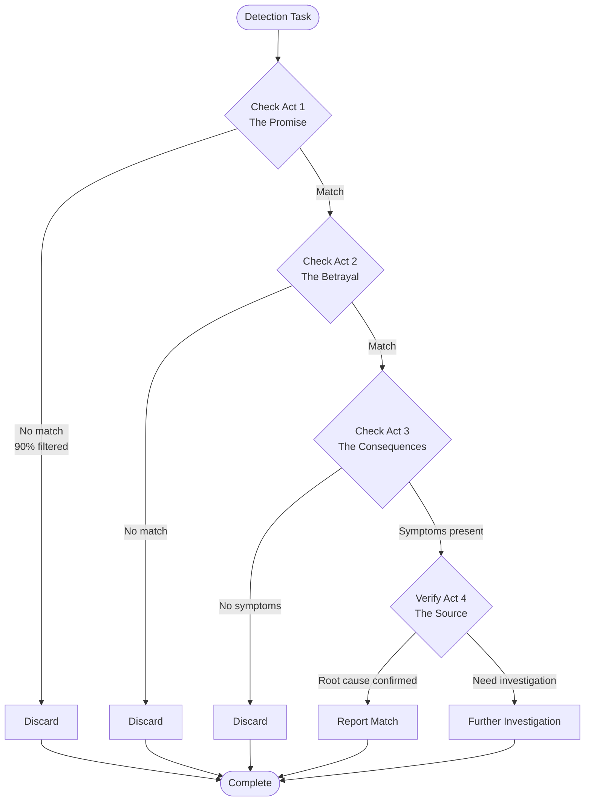

# Story-Based Framing Quick Reference

Fast reference for creating pattern descriptions using narrative structure.

## The Four-Act Formula

```
Act 1: The Promise      → What it claims/appears to be (most distinctive)
Act 2: The Betrayal     → Where it actually breaks (second most distinctive)
Act 3: The Consequences → Observable symptoms (verification)
Act 4: The Source       → Root cause (fix strategy)
```

## Quick Start Checklist

### Before Writing

- [ ] Pattern name chosen (memorable, evocative)
- [ ] Domain identified (code, business, security, UX, data, medical, ops)
- [ ] Core violation clear (what promise is broken?)
- [ ] Distinctive traits identified (what uniquely identifies this?)

### Act 1: The Promise

- [ ] States what is claimed/promised/documented
- [ ] Cites specific declarations
- [ ] Describes "correct-looking" initial state
- [ ] **Contains most distinctive structural criterion**

### Act 2: The Betrayal

- [ ] Specifies exact violation point
- [ ] Uses contrast word ("But", "However", "Instead")
- [ ] Cites specific code/config/UI element
- [ ] **Contains second most distinctive criterion**

### Act 3: The Consequences

- [ ] Lists concrete, observable symptoms
- [ ] Provides verification criteria
- [ ] Includes metrics/counts where available
- [ ] Shows workarounds or compensating mechanisms

### Act 4: The Source

- [ ] Explains architectural root cause
- [ ] Traces origin (historical, constraint, incentive)
- [ ] Distinguishes isolated vs. systemic
- [ ] Informs fix strategy

### The Fix

- [ ] Addresses Act 2 violation directly
- [ ] Tackles Act 4 root cause when possible
- [ ] Provides specific action steps
- [ ] Brief (2-4 sentences)

---

## Templates by Domain

### Code Analysis Template

```markdown
# Pattern: {Memorable Name}

## Act 1: The Promise
{Class/function/module} declares {type/interface/contract} promising to {behavior}.

**Code example:**
\```{language}
# Declaration showing the promise
\```

## Act 2: The Betrayal
But the implementation {accepts/stores/returns} {wrong type/violates contract} instead of {promised behavior}.

**Code example:**
\```{language}
# Implementation showing the violation
\```

## Act 3: The Consequences
Methods contain {isinstance checks/type suppressions/try-except/workarounds} to compensate.

**Symptoms:**
- {Runtime checks at lines X, Y, Z}
- {Type suppressions: N instances}
- {Error handling: M try-except blocks}

## Act 4: The Source
Values originate from {heterogeneous storage/untyped API/legacy system} where {type information is lost/validation is missing/constraints are violated}.

**Origin:** {Historical decision/architectural constraint}

## The Fix
{Use TypeGuard/Add validation/Refactor storage/Change interface} to {address root cause}.
\```{language}
# Fix implementation
\```
```

### Business Process Template

```markdown
# Pattern: {Memorable Name}

## Act 1: The Promise
{Process/workflow/policy} documentation states: "{quoted requirement}".

**Observable characteristics:** {Where requirement is documented}

## Act 2: The Betrayal
But {specific condition/tag/user type} bypasses {control/approval/validation} entirely.

**The breaking point:** {File/config/code} line {N} contains: {quoted bypass logic}

## Act 3: The Consequences
- {Audit finding percentage}
- {Team complaints}
- {Budget/compliance impact}

**Symptoms:**
- {Log evidence}
- {Metric deviation}
- {Stakeholder feedback}

## Act 4: The Source
The {bypass/exception/workaround} was added during {emergency/crisis/POC} and the "temporary" change was never removed.

**Origin:** {Emergency modification/rapid prototyping/legacy integration}

## The Fix
1. {Remove bypass for threshold cases}
2. {Create proper expedited workflow}
3. {Define criteria with governance approval}
4. {Add automated enforcement check}
```

### Security Audit Template

```markdown
# Pattern: {Memorable Name}

## Act 1: The Promise
{Policy/documentation} specifies: "{security requirement}".

**Observable characteristics:** {Security checklist/compliance framework/training materials}

## Act 2: The Betrayal
But {account/configuration/rule} has {excessive permissions/allows unauthorized access/violates principle}.

**The breaking point:** {Log/scan/test} shows:
- {Specific permission violation}
- {Access that shouldn't be possible}

## Act 3: The Consequences
- {Scanning tool findings: N issues}
- {Penetration test results}
- {Compliance audit rating}
- {Blast radius assessment}

**Symptoms:**
- {Unused permissions: X%}
- {Access in unexpected locations}
- {No monitoring alerts despite violations}

## Act 4: The Source
{Account/rule} was created during {POC/emergency/initial setup} using {overprivileged template/copy-paste from internet/default config}. Production inherited {POC/emergency} configuration without security review.

**Origin:** {Rapid prototyping/emergency response/lack of review}

## The Fix
1. {Audit actual usage via logs}
2. {Create minimal permission set}
3. {Implement least privilege}
4. {Rotate credentials}
5. {Add security review requirement}
```

### UX/Design Template

```markdown
# Pattern: {Memorable Name}

## Act 1: The Promise
{UI element/flow} promises: "{quoted user-facing text}".

**Observable characteristics:** {Marketing claims/FAQ/user reviews}

## Act 2: The Betrayal
But {clicking/selecting/attempting} {action} requires:
1. {Unexpected step 1}
2. {Friction point 2}
3. {Hidden requirement 3}
4. {Confirm-shaming or dark pattern element}

**The breaking point:** {Specific UI element/flow diagram}

## Act 3: The Consequences
- {Completion rate: X% abandonment}
- {Support tickets: N per day}
- {User complaints/reviews}
- {Chargeback rate increase}
- {Regulatory attention}

**Symptoms:**
- {Analytics data}
- {Support ticket themes}
- {Social media sentiment}
- {Legal risk}

## Act 4: The Source
{Team} was incentivized on {metric} leading to design that {optimizes wrong thing}. Leadership approved based on {short-term impact}, ignoring {long-term risk}.

**Origin:** {Misaligned incentives/dark pattern strategy/retention optimization}

## The Fix
1. {Simplify to single action}
2. {Use neutral language}
3. {Remove friction/shaming}
4. {Update team incentives}
```

### Data Quality Template

```markdown
# Pattern: {Memorable Name}

## Act 1: The Promise
{API/service/documentation} states: "{data freshness/accuracy/completeness requirement}".

**Observable characteristics:** {Response headers/monitoring dashboard/SLA}

## Act 2: The Betrayal
But {cache/CDN/proxy} sets {incorrect TTL/no expiration/long timeout} overriding {promised freshness}.

**The breaking point:** Multiple layers with different policies:
- {Layer 1: duration}
- {Layer 2: duration}
- {Layer 3: duration}

## Act 3: The Consequences
- {Users see stale data: timeframe}
- {Operations fail: N% failure rate}
- {Support calls: N per day}
- {Business metric impact}

**Symptoms:**
- {Cache age in responses}
- {Database vs. API discrepancy}
- {Cache hit rate too high}
- {Order/transaction failure rate}

## Act 4: The Source
{Cache/optimization} was added to {reduce load/improve performance} during {traffic spike/crisis}. {Team} configured {duration} based on {generic template} without understanding {data velocity/freshness requirements}.

**Origin:** {Performance optimization without impact analysis/siloed decisions}

## The Fix
1. {Reduce cache duration to match requirement}
2. {Add cache key variation by data state}
3. {Implement invalidation on updates}
4. {Add observability headers}
5. {Create caching decision matrix}
6. {Establish cross-functional SLO}
```

---

## Causal Language Guide

### Strong Transitions (Use These)

| Transition | Use Case | Example |
|------------|----------|---------|
| **But** | Shows violation | "Promises X, but actually does Y" |
| **However** | Contrasts expectation | "Should validate, however accepts any input" |
| **Instead** | Shows substitution | "Should store T, instead stores Union" |
| **Because** | Shows causation | "Because of union storage, methods need isinstance" |
| **This forces** | Shows consequence | "This forces developers to add type suppressions" |
| **Which originates from** | Traces root cause | "Which originates from heterogeneous dict storage" |
| **Leading to** | Shows result | "Leading to 40% false positives" |
| **Causing** | Shows direct cause | "Causing race conditions" |

### Weak Transitions (Avoid)

| Transition | Why Weak | Better Alternative |
|------------|----------|-------------------|
| Additionally | Implies independence | "Because of this violation..." |
| Also | Suggests flat list | "This forces..." |
| Furthermore | Just adds more | "Which causes..." |
| Moreover | No causation | "Leading to..." |
| In addition | Lacks connection | "As a result..." |

---

## Detection Workflow



---

## Common Mistakes

### Mistake 1: Starting with Symptoms

**Wrong**:
```
Act 1: Code has isinstance() checks
Act 2: Code has type: ignore comments
```

**Correct**:
```
Act 1: Class declares Generic[T]
Act 2: Constructor accepts Union instead of T
Act 3: This forces isinstance() checks and type suppressions
```

### Mistake 2: Vague Promises

**Wrong**:
```
Act 1: System handles data
```

**Correct**:
```
Act 1: API promises real-time inventory with 60-second freshness (documented in API spec v2.1)
```

### Mistake 3: Missing Causation

**Wrong**:
```
Act 2: Constructor accepts union
Act 3: Methods have isinstance()
```

**Correct**:
```
Act 2: Constructor accepts union instead of T
Act 3: Because of this type mismatch, methods require isinstance() checks
```

### Mistake 4: Generic Act 4

**Wrong**:
```
Act 4: Bad design
```

**Correct**:
```
Act 4: Values originate from heterogeneous dict where specific type information is lost at storage boundary
```

---

## Pattern Naming Guide

Good pattern names are:

- **Memorable**: Easy to recall ("The Fake Generic" not "Type System Violation #3")
- **Evocative**: Suggests the core problem
- **Domain-appropriate**: Uses domain language
- **Specific**: Distinguishes from similar patterns

### Naming Formulas

| Formula | Example | Domain |
|---------|---------|--------|
| The {Adjective} {Noun} | The Fake Generic | Code |
| The {Behavior} {Entity} | The Phantom Approval | Business |
| The {State} {Resource} | The Overprivileged Service Account | Security |
| The {Deceptive} {Pattern} | The Confirm-Shaming Dialog | UX |
| The {Quality} {Data} | The Stale Cache Syndrome | Data |

---

## Efficiency Metrics

Track these metrics to validate story-based approach:

```python
metrics = {
    "steps_to_detection": 3,      # vs 7-10 for other approaches
    "false_positive_rate": 12,    # per 100 detections vs 45
    "time_to_fix_hours": 0.8,     # vs 2.5 hours
    "developer_understanding": 92 # % who understand root cause vs 65
}
```

---

## Quick Commands

### Create New Pattern from Template

```bash
# Copy template
cp assets/narrative_template.md patterns/my-new-pattern.md

# Edit with your pattern details
$EDITOR patterns/my-new-pattern.md
```

### Validate Pattern Structure

```bash
# Check all four acts present
grep -E "^### Act [1-4]:" patterns/my-pattern.md

# Check for causal language
grep -E "(But|However|Because|This forces|Which originates)" patterns/my-pattern.md
```

### Run Pattern Detection

```bash
# Detect using story-based descriptions
python scripts/detect_patterns.py --patterns ./patterns/*.md --target ./src/

# Generate report
python scripts/detect_patterns.py --format report --output pattern_report.md
```

---

## Links to Full Documentation

- [README](../README.md) - Plugin overview and installation
- [Usage Guide](./usage-guide.md) - Detailed usage instructions
- [SKILL.md](../skills/story-based-framing/SKILL.md) - Complete skill reference
- [Code Examples](../skills/story-based-framing/resources/code-analysis/example_patterns.md) - Fully-worked patterns
- [Cross-Domain Examples](../skills/story-based-framing/references/cross_domain_examples.md) - Business, security, UX, data, medical, ops
- [Experiment Results](../skills/story-based-framing/resources/code-analysis/experiment_results.md) - Validation data
- [Narrative Template](../skills/story-based-framing/assets/narrative_template.md) - Blank template

---

**Last Updated**: 2026-01-18
