# Add Documentation Updater Feature to Skill - Reusable Prompt Template

**Purpose**: This template provides a complete prompt for adding an automated documentation updater to any Claude skill. The updater downloads documentation from an upstream repository, processes it for AI consumption, and maintains a local cache with configurable refresh intervals.

**Use this template when**: You want to add local, auto-updating documentation to a skill (e.g., GitLab CI docs for gitlab-skill, glab CLI docs for gitlab-skill, etc.)

---

## Workflow Overview

```mermaid
graph TD
    Start([User Request]) --> LoadSkills[Phase 1: Load Skills<br/>python3-development<br/>skill-creator]
    LoadSkills --> Architect[Delegate to<br/>python-cli-architect]

    Architect --> ScriptCreated{Script Created?}
    ScriptCreated -->|Yes| Review[Phase 2: Code Review<br/>Delegate to<br/>python-code-reviewer]
    ScriptCreated -->|No| Architect

    Review --> ReviewPass{Review Pass?}
    ReviewPass -->|Yes| QualityGates[Phase 3: Quality Gates]
    ReviewPass -->|No| Architect

    QualityGates --> PreCommit[uv run pre-commit]
    PreCommit --> Ruff[ruff format + ruff check]
    Ruff --> TypeCheck[mypy + pyright]

    TypeCheck --> AllPass{All Gates Pass?}
    AllPass -->|Yes| Testing[Phase 4: Testing]
    AllPass -->|No| Architect

    Testing --> RunScript[Run sync-gitlab-docs.py]
    RunScript --> VerifyFiles[Verify files downloaded]
    VerifyFiles --> CheckShortcodes[Verify Hugo shortcodes removed]
    CheckShortcodes --> CheckLinks[Verify link transformation]
    CheckLinks --> CheckIndex[Verify Documentation Index]
    CheckIndex --> TestCooldown[Test cooldown mechanism]
    TestCooldown --> TestForce[Test --force flag]

    TestForce --> TestsPass{All Tests Pass?}
    TestsPass -->|Yes| Integration[Phase 5: Integration Test]
    TestsPass -->|No| Architect

    Integration --> SubAgent[Spawn general-purpose agent<br/>with minimal WHAT prompt]
    SubAgent --> AgentDiscovers{Agent discovers<br/>and uses skill?}
    AgentDiscovers -->|Yes| Complete([✅ Complete])
    AgentDiscovers -->|No| Architect

    style Start fill:#e1f5ff
    style Complete fill:#d4edda
    style Architect fill:#fff3cd
    style Review fill:#fff3cd
    style QualityGates fill:#f8d7da
    style Testing fill:#f8d7da
    style Integration fill:#d1ecf1
```



**Key Workflow Characteristics**:

- **Iterative Loop**: All phases can loop back to Phase 1 (python-cli-architect) on failure
- **Quality Gates**: Sequential execution (format → lint → type check)
- **Testing Phase**: Comprehensive validation before claiming production ready
- **Integration Test**: Verifies skill is actually usable by AI agents with minimal context

---

## Template Variables

Before using this prompt, replace these variables:

- `{SKILL_NAME}` - Name of the skill (e.g., "gitlab-skill")
- `{DOC_SOURCE_URL}` - Archive URL for documentation (e.g., GitLab tar.gz URL)
- `{DOC_PATH_IN_ARCHIVE}` - Path within archive to extract (e.g., "doc/ci", "doc/")
- `{LOCAL_DOC_DIR}` - Directory name for local documentation (e.g., "ci", "glab-cli")
- `{DOC_DESCRIPTION}` - Brief description for skill (e.g., "GitLab CI/CD pipeline documentation", "glab CLI command reference")
- `{COOLDOWN_DAYS}` - Days between automatic updates (typically 3-7)

---

## Full Prompt Template

`````markdown
Add an automated documentation updater feature to the {SKILL_NAME} skill.

**Goal**: Enable the skill to maintain a local, auto-updating copy of {DOC_DESCRIPTION} from the upstream repository.

## Requirements

### 1. Documentation Update Script

Create `{SKILL_NAME}/scripts/update-{LOCAL_DOC_DIR}-docs.py` with:

**Download & Extract**:

- Download documentation archive from: `{DOC_SOURCE_URL}`
- Extract to temporary directory
- Validate extraction (check for markdown files)
- Path to documentation in archive: `{DOC_PATH_IN_ARCHIVE}`

**Post-Processing (Markdown Grooming)**:

- **Link Transformation**:
  - Internal links (within extracted docs): Convert to relative paths starting with `./`
  - External links (outside extracted docs): Convert to raw repository URLs
  - Skip absolute URLs (http://, https://), anchor links (#), mailto links

- **Hugo Shortcode Removal**:
  - Remove `...` blocks
  - Remove `...` blocks
  - Support both `` and `{}` syntax variants
  - Use regex with `re.DOTALL` for multiline matching
  - **Critical**: Hugo uses `` (slash inside angle brackets) for closing tags

- **Path-Aware Link Resolution**:
  - Pass current file path and docs root to link transformer
  - Use `Path.resolve()` and `Path.relative_to()` for accurate path resolution
  - Handle arbitrary directory nesting depths

**File Tree Generation**:

- Scan documentation directory recursively
- Extract YAML frontmatter from each markdown file
  - Parse `title:` field for link text
  - Parse `description:` field for context
  - Fallback to filename if no frontmatter
- Generate markdown tree structure with rich context:
  ```text
  ├── [Title from frontmatter](./path/to/file.md)
      Description from frontmatter
  ```
- Use relative paths starting with `./`
- Return formatted markdown string in code fence
- Dependencies: Add `pyyaml>=6.0.0` and `types-pyyaml>=6.0.0` to PEP 723 metadata

**SKILL.md Integration**:

- Find or create `## Documentation Index` section in SKILL.md
- Replace section content with generated file tree
- Preserve all other sections
- Use regex with `re.MULTILINE | re.DOTALL` for section matching

**Lock File Mechanism**:

- Location: `{SKILL_NAME}/.update-{LOCAL_DOC_DIR}-docs.lock`
- Format: JSON with `last_run`, `last_status`, `files_processed`
- Cooldown: {COOLDOWN_DAYS} days for successful runs only
- Failed runs allow immediate retry
- `--force` flag bypasses cooldown
- Use atomic writes (temp file + rename)
- Exit code 0 when blocked by cooldown (not an error)

**Technical Requirements**:

- Python 3.11+ with PEP 723 inline metadata
- Shebang: `#!/usr/bin/env -S uv --quiet run --active --script`
- Dependencies: `httpx>=0.28.1`, `typer>=0.19.2`, `pyyaml>=6.0.0`, `types-pyyaml>=6.0.0`
- Use Rich for progress feedback (download, extract, groom, index)
- Async download with progress bars
- Comprehensive error handling with specific exception types

### 2. Update SKILL.md

Add to the `## Execution Protocol` section (create if missing):

````markdown
## Execution Protocol

The model must follow this sequence when {SKILL_NAME} applies:

1. **Update documentation reference** (first step on skill activation):
   ```bash
   uv run scripts/sync-gitlab-docs.py --working-dir .
   ```
````
`````

```markdown
- Updates {DOC_DESCRIPTION} from official repository
- Respects {COOLDOWN_DAYS}-day cooldown (successful runs only)
- Use `--force` flag to bypass cooldown if needed
- Creates/updates Documentation Index in this SKILL.md file
- Lock file: `.sync-gitlab-docs.lock` (gitignored)

2. [Rest of existing protocol steps...]
```

Update skill description in frontmatter to include:

```yaml
description: [Existing description]. Use this skill before working with {DOC_DESCRIPTION}.
```

### 3. Update .gitignore

Add to repository root `.gitignore`:

```text
# {SKILL_NAME} documentation sync lock files and generated docs
*/.sync-gitlab-docs.lock
{SKILL_NAME}/references/{LOCAL_DOC_DIR}/
```

### 4. Implementation Workflow

Follow this orchestration workflow:

**Phase 1: Implementation**

1. Load skills: python3-development, skill-creator
2. Delegate to python-cli-architect agent:
   - Provide all requirements above
   - Specify file path: `{SKILL_NAME}/scripts/sync-gitlab-docs.py`
   - Request comprehensive error handling and progress feedback

**Phase 2: Code Review**

1. Delegate to python-code-reviewer agent:
   - Review for correctness, performance, security
   - Check regex patterns for ReDoS vulnerabilities
   - Verify path-aware link transformation
   - Ensure atomic operations for lock file

**Phase 3: Quality Gates**

1. Run linting: `uv run pre-commit run --files scripts/sync-gitlab-docs.py`
2. Verify passes: ruff format, ruff check, mypy, pyright

**Phase 4: Testing & Validation**

1. Run script: `uv run scripts/sync-gitlab-docs.py --working-dir .`
2. Verify downloaded files exist
3. Check Hugo shortcodes removed: `grep -r "{{< details" references/{LOCAL_DOC_DIR}/ | wc -l` (should be 0)
4. Check links transformed correctly:
   - Internal: Sample `./` relative paths
   - External: Sample raw repository URLs
5. Verify Documentation Index created in SKILL.md
6. Test cooldown: Run without `--force` (should block)
7. Test force flag: Run with `--force` (should succeed)

**Phase 5: Integration Test**

1. Use Task tool with general-purpose agent
2. Provide minimal prompt (WHAT only, no WHERE/HOW)
3. Agent should discover and use the skill
4. Verify agent can access documentation

## Success Criteria

- ✅ Script downloads and processes documentation successfully
- ✅ All Hugo shortcodes removed (0 occurrences)
- ✅ Links correctly transformed (internal=relative, external=raw URLs)
- ✅ Documentation Index created with titles from YAML frontmatter
- ✅ Descriptions appear on indented lines below file entries
- ✅ Graceful fallback to filename when frontmatter missing
- ✅ Lock file prevents runs within {COOLDOWN_DAYS} days
- ✅ `--force` flag bypasses cooldown
- ✅ All quality gates pass (ruff, mypy, pyright)
- ✅ End-to-end integration test successful
- ✅ .gitignore excludes lock file

## Common Pitfalls to Avoid

1. **Hugo Shortcode Regex**: Must use `{{\s*<\s*/` (slash inside angle brackets), not `{{\s*</`
2. **Duplicate Pattern Compilation**: Use module-level compiled patterns, not local re.compile() in functions
3. **Link Path Resolution**: Must be path-aware (pass current file context), not hardcoded depth assumptions
4. **Lock File Atomicity**: Use temp file + rename pattern, not direct write
5. **Quality Gate Ordering**: Format before lint (ruff format → ruff check)
6. **Production Ready Claims**: Only claim production-ready AFTER successful end-to-end test

---

## Example Usage

For adding glab CLI documentation to gitlab-skill:

**Step 1**: Fill in template variables:

- `{SKILL_NAME}` → `gitlab-skill`
- `{DOC_SOURCE_URL}` → `https://gitlab.com/gitlab-org/cli/-/archive/main/cli-main.tar.gz?path=docs`
- `{DOC_PATH_IN_ARCHIVE}` → `docs`
- `{LOCAL_DOC_DIR}` → `glab-cli`
- `{DOC_DESCRIPTION}` → `glab CLI command reference and usage documentation`
- `{COOLDOWN_DAYS}` → `7`

**Step 2**: Use the filled template as your prompt to the orchestrator

**Step 3**: Orchestrator follows the workflow to implement the feature

---

## Extending the Pattern

This pattern can be adapted for:

- **GitLab Runner documentation**: Extract `doc/` from gitlab-runner repository
- **Terraform provider docs**: Extract provider documentation
- **API documentation**: Download OpenAPI specs and generate markdown
- **Library documentation**: Clone and extract docs/ from any repository
- **Framework guides**: Download and process framework documentation

The core pattern remains the same: download → process → index → lock file mechanism.

---

## Template Maintenance

**Location**: Store this template in `{REPO_ROOT}/templates/` directory

**Updates**: When the pattern evolves (e.g., new post-processing steps), update this template

**Versioning**: Include date in filename when making breaking changes (e.g., `add-documentation-updater-v2-2025-11-19.md`)
